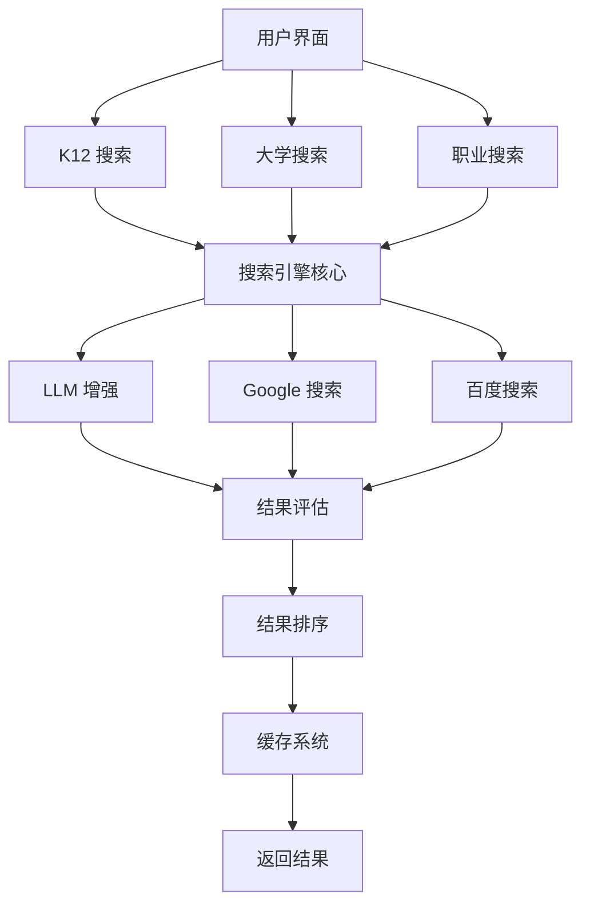
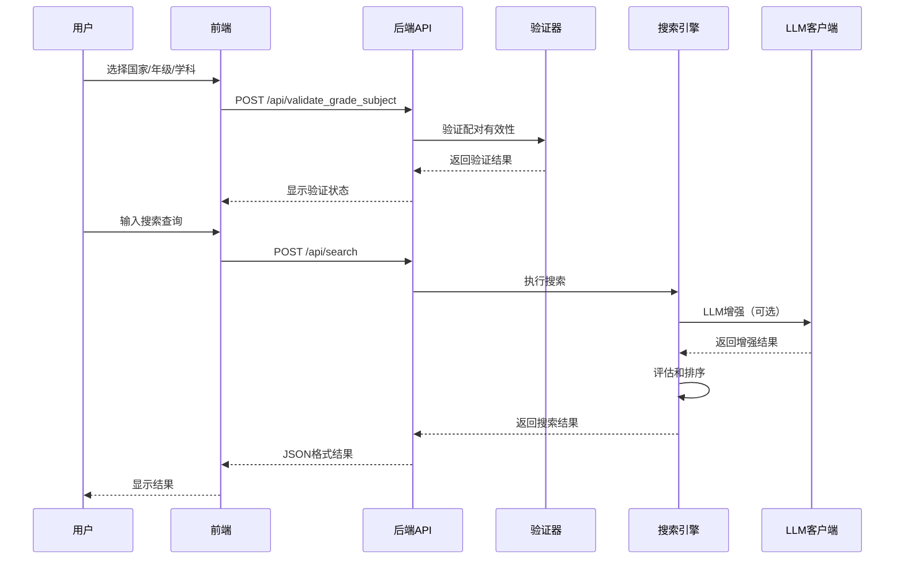
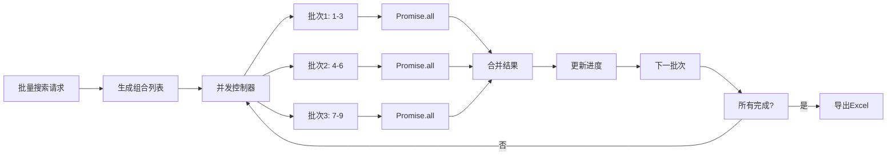
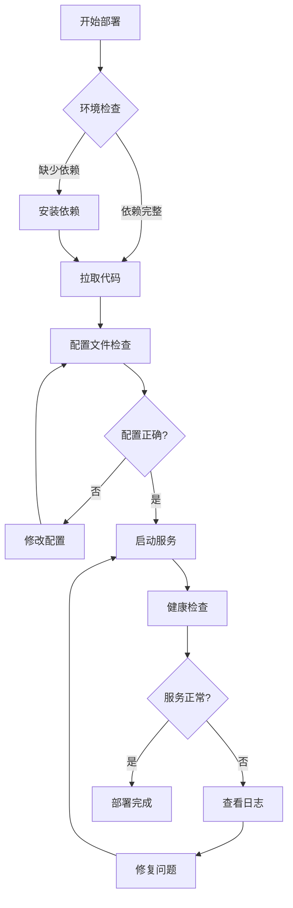
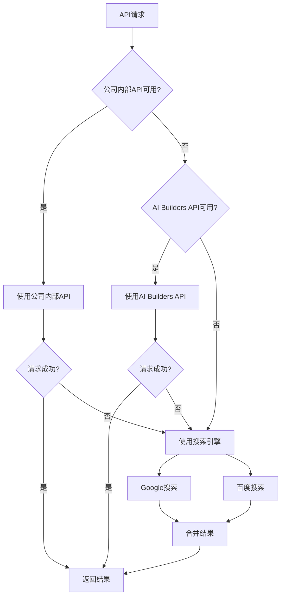

# Indonesia 全教育层级智能搜索系统 - 完整操作手册 (SOP)

**文档版本**: v5.0
**系统版本**: v5.0 (commit 0b697f9)
**编写日期**: 2026-01-07
**适用对象**: 系统用户、开发者、运维人员

---

## 📑 目录

1. [系统概述](#1-系统概述-system-overview)
2. [快速开始](#2-快速开始-quick-start)
3. [K12 教育搜索](#3-k12-教育搜索-k12-education-search)
4. [大学教育搜索](#4-大学教育搜索-university-search)
5. [职业教育搜索](#5-职业教育搜索-vocational-search)
6. [系统配置](#6-系统配置-system-configuration)
7. [API 接口](#7-api-接口-api-reference)
8. [部署指南](#8-部署指南-deployment-guide)
9. [测试指南](#9-测试指南-testing-guide)
10. [故障排除](#10-故障排除-troubleshooting)

---

## 1. 系统概述 (System Overview)

### 1.1 系统简介

Indonesia 全教育层级智能搜索系统是一个专为新兴市场国家设计的综合性教育资源搜索平台。系统整合了 K12 基础教育、大学教育和职业教育三个层级，利用先进的 LLM (大语言模型) 技术和搜索引擎，为用户提供高质量、精准的教育资源检索服务。

**核心特性**:
- ✅ 支持 10 个新兴市场国家
- ✅ 覆盖 K12、大学、职业三大教育层级
- ✅ LLM 增强搜索结果质量
- ✅ 智能年级-学科配对验证
- ✅ 批量搜索并发优化
- ✅ 多搜索引擎降级策略
- ✅ 完善的缓存机制

### 1.2 核心功能

#### K12 基础教育搜索
- 支持 10 个国家的 K12 课程体系
- 年级-学科科学验证
- 学期筛选
- 资源类型过滤（视频/文档）
- 批量搜索多组合

#### 大学教育资源搜索
- 覆盖印尼顶尖 5 所大学
- 按大学、学院、专业搜索
- 课程资源和学习资料
- 学科专业信息

#### 职业教育搜索
- 5 大技能领域
- 14 个培训课程
- 职业技能提升资源
- 证书课程信息

### 1.3 技术架构



**技术栈**:
- **后端**: Python 3.9+, Flask
- **前端**: HTML5, CSS3, JavaScript
- **AI/ML**: OpenAI API, Google Gemini, DeepSeek
- **搜索引擎**: Google Custom Search, 百度搜索
- **数据格式**: JSON, YAML, Pydantic v2
- **缓存**: 文件系统缓存 (MD5 键)

### 1.4 适用场景

**教育机构**:
- 寻找优质教学资源
- 课程内容开发参考
- 多语言教育资源整合

**教师和讲师**:
- 备课素材搜索
- 教学视频查找
- 课程设计参考

**学生和自学者**:
- 学习资源检索
- 课程预习复习
- 技能提升学习

**教育研究者**:
- 教育资源分析
- 课程体系研究
- 跨国教育对比

---

## 2. 快速开始 (Quick Start)

### 2.1 环境要求

**硬件要求**:
- CPU: 2 核心以上 (推荐 4 核心)
- 内存: 8GB RAM (推荐 16GB)
- 磁盘: 20GB 可用空间

**软件要求**:
- Python 3.9 或更高版本
- pip (Python 包管理器)
- git (版本控制，可选)
- 现代浏览器 (Chrome, Firefox, Safari, Edge)

**操作系统**:
- Linux (Ubuntu 20.04+, CentOS 7+)
- macOS (10.15+)
- Windows 10/11

### 2.2 安装步骤

#### 步骤 1: 获取代码

```bash
# 使用 git 克隆 (推荐)
git clone <repository-url>
cd Indonesia

# 或下载压缩包解压
# unzip Indonesia.zip
# cd Indonesia
```

#### 步骤 2: 创建虚拟环境 (推荐)

```bash
# macOS 和 Linux
python3 -m venv venv
source venv/bin/activate

# Windows
python -m venv venv
venv\Scripts\activate
```

#### 步骤 3: 安装依赖

```bash
pip install --upgrade pip
pip install -r requirements.txt
```

**主要依赖包**:
- `flask` - Web 框架
- `pydantic` - 数据验证
- `openai` - LLM API 客户端
- `requests` - HTTP 客户端
- `yaml` - 配置文件解析

#### 步骤 4: 配置系统

```bash
# 复制示例配置文件
cp config/llm.yaml.example config/llm.yaml

# 编辑配置文件，填入你的 API token
nano config/llm.yaml  # 或使用其他编辑器
```

**配置文件示例** (`config/llm.yaml`):
```yaml
company_internal:
  base_url: "https://hk-intra-paas.transsion.com/tranai-proxy/v1"
  api_token: "your-api-token-here"
  models:
    default: "gpt-4o"
    fast: "gemini-2.5-flash"

ai_builders:
  base_url: "https://api.aibuilders.com/v1"
  api_token: "your-ai-builders-token-here"
  models:
    default: "deepseek"
```

#### 步骤 5: 初始化数据目录

```bash
mkdir -p data/cache logs
```

### 2.3 快速验证

#### 启动服务器

```bash
# 开发环境
python3 web_app.py

# 或使用虚拟环境
python web_app.py
```

**成功启动标志**:
```
 * Running on http://0.0.0.0:5001
 * Press CTRL+C to quit
```

#### 访问系统

1. 打开浏览器，访问: `http://localhost:5001`
2. 应该看到 K12 教育搜索主页

#### 测试 API

```bash
# 健康检查
curl http://localhost:5001/

# 获取国家列表
curl http://localhost:5001/api/countries
```

**预期响应**:
```json
{
  "success": true,
  "countries": [
    {
      "country_code": "ID",
      "country_name": "Indonesia",
      "grades": ["Kelas 1", "Kelas 2", ...],
      "subjects": ["Matematika", "Bahasa Indonesia", ...]
    }
  ]
}
```

### 2.4 常见问题

**Q: Python 版本不兼容怎么办？**
A: 确保使用 Python 3.9 或更高版本。检查版本: `python3 --version`

**Q: 依赖安装失败？**
A: 尝试升级 pip: `pip install --upgrade pip`

**Q: 端口 5001 已被占用？**
A: 修改 `web_app.py` 中的端口，或停止占用该端口的进程:
```bash
lsof -i :5001
kill -9 <PID>
```

**Q: API 调用失败？**
A: 检查 `config/llm.yaml` 中的 API token 是否正确

---

## 3. K12 教育搜索 (K12 Education Search)

### 3.1 功能说明

K12 教育搜索是系统的核心功能，为幼儿园到 12 年级的学生和教师提供精准的教育资源检索服务。

**支持的国家**:
- 🇨🇳 中国 (China)
- 🇪🇬 埃及 (Egypt)
- 🇮🇩 印度尼西亚 (Indonesia)
- 🇮🇳 印度 (India)
- 🇮🇶 伊拉克 (Iraq)
- 🇳🇬 尼日利亚 (Nigeria)
- 🇵🇭 菲律宾 (Philippines)
- 🇷🇺 俄罗斯 (Russia)
- 🇸🇦 沙特阿拉伯 (Saudi Arabia)
- 🇿🇦 南非 (South Africa)

### 3.2 操作流程

#### 完整搜索流程图



### 3.3 使用提示词

**你正在使用 K12 教育资源搜索功能。请按以下步骤操作：**

**步骤 1: 选择国家**
- 从下拉菜单中选择目标国家
- 支持: 中国, 埃及, 印尼, 印度, 伊拉克, 尼日利亚, 菲律宾, 俄罗斯, 沙特, 南非

**步骤 2: 选择年级**
- 根据所选国家，选择对应的年级
- 印尼: Kelas 1-12
- 中国: Grade 1-12
- 埃及: Grade 1-12
- 其他国家类似

**步骤 3: 选择学科**
- 从学科列表中选择要搜索的学科
- 常见学科: 数学, 科学, 语言, 社会研究等
- 系统会自动验证年级-学科配对是否有效

**步骤 4: 选择学期**（可选）
- Sem 1 (第一学期)
- Sem 2 (第二学期)
- All (全部学期)

**步骤 5: 选择资源类型**
- Video (视频资源)
- Document (文档资源)
- All (全部资源)

**步骤 6: 输入搜索查询**
- 输入你要搜索的具体内容
- 例如: "Matematika Kelas 1", "Science Grade 3"
- 建议使用目标国家语言获得更好结果

**步骤 7: 执行搜索**
- 点击"搜索"按钮
- 等待结果返回（通常 5-15 秒）
- 查看搜索结果，点击链接访问资源

**批量搜索**:
- 勾选"批量搜索多个年级-学科组合"
- 选择多个年级和学科
- 系统会自动生成所有有效组合
- 执行批量搜索并导出 Excel

**注意事项**:
- 某些年级-学科组合可能无效（如一年级没有物理）
- 搜索速度取决于网络环境
- 结果会缓存 1 小时，重复查询更快

### 3.4 配置管理

#### 国家配置

国家配置存储在 `data/countries.json`:

```json
{
  "country_code": "ID",
  "country_name": "Indonesia",
  "grades": ["Kelas 1", "Kelas 2", ...],
  "subjects": ["Matematika", "Bahasa Indonesia", ...],
  "grade_subject_rules": {
    "Kelas 1": ["Matematika", "Bahasa Indonesia", ...],
    "Kelas 10": ["Fisika", "Kimia", ...]
  }
}
```

#### 添加新国家

1. 编辑 `data/countries.json`
2. 添加新的国家配置
3. 定义年级和学科列表
4. 配置年级-学科规则
5. 重启服务器

### 3.5 批量搜索

#### 批量搜索流程



#### 并发配置

批量搜索使用并发控制提升性能:

```javascript
// 并发配置
const MAX_CONCURRENT = 3;  // 同时进行的最大搜索数

// 进度显示
function updateProgressUI(completedCount, totalCount, failedCount, resultCount, startTime) {
    const elapsed = ((Date.now() - startTime) / 1000).toFixed(1);
    const progressPercent = (completedCount / totalCount) * 100;

    console.log(`进度: ${completedCount}/${totalCount} (${progressPercent.toFixed(1)}%)`);
    console.log(`已完成: ${completedCount}, 失败: ${failedCount}, 结果: ${resultCount}个`);
    console.log(`已用时间: ${elapsed}秒`);

    if (completedCount < totalCount) {
        const avgTime = elapsed / completedCount;
        const remaining = (totalCount - completedCount) * avgTime;
        console.log(`预计剩余时间: ${remaining.toFixed(1)}秒`);
    }
}
```

#### Excel 导出

批量搜索完成后自动导出 Excel:

```javascript
// 导出到 Excel
function exportToExcel(allResults, semester, resourceType) {
    const ws = XLSX.utils.json_to_sheet(allResults);
    const wb = XLSX.utils.book_new();
    XLSX.utils.book_append_sheet(wb, ws, "搜索结果");

    const filename = `批量搜索_${semester}_${resourceType}_${Date.now()}.xlsx`;
    XLSX.writeFile(wb, filename);
    console.log(`✅ 结果已导出: ${filename}`);
}
```

---

## 4. 大学教育搜索 (University Search)

### 4.1 功能说明

大学教育资源搜索专注于高等教育机构的学习资料和课程资源，目前主要覆盖印度尼西亚的顶尖大学。

### 4.2 支持的大学

#### UI - Universitas Indonesia (印尼大学)

**学院和专业**:
- 计算机科学 (Computer Science)
- 工程学 (Engineering)
- 经济学 (Economics)
- 医学 (Medicine)

**大学代码**: `UI`

#### ITB - Institut Teknologi Bandung (万隆理工学院)

**学院和专业**:
- 工程学 (Engineering)
- 科学 (Science)

**大学代码**: `ITB`

#### UGM - Gadjah Mada University (加查马达大学)

**学院和专业**:
- 计算机科学 (Computer Science)

**大学代码**: `UGM`

#### ITS - Sepuluh Nopember Institute of Technology (十一月理工学院)

**学院和专业**:
- 计算机科学 (Computer Science)

**大学代码**: `ITS`

#### UNDIP - Diponegoro University (迪波内戈罗大学)

**学院和专业**:
- 计算机科学 (Computer Science)

**大学代码**: `UNDIP`

### 4.3 使用提示词

**你正在使用大学教育资源搜索功能。请按以下步骤操作：**

**步骤 1: 选择国家**
- 目前支持印度尼西亚 (ID)

**步骤 2: 选择大学**
- UI (Universitas Indonesia) - 印尼大学
  - 计算机科学
  - 工程学
  - 经济学
  - 医学

- ITB (Institut Teknologi Bandung) - 万隆理工学院
  - 工程学
  - 科学

- UGM (Gadjah Mada University) - 加查马达大学
  - 计算机科学

- ITS (Sepuluh Nopember Institute of Technology) - 十一月理工学院
  - 计算机科学

- UNDIP (Diponegoro University) - 迪波内戈罗大学
  - 计算机科学

**步骤 3: 输入搜索查询**
- 输入课程名称、主题或关键词
- 例如: "Algoritma", "Machine Learning", "Data Structures"

**步骤 4: 设置搜索参数**
- 最大结果数: 默认 10，最多 50
- 选择是否启用 LLM 增强

**步骤 5: 执行搜索**
- 点击"搜索"按钮
- 查看搜索结果

**搜索技巧**:
- 使用印尼语或英语关键词
- 尝试课程代码（如 "CS101"）
- 搜索具体主题而非宽泛概念

### 4.4 搜索策略

#### 课程资源搜索

**搜索查询示例**:
- "Algoritma dan Struktur Data" - 算法与数据结构
- "Machine Learning UI" - 机器学习课程
- "Calculus ITB" - 微积分课程

#### 学习资料搜索

**搜索查询示例**:
- "lecture notes probability UGM" - 概率论讲义
- "tutorial fluid dynamics ITS" - 流体动力学教程
- "exercise macroeconomics UNDIP" - 宏观经济学习题

---

## 5. 职业教育搜索 (Vocational Search)

### 5.1 功能说明

职业教育搜索专注于实用技能培训和职业发展资源，帮助用户提升职业技能和获取行业认证。

### 5.2 技能领域

#### 💻 IT (Information Technology) - 信息技术

**培训课程**:
- Python Programming - Python 编程
- Web Development - Web 开发
- Data Science - 数据科学

**应用场景**: 软件开发、数据分析、系统管理

#### 🌍 LANG (Foreign Languages) - 外语

**培训课程**:
- English - 英语
- Mandarin - 中文（普通话）
- Japanese - 日语

**应用场景**: 国际交流、商务沟通、文化学习

#### 💼 BIZ (Business & Management) - 商业管理

**培训课程**:
- Digital Marketing - 数字营销
- Entrepreneurship - 创业学
- Financial Management - 财务管理

**应用场景**: 企业管理、市场营销、财务规划

#### 🎨 DESIGN (Design & Creative) - 设计创意

**培训课程**:
- Graphic Design - 平面设计
- UI/UX Design - 用户界面/体验设计

**应用场景**: 视觉设计、产品设计、品牌设计

#### 🤝 SOFT (Soft Skills) - 软技能

**培训课程**:
- Communication Skills - 沟通技巧
- Leadership - 领导力
- Problem Solving - 问题解决

**应用场景**: 团队协作、管理能力、职业发展

### 5.3 使用提示词

**你正在使用职业教育资源搜索功能。请按以下步骤操作：**

**步骤 1: 选择国家**
- 目前支持印度尼西亚 (ID)

**步骤 2: 选择技能领域**
- 💻 IT (Information Technology) - 信息技术
  - Python Programming
  - Web Development
  - Data Science

- 🌍 LANG (Foreign Languages) - 外语
  - English
  - Mandarin
  - Japanese

- 💼 BIZ (Business & Management) - 商业管理
  - Digital Marketing
  - Entrepreneurship
  - Financial Management

- 🎨 DESIGN (Design & Creative) - 设计创意
  - Graphic Design
  - UI/UX Design

- 🤝 SOFT (Soft Skills) - 软技能
  - Communication Skills
  - Leadership
  - Problem Solving

**步骤 3: 选择培训课程**（可选）
- 根据技能领域，选择具体课程
- 不选择则搜索该领域所有相关资源

**步骤 4: 输入搜索查询**
- 输入具体技能或主题
- 例如: "Python", "Digital Marketing", "UI Design"

**步骤 5: 执行搜索**
- 点击"搜索"按钮
- 查看培训资源、视频、文档等

**应用场景**:
- 职业技能提升
- 证书课程学习
- 实用技能培训
- 就业准备

### 5.4 证书体系

系统支持的职业培训证书:

- **IT 证书**: Python Developer, Web Developer, Data Scientist
- **语言证书**: TOEFL/IELTS (英语), HSK (中文), JLPT (日语)
- **商业证书**: Digital Marketing, Entrepreneurship, Financial Analyst
- **设计证书**: Graphic Designer, UI/UX Designer
- **软技能证书**: Communication, Leadership, Management

---

## 6. 系统配置 (System Configuration)

### 6.1 国家配置

**文件位置**: `data/countries.json`

**配置结构**:
```json
{
  "country_code": "ID",
  "country_name": "Indonesia",
  "grades": ["Kelas 1", "Kelas 2", ...],
  "subjects": ["Matematika", "Bahasa Indonesia", ...],
  "grade_subject_rules": {
    "Kelas 1": ["Matematika", "Bahasa Indonesia", "IPA"],
    "Kelas 10": ["Matematika", "Fisika", "Kimia", "Biologi"]
  }
}
```

**配置说明**:
- `country_code`: 2 位国家代码 (ISO 3166-1 alpha-2)
- `country_name`: 国家全名
- `grades`: 年级列表（按递增顺序）
- `subjects`: 学科列表
- `grade_subject_rules`: 年级-学科有效配对规则

### 6.2 API 配置

**文件位置**: `config/llm.yaml`

**配置结构**:
```yaml
# 公司内部 API
company_internal:
  base_url: "https://hk-intra-paas.transsion.com/tranai-proxy/v1"
  api_token: "${COMPANY_API_TOKEN}"  # 环境变量
  timeout:
    connect: 10  # 连接超时（秒）
    read: 60     # 读取超时（秒）
  models:
    default: "gpt-4o"           # 默认模型
    fast: "gemini-2.5-flash"    # 快速模型
    vision: "gemini-2.5-flash"  # 视觉模型

# AI Builders API (备用)
ai_builders:
  base_url: "https://api.aibuilders.com/v1"
  api_token: "${AI_BUILDERS_TOKEN}"
  timeout:
    connect: 10
    read: 60
  models:
    default: "deepseek"

# 搜索引擎配置
search_engines:
  google:
    enabled: true
    api_key: "${GOOGLE_API_KEY}"
    cx: "${GOOGLE_CX}"
  baidu:
    enabled: true
    api_key: "${BAIDU_API_KEY}"
```

**环境变量配置**:

创建 `.env` 文件:
```bash
# 公司 API
COMPANY_API_TOKEN=your-token-here

# AI Builders API
AI_BUILDERS_TOKEN=your-token-here

# 搜索引擎
GOOGLE_API_KEY=your-key-here
GOOGLE_CX=your-cx-here
BAIDU_API_KEY=your-key-here
```

### 6.3 缓存配置

**文件位置**: `config/search.yaml`

**配置结构**:
```yaml
cache:
  enabled: true
  directory: "data/cache"
  ttl: 3600  # 缓存时间（秒），默认 1 小时
  max_size: 1000  # 最大缓存条目数

search:
  max_results: 20  # 默认最大结果数
  timeout: 30  # 搜索超时（秒）
  enable_llm_enhancement: true
```

**缓存键生成**:
```python
import hashlib
import json

def generate_cache_key(params):
    """生成缓存键"""
    # 排序参数确保一致性
    sorted_params = json.dumps(params, sort_keys=True)
    # MD5 哈希
    return hashlib.md5(sorted_params.encode()).hexdigest()
```

### 6.4 性能调优

#### 并发控制

```javascript
// 批量搜索并发配置
const MAX_CONCURRENT = 3;  // 推荐值: 3-5

// 服务器端并发限制
# config/search.yaml
concurrency:
  max_concurrent: 10  # 最大并发请求数
  queue_size: 50      # 请求队列大小
  timeout: 120        # 请求超时（秒）
```

#### 性能监控

系统内置性能监控，数据保存在 `data/performance`:

```python
# 性能指标
- API 响应时间
- 搜索成功率
- 缓存命中率
- 并发请求数
- 错误率
```

#### 优化建议

**提高搜索速度**:
1. 启用缓存（已默认启用）
2. 使用更快的 LLM 模型 (gemini-2.5-flash)
3. 减少 `max_results` 数量
4. 在公司网络或使用 VPN

**降低 API 成本**:
1. 增加缓存 TTL 时间
2. 优先使用免费搜索引擎
3. 限制 LLM 调用频率
4. 批量搜索时禁用 LLM 增强

---

## 7. API 接口 (API Reference)

### 7.1 基础信息

**Base URL**: `http://localhost:5001`
**Content-Type**: `application/json`
**字符编码**: `UTF-8`
**API 版本**: v5.0

### 7.2 核心端点

#### 1. 服务器健康检查

**端点**: `GET /`

**描述**: 检查服务器是否正常运行

**请求**:
```http
GET / HTTP/1.1
Host: localhost:5001
```

**响应**:
```http
HTTP/1.1 200 OK
Content-Type: text/html; charset=utf-8

<!DOCTYPE html>
<html>
<head><title>Indonesia Education Search System</title></head>
<body>
<h1>Education Search System v5.0</h1>
<p>Status: Running</p>
</body>
</html>
```

**状态码**:
- `200 OK` - 服务器正常运行

---

#### 2. 获取国家列表

**端点**: `GET /api/countries`

**描述**: 获取所有支持的国家及其配置

**请求**:
```http
GET /api/countries HTTP/1.1
Host: localhost:5001
```

**响应**:
```json
{
  "success": true,
  "countries": [
    {
      "country_code": "ID",
      "country_name": "Indonesia",
      "grades": ["Kelas 1", "Kelas 2", ...],
      "subjects": ["Matematika", "Bahasa Indonesia", ...]
    },
    ...
  ]
}
```

**状态码**:
- `200 OK` - 成功返回国家列表
- `500 Internal Server Error` - 服务器错误

---

#### 3. K12 搜索

**端点**: `POST /api/search`

**描述**: 执行 K12 教育资源搜索

**请求**:
```http
POST /api/search HTTP/1.1
Host: localhost:5001
Content-Type: application/json

{
  "country": "ID",
  "grade": "Kelas 1",
  "subject": "Matematika",
  "query": "Matematika Kelas 1",
  "semester": "All",
  "resourceType": "all"
}
```

**请求参数**:

| 参数 | 类型 | 必填 | 说明 |
|------|------|------|------|
| `country` | string | ✅ | 国家代码 (如 "ID", "CN") |
| `grade` | string | ✅ | 年级 (如 "Kelas 1", "Grade 3") |
| `subject` | string | ✅ | 学科 (如 "Matematika", "Science") |
| `query` | string | ✅ | 搜索查询 |
| `semester` | string | ❌ | 学期 ("Sem 1", "Sem 2", "All") |
| `resourceType` | string | ❌ | 资源类型 ("video", "document", "all") |

**响应**:
```json
{
  "success": true,
  "query": "Matematika Kelas 1",
  "country": "ID",
  "grade": "Kelas 1",
  "subject": "Matematika",
  "total_count": 16,
  "results": [
    {
      "title": "Matematika Kelas 1 - Penjumlahan",
      "url": "https://www.youtube.com/watch?v=xxx",
      "description": "Video pembelajaran matematika...",
      "source": "YouTube",
      "type": "video",
      "score": 0.95
    },
    ...
  ]
}
```

**状态码**:
- `200 OK` - 搜索成功
- `400 Bad Request` - 请求参数错误
- `500 Internal Server Error` - 服务器错误

---

#### 4. 验证年级-学科配对

**端点**: `POST /api/validate_grade_subject`

**描述**: 验证年级和学科的配对是否有效

**请求**:
```http
POST /api/validate_grade_subject HTTP/1.1
Host: localhost:5001
Content-Type: application/json

{
  "country": "ID",
  "grade": "Kelas 1",
  "subject": "Matematika"
}
```

**响应（有效）**:
```json
{
  "valid": true,
  "country": "ID",
  "grade": "Kelas 1",
  "subject": "Matematika",
  "message": "有效的年级-学科配对"
}
```

**响应（无效）**:
```json
{
  "valid": false,
  "country": "ID",
  "grade": "Kelas 1",
  "subject": "Fisika",
  "message": "Kelas 1 不开设 Fisika 课程"
}
```

---

#### 5. 大学搜索

**端点**: `POST /api/search_university`

**描述**: 搜索大学教育资源

**请求**:
```http
POST /api/search_university HTTP/1.1
Host: localhost:5001
Content-Type: application/json

{
  "country": "ID",
  "university_code": "UI",
  "query": "Algoritma",
  "max_results": 10
}
```

**请求参数**:

| 参数 | 类型 | 必填 | 说明 |
|------|------|------|------|
| `country` | string | ✅ | 国家代码 |
| `university_code` | string | ✅ | 大学代码 ("UI", "ITB", etc.) |
| `query` | string | ✅ | 搜索查询 |
| `max_results` | integer | ❌ | 最大结果数 (默认 10) |

**响应**:
```json
{
  "success": true,
  "university": "Universitas Indonesia",
  "query": "Algoritma",
  "total_count": 8,
  "results": [...]
}
```

---

#### 6. 职业搜索

**端点**: `POST /api/search_vocational`

**描述**: 搜索职业教育资源

**请求**:
```http
POST /api/search_vocational HTTP/1.1
Host: localhost:5001
Content-Type: application/json

{
  "country": "ID",
  "skill_area": "IT",
  "course": "Python Programming",
  "query": "Python",
  "max_results": 10
}
```

**请求参数**:

| 参数 | 类型 | 必填 | 说明 |
|------|------|------|------|
| `country` | string | ✅ | 国家代码 |
| `skill_area` | string | ✅ | 技能领域 ("IT", "LANG", etc.) |
| `course` | string | ❌ | 具体课程 |
| `query` | string | ✅ | 搜索查询 |
| `max_results` | integer | ❌ | 最大结果数 |

**响应**:
```json
{
  "success": true,
  "skill_area": "IT",
  "query": "Python",
  "total_count": 12,
  "results": [...]
}
```

### 7.3 错误处理

**错误响应格式**:
```json
{
  "success": false,
  "error": "错误信息",
  "error_code": "ERROR_CODE",
  "details": {
    "field": "参数名称",
    "message": "详细错误信息"
  }
}
```

**常见错误码**:

| 状态码 | 错误码 | 说明 |
|--------|--------|------|
| 400 | `INVALID_PARAMS` | 请求参数无效 |
| 400 | `MISSING_REQUIRED_FIELD` | 缺少必填字段 |
| 404 | `COUNTRY_NOT_FOUND` | 国家代码不存在 |
| 404 | `UNIVERSITY_NOT_FOUND` | 大学代码不存在 |
| 500 | `API_ERROR` | 外部 API 调用失败 |
| 500 | `INTERNAL_ERROR` | 服务器内部错误 |

### 7.4 使用提示词

**你正在调用 Indonesia 教育搜索系统的 API。请参考以下指南：**

**基础信息**:
- Base URL: http://localhost:5001
- Content-Type: application/json
- 字符编码: UTF-8

**核心端点**:

1. **服务器健康检查**
   ```
   GET /
   返回: 200 OK
   ```

2. **获取国家列表**
   ```
   GET /api/countries
   返回: {"success": true, "countries": [...]}
   ```

3. **K12 搜索**
   ```
   POST /api/search
   Body: {
     "country": "ID",
     "grade": "Kelas 1",
     "subject": "Matematika",
     "query": "Matematika Kelas 1",
     "semester": "All",
     "resourceType": "all"
   }
   ```

4. **验证年级-学科配对**
   ```
   POST /api/validate_grade_subject
   Body: {
     "country": "ID",
     "grade": "Kelas 1",
     "subject": "Matematika"
   }
   ```

5. **大学搜索**
   ```
   POST /api/search_university
   Body: {
     "country": "ID",
     "university_code": "UI",
     "query": "Algoritma",
     "max_results": 10
   }
   ```

6. **职业搜索**
   ```
   POST /api/search_vocational
   Body: {
     "country": "ID",
     "skill_area": "IT",
     "course": "Python Programming",
     "query": "Python",
     "max_results": 10
   }
   ```

**错误处理**:
- 400: 请求参数错误
- 500: 服务器内部错误
- 检查响应中的 "error" 字段获取详细信息

**最佳实践**:
- 调用搜索前先验证年级-学科配对
- 使用缓存避免重复搜索
- 批量搜索使用并发控制
- 处理超时（建议 30 秒）

---

## 8. 部署指南 (Deployment Guide)

### 8.1 开发环境部署

#### 系统要求

- Python 3.9+
- 8GB RAM
- 20GB 磁盘空间
- macOS/Linux/Windows

#### 安装步骤

```bash
# 1. 克隆代码
git clone <repository-url>
cd Indonesia
git checkout main

# 2. 创建虚拟环境
python3 -m venv venv
source venv/bin/activate  # Windows: venv\Scripts\activate

# 3. 安装依赖
pip install -r requirements.txt

# 4. 配置系统
cp config/llm.yaml.example config/llm.yaml
# 编辑 config/llm.yaml 填入 API token

# 5. 初始化数据目录
mkdir -p data/cache logs

# 6. 启动服务器
python3 web_app.py
```

#### 验证部署

```bash
# 健康检查
curl http://localhost:5001/

# API 测试
curl http://localhost:5001/api/countries

# 运行测试套件
python3 tests/test_comprehensive_system.py
```

### 8.2 生产环境部署

#### 使用 Gunicorn

**安装 Gunicorn**:
```bash
pip install gunicorn
```

**启动服务**:
```bash
# 4 工作进程，绑定所有网络接口的 5001 端口
gunicorn -w 4 -b 0.0.0.0:5001 web_app:app
```

**配置文件** (`gunicorn.conf.py`):
```python
import multiprocessing

# 服务器套接字
bind = "0.0.0.0:5001"
backlog = 2048

# 工作进程
workers = multiprocessing.cpu_count() * 2 + 1
worker_class = "sync"
worker_connections = 1000
timeout = 30
keepalive = 2

# 日志
accesslog = "logs/gunicorn_access.log"
errorlog = "logs/gunicorn_error.log"
loglevel = "info"

# 进程命名
proc_name = "education-search"

# 守护进程
daemon = False
pidfile = "/var/run/education-search.pid"
```

**启动**:
```bash
gunicorn -c gunicorn.conf.py web_app:app
```

#### 使用 Systemd

**服务文件** (`/etc/systemd/system/education-search.service`):
```ini
[Unit]
Description=Indonesia Education Search System
After=network.target

[Service]
Type=notify
User=www-data
Group=www-data
WorkingDirectory=/path/to/Indonesia
Environment="PATH=/path/to/Indonesia/venv/bin"
ExecStart=/path/to/Indonesia/venv/bin/gunicorn -c gunicorn.conf.py web_app:app
ExecReload=/bin/kill -s HUP $MAINPID
KillMode=mixed
TimeoutStopSec=5
PrivateTmp=true
Restart=on-failure
RestartSec=5

[Install]
WantedBy=multi-user.target
```

**管理服务**:
```bash
# 重载 systemd
sudo systemctl daemon-reload

# 启动服务
sudo systemctl start education-search

# 停止服务
sudo systemctl stop education-search

# 重启服务
sudo systemctl restart education-search

# 查看状态
sudo systemctl status education-search

# 开机自启
sudo systemctl enable education-search
```

#### 使用 Nginx 反向代理

**Nginx 配置** (`/etc/nginx/sites-available/education-search`):
```nginx
server {
    listen 80;
    server_name education.example.com;

    # 日志
    access_log /var/log/nginx/education-search-access.log;
    error_log /var/log/nginx/education-search-error.log;

    # 反向代理
    location / {
        proxy_pass http://127.0.0.1:5001;
        proxy_set_header Host $host;
        proxy_set_header X-Real-IP $remote_addr;
        proxy_set_header X-Forwarded-For $proxy_add_x_forwarded_for;
        proxy_set_header X-Forwarded-Proto $scheme;

        # 超时设置
        proxy_connect_timeout 60s;
        proxy_send_timeout 60s;
        proxy_read_timeout 60s;
    }

    # 静态文件
    location /static {
        alias /path/to/Indonesia/static;
        expires 30d;
        add_header Cache-Control "public, immutable";
    }
}
```

**启用配置**:
```bash
# 创建软链接
sudo ln -s /etc/nginx/sites-available/education-search /etc/nginx/sites-enabled/

# 测试配置
sudo nginx -t

# 重载 Nginx
sudo systemctl reload nginx
```

### 8.3 部署流程图



### 8.4 使用提示词

**你正在部署 Indonesia 教育搜索系统。请按以下步骤操作：**

**环境要求**:
- Python 3.9+
- 8GB RAM（推荐 16GB）
- 20GB 磁盘空间
- Linux/macOS/Windows

**步骤 1: 克隆代码**
```bash
git clone <repository-url>
cd Indonesia
git checkout main
```

**步骤 2: 安装依赖**
```bash
pip3 install -r requirements.txt
# 或使用虚拟环境
python3 -m venv venv
source venv/bin/activate  # Windows: venv\Scripts\activate
pip install -r requirements.txt
```

**步骤 3: 配置系统**
- 复制示例配置: `cp config/llm.yaml.example config/llm.yaml`
- 编辑配置文件，填入 API token
- 验证配置: `python3 scripts/validate_config.py`

**步骤 4: 初始化数据**
```bash
mkdir -p data/cache logs
python3 scripts/init_data.py
```

**步骤 5: 启动服务**
```bash
# 开发环境
python3 web_app.py

# 生产环境（使用 gunicorn）
gunicorn -w 4 -b 0.0.0.0:5001 web_app:app
```

**步骤 6: 验证部署**
```bash
# 健康检查
curl http://localhost:5001/

# API 测试
curl http://localhost:5001/api/countries

# 运行测试套件
python3 tests/test_comprehensive_system.py
```

**步骤 7: 配置监控**
- 设置日志轮转: `logrotate`
- 配置进程管理: `systemd` 或 `supervisor`
- 监控系统资源: CPU、内存、磁盘
- 设置告警: 服务宕机、API 失败率

**生产环境优化**:
- 使用 Nginx 反向代理
- 启用 HTTPS
- 配置 CORS
- 限制请求频率
- 使用 Redis 缓存（可选）

**备份策略**:
- 定期备份配置文件
- 备份缓存数据（可选）
- 备份日志文件
- 使用 git 管理代码版本

**更新部署**:
```bash
git pull origin main
pip install -r requirements.txt --upgrade
# 重启服务
sudo systemctl restart education-search
```

### 8.5 监控和日志

#### 日志配置

**日志文件位置**:
- 主日志: `logs/search_system.log`
- Web 日志: `logs/web_app.log`
- Gunicorn 访问日志: `logs/gunicorn_access.log`
- Gunicorn 错误日志: `logs/gunicorn_error.log`

**日志轮转** (`/etc/logrotate.d/education-search`):
```
/path/to/Indonesia/logs/*.log {
    daily
    rotate 14
    compress
    delaycompress
    missingok
    notifempty
    create 0640 www-data www-data
    sharedscripts
    postrotate
        systemctl reload education-search > /dev/null 2>&1 || true
    endscript
}
```

#### 性能监控

**系统指标**:
- CPU 使用率
- 内存使用率
- 磁盘 I/O
- 网络流量

**应用指标**:
- API 响应时间
- 搜索成功率
- 缓存命中率
- 并发请求数
- 错误率

**监控工具**:
- Prometheus + Grafana
- Datadog
- New Relic
- 自定义监控脚本

---

## 9. 测试指南 (Testing Guide)

### 9.1 单元测试

**测试框架**: `pytest`

**运行单元测试**:
```bash
# 运行所有测试
pytest tests/

# 运行特定测试文件
pytest tests/test_config_manager.py

# 显示详细输出
pytest -v tests/

# 生成覆盖率报告
pytest --cov=. tests/
```

**测试示例** (`tests/test_config_manager.py`):
```python
import pytest
from core.config_manager import ConfigManager

def test_load_countries():
    """测试加载国家配置"""
    manager = ConfigManager()
    countries = manager.get_countries()

    assert len(countries) > 0
    assert any(c['country_code'] == 'ID' for c in countries)

def test_get_country_by_code():
    """测试通过代码获取国家"""
    manager = ConfigManager()
    country = manager.get_country('ID')

    assert country is not None
    assert country['country_name'] == 'Indonesia'
    assert len(country['grades']) > 0
```

### 9.2 集成测试

**综合测试套件** (`tests/test_comprehensive_system.py`):
```python
import requests
import pytest

BASE_URL = "http://localhost:5001"

def test_api_health():
    """测试 API 健康状态"""
    response = requests.get(f"{BASE_URL}/")
    assert response.status_code == 200

def test_countries_api():
    """测试国家配置 API"""
    response = requests.get(f"{BASE_URL}/api/countries")
    data = response.json()

    assert data['success'] == True
    assert len(data['countries']) > 0
    assert any(c['country_code'] == 'ID' for c in data['countries'])

def test_k12_search():
    """测试 K12 搜索"""
    response = requests.post(f"{BASE_URL}/api/search", json={
        "country": "ID",
        "grade": "Kelas 1",
        "subject": "Matematika",
        "query": "Matematika Kelas 1",
        "semester": "All",
        "resourceType": "all"
    })
    data = response.json()

    assert data['success'] == True
    assert data['total_count'] > 0
    assert len(data['results']) > 0
```

**运行集成测试**:
```bash
python3 tests/test_comprehensive_system.py
```

### 9.3 性能测试

**批量搜索性能测试**:
```bash
# 使用 Apache Bench
ab -n 100 -c 10 http://localhost:5001/api/countries

# 使用 wrk
wrk -t4 -c100 -d30s http://localhost:5001/api/countries
```

**自定义性能测试脚本** (`tests/test_performance.py`):
```python
import requests
import time
from concurrent.futures import ThreadPoolExecutor

def test_search_performance():
    """测试搜索性能"""
    start_time = time.time()

    response = requests.post("http://localhost:5001/api/search", json={
        "country": "ID",
        "grade": "Kelas 1",
        "subject": "Matematika",
        "query": "Matematika Kelas 1"
    })

    elapsed = time.time() - start_time

    assert response.status_code == 200
    assert elapsed < 30  # 30 秒内完成

    print(f"搜索耗时: {elapsed:.2f}秒")

def test_concurrent_searches():
    """测试并发搜索"""
    def search():
        requests.post("http://localhost:5001/api/search", json={
            "country": "ID",
            "grade": "Kelas 1",
            "subject": "Matematika",
            "query": "Matematika Kelas 1"
        })

    start_time = time.time()

    with ThreadPoolExecutor(max_workers=5) as executor:
        futures = [executor.submit(search) for _ in range(10)]
        for future in futures:
            future.result()

    elapsed = time.time() - start_time
    avg_time = elapsed / 10

    print(f"10个并发搜索总耗时: {elapsed:.2f}秒")
    print(f"平均每个搜索: {avg_time:.2f}秒")
```

### 9.4 手动测试

**测试检查清单**:

#### 功能测试
- [ ] K12 搜索 - 单个搜索
- [ ] K12 搜索 - 批量搜索
- [ ] 大学搜索
- [ ] 职业搜索
- [ ] 年级-学科验证
- [ ] Excel 导出

#### UI 测试
- [ ] 主页显示正常
- [ ] 下拉菜单功能
- [ ] 搜索按钮响应
- [ ] 进度显示
- [ ] 结果展示

#### API 测试
- [ ] `/api/countries`
- [ ] `/api/search`
- [ ] `/api/validate_grade_subject`
- [ ] `/api/search_university`
- [ ] `/api/search_vocational`

#### 性能测试
- [ ] 单个搜索 < 15 秒
- [ ] 批量搜索 (10 个) < 60 秒
- [ ] API 响应时间 < 1 秒
- [ ] 缓存命中 < 0.1 秒

---

## 10. 故障排除 (Troubleshooting)

### 10.1 常见问题

#### 问题 1: 搜索无响应

**症状**:
- 点击搜索按钮后无反应
- 页面一直加载
- 浏览器控制台有错误

**诊断步骤**:
```bash
# 1. 检查网络连接
ping google.com

# 2. 检查服务器是否运行
lsof -i :5001

# 3. 查看服务器日志
tail -f logs/search_system.log

# 4. 重启服务器
kill -9 <PID>
python3 web_app.py
```

**解决方案**:
1. 检查网络连接
2. 查看浏览器控制台是否有 JavaScript 错误
3. 重启服务器
4. 清除浏览器缓存 (Ctrl+Shift+R)

---

#### 问题 2: API 调用失败

**症状**:
- API 返回 500 错误
- 搜索结果为空
- 日志显示 API 错误

**诊断步骤**:
```bash
# 1. 检查 API 配置
cat config/llm.yaml

# 2. 测试 API 连通性
curl -X POST https://api.example.com/v1/chat/completions \
  -H "Authorization: Bearer $TOKEN" \
  -H "Content-Type: application/json" \
  -d '{"model":"gpt-4o","messages":[{"role":"user","content":"test"}]}'

# 3. 查看错误日志
tail -100 logs/search_system.log | grep ERROR
```

**解决方案**:
1. 验证 API token 是否有效
2. 检查 `config/llm.yaml` 配置
3. 测试网络连通性
4. 查看日志: `logs/search_system.log`
5. 检查是否触发了 WAF 拦截（宿舍网络问题）

---

#### 问题 3: 搜索结果为空

**症状**:
- API 返回成功但 `total_count = 0`
- 没有搜索结果

**诊断步骤**:
```bash
# 1. 验证年级-学科配对
curl -X POST http://localhost:5001/api/validate_grade_subject \
  -H "Content-Type: application/json" \
  -d '{"country":"ID","grade":"Kelas 1","subject":"Matematika"}'

# 2. 检查搜索引擎
curl "https://www.googleapis.com/customsearch/v1?key=$KEY&cx=$CX&q=math"

# 3. 查看日志
tail -100 logs/search_system.log | grep -i "no results"
```

**解决方案**:
1. 验证年级-学科配对是否有效
2. 尝试不同的搜索查询
3. 检查搜索引擎是否可用
4. 禁用 LLM 增强试试
5. 查看日志中的错误信息

---

#### 问题 4: 批量搜索速度慢

**症状**:
- 批量搜索耗时过长
- 进度卡住不动

**诊断步骤**:
```bash
# 1. 检查并发配置
grep "MAX_CONCURRENT" templates/index.html

# 2. 测试网络延迟
ping -c 10 google.com

# 3. 查看服务器负载
top
htop
```

**解决方案**:
1. 检查并发配置: `MAX_CONCURRENT`（应为 3）
2. 减少搜索组合数量
3. 使用缓存加快重复搜索
4. 检查网络延迟
5. 在公司网络或使用 VPN

---

#### 问题 5: 服务器启动失败

**症状**:
- 启动命令报错
- 服务无法启动

**诊断步骤**:
```bash
# 1. 检查 Python 版本
python3 --version

# 2. 检查依赖
pip list | grep flask

# 3. 检查端口占用
lsof -i :5001

# 4. 查看详细错误
python3 web_app.py
```

**解决方案**:
1. 检查 Python 版本（需要 3.9+）
2. 安装依赖: `pip install -r requirements.txt`
3. 检查配置文件格式
4. 检查端口 5001 是否被占用
5. 查看错误堆栈信息

---

#### 问题 6: 缓存不工作

**症状**:
- 重复查询速度没有提升
- 缓存文件未生成

**诊断步骤**:
```bash
# 1. 检查缓存目录
ls -la data/cache/

# 2. 检查目录权限
ls -ld data/cache/

# 3. 查看缓存配置
cat config/search.yaml | grep -A 5 cache
```

**解决方案**:
1. 检查 `data/cache` 目录权限
2. 清理所有缓存文件
3. 重启服务器
4. 检查缓存 TTL 设置

### 10.2 调试技巧

#### 启用详细日志

**修改日志级别** (`config/search.yaml`):
```yaml
logging:
  level: DEBUG  # DEBUG, INFO, WARNING, ERROR
  file: "logs/search_system.log"
  max_bytes: 10485760  # 10MB
  backup_count: 5
```

**查看实时日志**:
```bash
tail -f logs/search_system.log

# 过滤错误
tail -f logs/search_system.log | grep ERROR

# 过滤 API 调用
tail -f logs/search_system.log | grep API
```

#### 使用 Python 调试器

**插入断点**:
```python
import pdb; pdb.set_trace()  # 设置断点
```

**运行调试模式**:
```bash
python3 -m pdb web_app.py
```

#### 检查 API 调用

**使用 curl 测试**:
```bash
# 测试搜索 API
curl -X POST http://localhost:5001/api/search \
  -H "Content-Type: application/json" \
  -d '{"country":"ID","grade":"Kelas 1","subject":"Matematika","query":"test"}' \
  -v
```

**使用 Postman**:
1. 导入 API 端点
2. 设置请求头和参数
3. 发送请求查看响应

### 10.3 日志分析

#### 日志格式

```
2026-01-07T01:06:57.212Z - web_app - INFO - 服务器启动成功
2026-01-07T01:07:01.345Z - discovery_agent - ERROR - API调用失败: Connection timeout
```

**字段说明**:
- 时间戳 (ISO 8601)
- 模块名
- 日志级别
- 消息内容

#### 常见错误模式

**1. WAF 拦截**:
```
[❌ 错误] 公司内部API调用失败: 405 Not Allowed
[⚠️ 警告] 请求被WAF拦截
```

**2. 超时错误**:
```
[❌ 错误] API请求超时: ReadTimeout
```

**3. 配置错误**:
```
[❌ 错误] 配置文件不存在: config/llm.yaml
```

#### 日志分析脚本

**统计错误类型**:
```bash
grep ERROR logs/search_system.log | awk '{print $5}' | sort | uniq -c
```

**查找特定错误**:
```bash
grep "API调用失败" logs/search_system.log | tail -20
```

**分析响应时间**:
```bash
grep "响应时间" logs/search_system.log | awk -F'=|ms' '{print $2}' | awk '{sum+=$1; count++} END {print "平均响应时间:", sum/count, "ms"}'
```

### 10.4 性能优化

#### API 降级策略



**缓存优化**:
```python
# 增加缓存 TTL
cache_ttl: 7200  # 2 小时

# 预热缓存
def warmup_cache():
    common_queries = [
        {"country": "ID", "grade": "Kelas 1", "subject": "Matematika"},
        {"country": "ID", "grade": "Kelas 2", "subject": "Matematika"},
        ...
    ]
    for query in common_queries:
        search(query)  # 预先搜索并缓存
```

**并发优化**:
```javascript
// 增加并发数
const MAX_CONCURRENT = 5;  // 从 3 增加到 5

// 使用连接池
const agent = new https.Agent({
    maxSockets: 50,
    keepAlive: true
});
```

### 10.5 使用提示词

**你遇到了系统问题，请按以下步骤排查：**

**问题 1: 搜索无响应**
- 检查网络连接
- 查看浏览器控制台是否有错误
- 检查服务器是否运行: `lsof -i :5001`
- 重启服务器: `python3 web_app.py`
- 清除浏览器缓存 (Ctrl+Shift+R)

**问题 2: API 调用失败**
- 检查 API 配置: config/llm.yaml
- 验证 API token 是否有效
- 测试网络连通性: `curl https://api.example.com`
- 查看日志: logs/search_system.log
- 检查是否触发了 WAF 拦截（宿舍网络问题）

**问题 3: 搜索结果为空**
- 验证年级-学科配对是否有效
- 尝试不同的搜索查询
- 检查搜索引擎是否可用
- 禁用 LLM 增强试试
- 查看日志中的错误信息

**问题 4: 批量搜索速度慢**
- 检查并发配置: MAX_CONCURRENT（应为 3）
- 减少搜索组合数量
- 使用缓存加快重复搜索
- 检查网络延迟
- 在公司网络或使用 VPN

**问题 5: 服务器启动失败**
- 检查 Python 版本（需要 3.9+）
- 安装依赖: `pip install -r requirements.txt`
- 检查配置文件格式
- 检查端口 5001 是否被占用
- 查看错误堆栈信息

**问题 6: 缓存不工作**
- 检查 data/cache 目录权限
- 清理所有缓存文件
- 重启服务器
- 检查缓存 TTL 设置

**获取日志**:
- 主日志: `logs/search_system.log`
- Web 日志: `logs/web_app.log`
- 实时查看: `tail -f logs/search_system.log`

**联系支持**:
- 提供详细的错误描述
- 附上相关日志片段
- 说明操作步骤
- 报告系统版本（git commit hash）

---

## 附录 A: 系统版本信息

**文档版本**: v5.0
**系统版本**: v5.0
**Git 提交**: 0b697f9
**发布日期**: 2026-01-07
**测试通过率**: 91.3% (21/23)

---

## 附录 B: 相关文档

- [用户手册](USER_MANUAL.md)
- [开发者指南](DEVELOPER_GUIDE.md)
- [LLM 模型目录](LLM_MODELS_CATALOG.md)
- [数据模型目录](MODEL_CATALOG.md)
- [测试指南](../tests/TESTING_GUIDE.md)
- [最终测试报告](FINAL_TEST_REPORT.md)

---

## 附录 C: 联系支持

**技术支持**: [技术支持邮箱]
**问题反馈**: [GitHub Issues]
**文档更新**: 2026-01-07

---

**文档结束**
