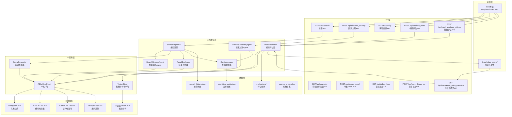
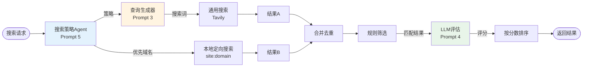
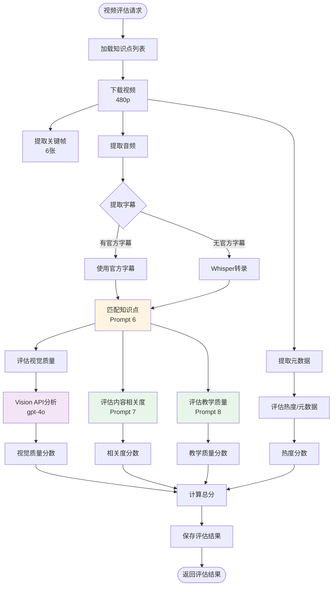

# K12 视频搜索系统 V3.2.0 - 完整 SOP 文档

## 📋 文档信息

- **版本**: V3.2.0
- **最后更新**: 2025-12-30
- **状态**: ✅ 生产就绪
- **作者**: AI Assistant

---

## 📑 目录

1. [系统概述](#1-系统概述)
2. [系统架构](#2-系统架构)
3. [完整流程图](#3-完整流程图)
4. [LLM 提示词完整清单](#4-llm-提示词完整清单)
5. [API 接口文档](#5-api-接口文档)
6. [核心组件说明](#6-核心组件说明)
7. [数据模型](#7-数据模型)
8. [使用流程](#8-使用流程)
9. [错误处理与优化](#9-错误处理与优化)
10. [部署与配置](#10-部署与配置)

---

## 1. 系统概述

### 1.1 项目目标

K12 视频搜索系统 V3.2.0 是一个**AI 驱动的多国家 K12 教育视频搜索和评估系统**，旨在为不同国家的 K12 教育体系自动搜索、评估高质量的教育视频资源。

### 1.2 核心特性

1. **AI 驱动的国家自动接入**：通过 UI 交互，AI 自动调研并配置新国家的教育体系信息
2. **智能搜索策略 Agent**：根据国家、年级、科目制定个性化的搜索策略（新增）
3. **智能搜索词生成**：根据国家、年级、学科自动生成本地语言的搜索词
4. **混合搜索策略**：通用搜索（YouTube）+ 本地定向搜索（本地视频平台）
5. **结果评估**：使用 LLM 对搜索结果进行 0-10 分评分，并提供推荐理由
6. **视频深度评估**：多维度评估视频质量（视觉质量、内容相关度、教学质量、热度）
7. **知识点匹配**：自动匹配视频到知识点，支持知识点概览展示
8. **学科交叉验证**：自动验证和补充遗漏的核心学科
9. **批量搜索**：支持"全部"选项，自动批量搜索所有年级/学科组合（并发执行）
10. **历史管理**：支持搜索历史筛选和批量导出 Excel
11. **Debug日志系统**：完整的日志记录和导出功能

### 1.3 技术栈

- **后端框架**: Flask 2.3+
- **数据验证**: Pydantic 2.0+
- **LLM API**: AI Builders API (DeepSeek, Grok-4-Fast, Gemini 2.5 Pro)
- **搜索引擎**: Tavily Search (通过 AI Builders API)
- **视觉分析**: 小豆包平台 Vision API (gpt-4o)
- **视频处理**: yt-dlp, ffmpeg-python, Whisper
- **数据处理**: Pandas 2.0+, OpenPyXL 3.1+
- **并发处理**: ThreadPoolExecutor
- **日志系统**: Python logging + 自定义日志工具

---

## 2. 系统架构

### 2.1 整体架构图



---

## 3. 完整流程图

### 3.1 主流程图

```mermaid
flowchart TB
    Start([用户访问系统]) --> LoadPage[加载页面]
    LoadPage --> LoadCountries[加载国家列表]
    LoadCountries --> SelectCountry{选择国家}
    
    SelectCountry -->|国家不存在| DiscoverCountry[国家发现流程]
    SelectCountry -->|国家存在| SelectGrade[选择年级/学科]
    
    DiscoverCountry --> SearchInfo[搜索教育体系信息]
    SearchInfo --> ExtractInfo[LLM提取信息<br/>Prompt 1]
    ExtractInfo --> VerifySubjects[学科交叉验证<br/>Prompt 2]
    VerifySubjects --> SaveConfig[保存配置]
    SaveConfig --> SelectGrade
    
    SelectGrade --> Search[发起搜索]
    
    Search --> GenerateStrategy[生成搜索策略<br/>Prompt 5]
    GenerateStrategy --> GenerateQuery[生成搜索词<br/>Prompt 3]
    GenerateQuery --> GeneralSearch[通用搜索<br/>YouTube等]
    GenerateQuery --> LocalSearch[本地定向搜索<br/>site:domain]
    
    GeneralSearch --> MergeResults[合并去重]
    LocalSearch --> MergeResults
    
    MergeResults --> RuleFilter[规则筛选]
    RuleFilter --> LLMScore[LLM评分<br/>Prompt 4]
    LLMScore --> DisplayResults[显示结果]
    
    DisplayResults --> UserAction{用户操作}
    UserAction -->|导出| ExportExcel[导出Excel]
    UserAction -->|评估| EvaluateVideo[视频深度评估]
    UserAction -->|查看概览| KnowledgeOverview[知识点概览]
    
    EvaluateVideo --> DownloadVideo[下载视频]
    DownloadVideo --> ExtractData[提取元数据/关键帧/字幕]
    ExtractData --> MatchKP[匹配知识点<br/>Prompt 6]
    MatchKP --> EvalVisual[评估视觉质量<br/>Vision API]
    EvalVisual --> EvalRelevance[评估内容相关度<br/>Prompt 7]
    EvalRelevance --> EvalPedagogy[评估教学质量<br/>Prompt 8]
    EvalPedagogy --> EvalMetadata[评估热度/元数据]
    EvalMetadata --> ShowEvalResult[显示评估结果]
    
    KnowledgeOverview --> FilterKP[筛选知识点]
    FilterKP --> ShowKP[显示知识点统计]
    ShowKP --> ShowVideos[显示视频柱状图]
    ShowVideos --> ShowDetail[显示视频详情]
    
    style ExtractInfo fill:#fff4e1
    style VerifySubjects fill:#e8f5e9
    style GenerateStrategy fill:#e3f2fd
    style GenerateQuery fill:#fff4e1
    style LLMScore fill:#e8f5e9
    style MatchKP fill:#fff4e1
    style EvalRelevance fill:#e8f5e9
    style EvalPedagogy fill:#e8f5e9
    style EvalVisual fill:#f3e5f5
```



### 3.2 搜索流程详细图



### 3.3 视频评估流程详细图



---

## 4. LLM 提示词完整清单

### 4.1 提示词总览表

| 序号 | 提示词名称 | 使用场景 | 文件位置 | LLM 模型 | Temperature | Max Tokens | 返回格式 | 禁用工具 |
|------|-----------|---------|---------|----------|-------------|------------|----------|---------|
| 1 | 国家信息提取 | 从搜索结果提取国家教育体系信息 | `discovery_agent.py` | Gemini 2.5 Pro | 0.2 | 4000 | JSON 对象 | ❌ |
| 2 | 学科交叉验证 | 验证和补充遗漏的核心学科 | `discovery_agent.py` | DeepSeek | 0.2 | 1000 | JSON 数组 | ✅ |
| 3 | 搜索词生成 | 根据国家/年级/学科生成搜索词 | `search_engine_v2.py` | DeepSeek | 0.2 | 50 | 纯文本 | ✅ |
| 4 | 结果评估 | 对搜索结果评分和推荐 | `search_engine_v2.py` | DeepSeek | 0.3 | 1500 | JSON 数组 | ✅ |
| 5 | 搜索策略生成 | 制定个性化搜索策略 | `search_strategy_agent.py` | Grok-4-Fast | 0.2 | 500 | JSON 对象 | ✅ |
| 6 | 知识点匹配 | 匹配视频到知识点 | `core/video_evaluator.py` | DeepSeek | 0.3 | 500 | JSON 对象 | ✅ |
| 7 | 内容相关度评估 | 评估视频内容与知识点相关度 | `core/video_evaluator.py` | Grok-4-Fast | 0.1 | 300 | JSON 对象 | ✅ |
| 8 | 教学质量评估 | 评估视频教学质量 | `core/video_evaluator.py` | Grok-4-Fast | 0.1 | 300 | JSON 对象 | ✅ |
| 9 | 视觉质量评估 | 评估视频视觉设计质量 | `core/video_evaluator.py` | gpt-4o (Vision) | 0.3 | 500 | JSON 对象 | ✅ |

---

### 4.2 提示词 1: 国家信息提取（Country Profile Extraction）

**文件位置**: `discovery_agent.py` (第 115-192 行)

**用途**: 从 Tavily 搜索结果中提取国家 K12 教育体系的结构化信息

**模型**: Gemini 2.5 Pro

**参数配置**:
- `temperature`: 0.2
- `max_tokens`: 4000
- `tool_choice`: 默认（允许工具调用）

**调用方法**: `client.call_gemini()`

#### System Prompt

```
你是一个教育体系分析专家。你的任务是分析搜索结果，提取指定国家的 K12 教育体系信息。

**关键要求**：
1. **年级表达必须使用当地语言**：例如印尼是 "Kelas 1-12"，菲律宾是 "Kindergarten, Grade 1-12"，日本是 "小学1年生-6年生, 中学1年生-3年生"
2. **学科名称必须使用当地语言**：例如印尼是 "Matematika, IPA, IPS"，菲律宾是 "Math, Science, Filipino, Araling Panlipunan"，日本是 "国語, 算数, 理科, 社会"
3. **语言代码**：使用 ISO 639-1 标准（如：id, en, ja, fil, ms）
4. **国家代码**：使用 ISO 3166-1 alpha-2 标准（如：ID, PH, JP, MY, SG）

请仔细分析搜索结果，提取准确的信息。
```

#### User Prompt

```
请分析以下关于 {country_name} 的 K12 教育体系搜索结果，提取以下信息：

**需要提取的信息**：
1. **国家代码**（ISO 3166-1 alpha-2，如：ID, PH, JP）
2. **国家名称**（英文标准名称）
3. **国家中文名称**（中文标准名称，如：菲律宾、日本、印尼）
4. **主要语言代码**（ISO 639-1，如：id, en, ja）
5. **年级表达列表**（每个年级包含当地语言名称和中文名称）
6. **核心学科列表**（每个学科包含当地语言名称和中文名称）
7. **EdTech 域名白名单**（该国的在线教育平台域名，包括两类）：
   a. **EdTech 平台**：如 Khan Academy, Ruangguru, Zenius, Coursera 等在线教育平台
   b. **本地视频托管平台**：如 Rutube（俄罗斯）, Bilibili（中国）, Vidio（印尼）, Dailymotion（法国）等本地视频平台
8. **额外说明**（如有）

**搜索结果**：
{search_context}

**重要**：
- 年级和学科名称必须使用**当地语言**，同时提供对应的中文翻译
- 如果搜索结果中没有明确信息，请基于该国的教育体系常识进行合理推断
- 年级列表应该覆盖 K12 的所有年级（通常是 12-13 个年级）
- 学科列表应该包含该国的核心学科（至少 5-8 个）
- **域名提取**：必须同时提取 EdTech 平台和本地视频托管平台两类域名，确保覆盖该国的主要在线教育资源平台

**重要**：请只返回有效的 JSON 对象，不要包含任何其他文本、解释或 markdown 标记。直接返回 JSON，格式如下：

{
    "country_code": "PH",
    "country_name": "Philippines",
    "country_name_zh": "菲律宾",
    "language_code": "en",
    "grades": [
        {"local_name": "Kindergarten", "zh_name": "幼儿园"},
        {"local_name": "Grade 1", "zh_name": "一年级"},
        ...
    ],
    "subjects": [
        {"local_name": "Math", "zh_name": "数学"},
        {"local_name": "Science", "zh_name": "科学"},
        ...
    ],
    "domains": [
        "deped.gov.ph",
        "khanacademy.org",
        "rutube.ru",
        "bilibili.com"
    ],
    "notes": "菲律宾使用英语和菲律宾语双语教学"
}

**注意**：
- language_code 必须是单个字符串（如 "en"），不是数组
- grades 和 subjects 必须是对象数组，每个对象包含 local_name 和 zh_name
- 直接返回 JSON，不要添加任何前缀或后缀
```

---

### 4.3 提示词 2: 学科交叉验证（Subject Cross-Verification）

**文件位置**: `discovery_agent.py` (第 264-307 行)

**用途**: 审查已提取的学科列表，找出遗漏的核心学科

**模型**: DeepSeek

**参数配置**:
- `temperature`: 0.2
- `max_tokens`: 1000
- `tool_choice`: 禁用（不设置 tool_choice 和 tools）

**调用方法**: `client.call_llm()`

#### System Prompt

```
你是一个{country_name}的 K12 教育体系专家。你的任务是审查已提取的学科列表，对比该国官方 K12 课程大纲，找出被遗漏的核心学科（Core Subjects）。

**重要原则**：
1. 只识别**核心学科**（Core Subjects），这些学科通常是：
   - 语言类：母语、外语、地方语言
   - 数学类：数学、算术
   - 科学类：自然科学、物理、化学、生物
   - 社会类：历史、地理、社会研究、公民教育
   - 艺术类：音乐、美术、艺术
   - 体育类：体育、健康
   - 技术类：信息技术、技术教育
   - 价值观类：道德教育、宗教教育

2. **不要**包括选修课、兴趣班、课外活动等非核心学科

3. 如果当前列表已经完整，返回空数组

4. 每个遗漏的学科必须包含：
   - local_name：使用该国当地语言的学科名称
   - zh_name：对应的中文名称

5. 只返回 JSON 数组，不要其他文字
```

#### User Prompt

```
请审查以下关于 {country_name} 的 K12 教育体系已提取的学科列表：

**当前学科列表**：
{current_subjects_list}

**任务**：
对比 {country_name} 的官方 K12 课程大纲，找出被遗漏的核心学科。

**要求**：
1. 只识别核心学科（Core Subjects），不包括选修课
2. 如果列表已经完整，返回空数组 []
3. 每个遗漏的学科必须使用当地语言名称，并提供中文翻译
4. 只返回 JSON 数组格式，不要其他文字

**返回格式**（JSON 数组）：
[
    {"local_name": "学科当地语言名称", "zh_name": "学科中文名称"},
    {"local_name": "另一个学科", "zh_name": "另一个学科中文"}
]

如果列表完整，返回：[]
```

---

### 4.4 提示词 3: 搜索词生成（Query Generation）

**文件位置**: `search_engine_v2.py` (第 402-427 行)

**用途**: 根据国家、年级、学科生成本地语言的搜索词

**模型**: DeepSeek

**参数配置**:
- `temperature`: 0.2
- `max_tokens`: 50
- `tool_choice`: 禁用（不设置 tool_choice 和 tools）

**调用方法**: `client.call_llm()`

#### System Prompt

```
你是一个专业的搜索词生成专家，专门为教育视频资源生成高质量的搜索词。
你的任务是根据国家、年级、学期、学科信息，生成使用{language}语言的搜索词。

重要原则：
1. 使用目标国家的官方语言或常用语言（{language}）
2. 使用该国家教育系统中常用的术语
3. 优先使用"playlist"、"课程"、"教学视频"等关键词
4. 搜索词应该简洁、准确、有效（通常5-10个词）
5. **只返回搜索词本身，不要任何解释、说明或其他文字**
6. **不要使用中文，只使用{language}语言**
```

#### User Prompt

```
请为以下教育视频搜索生成搜索词：

国家：{request.country}
年级：{request.grade}
学期：{request.semester or "不指定"}
学科：{request.subject}
语言：{language}

要求：
- 使用{language}语言
- 包含学科和年级信息
- 优先包含"playlist"或"课程"等关键词
- 搜索词长度：5-10个词

**重要：只返回搜索词本身，不要任何其他文字、解释或说明。**
```

---

### 4.5 提示词 4: 结果评估（Result Evaluation）

**文件位置**: `search_engine_v2.py` (第 568-583 行)

**用途**: 对搜索结果进行评分和推荐

**模型**: DeepSeek

**参数配置**:
- `temperature`: 0.3
- `max_tokens`: 1500
- `tool_choice`: 禁用（不设置 tool_choice 和 tools）

**调用方法**: `client.call_llm()`

#### System Prompt

```
你是一个教育内容质量评估专家。你的任务是对搜索结果进行评分和推荐。

**评分标准（0-10分）**：
- 9-10分：内容高度相关，来源权威，标题明确，摘要显示高质量
- 7-8分：内容相关，来源可靠，标题清晰
- 5-6分：内容部分相关，但可能不够完整或权威
- 3-4分：内容相关性较低
- 0-2分：内容不相关或质量很低

**输出格式**：返回 JSON 数组，每个元素包含 score（0-10）和 recommendation_reason（推荐理由，50-100字）
```

#### User Prompt

```
请评估以下搜索结果，针对 {country} 的 {grade} {subject} 教学资源：

{results_context}

请返回 JSON 数组格式，每个结果一个对象，包含 score 和 recommendation_reason 字段。
```

---

### 4.6 提示词 5: 搜索策略生成（Search Strategy Generation）

**文件位置**: `search_strategy_agent.py` (第 95-132 行)

**用途**: 根据国家、年级、科目制定个性化的搜索策略

**模型**: Grok-4-Fast

**参数配置**:
- `temperature`: 0.2
- `max_tokens`: 500
- `tool_choice`: 禁用（不设置 tool_choice 和 tools）

**调用方法**: `client.call_llm()`

#### System Prompt

```
你是一个专业的搜索策略专家。你的任务是根据国家、年级、科目制定个性化的搜索策略。

**关键要求**：
1. 只能返回JSON格式，不能返回任何其他文本、解释、Markdown格式或代码块标记
2. 根据国家特点选择合适的搜索平台和搜索引擎
3. 对于中国，必须包含B站（bilibili.com）等中文平台，并使用中文搜索引擎
4. 对于其他国家，根据其常用平台和语言选择合适的策略

**输出格式**：
{
  "search_language": "语言代码（如：zh, en, id）",
  "use_chinese_search_engine": true/false,
  "platforms": ["平台列表，如：bilibili.com, youtube.com"],
  "search_queries": ["搜索词变体1", "搜索词变体2"],
  "priority_domains": ["优先搜索的域名列表"],
  "notes": "策略说明"
}

**重要**：直接返回JSON，不要添加任何前缀或后缀。
```

#### User Prompt

```
请为以下搜索请求制定搜索策略：

国家: {country} ({country_name})
语言代码: {language_code}
年级: {grade}
学科: {subject}
学期: {semester or '不指定'}

现有域名列表: {existing_domains}

**要求**：
1. 确定搜索语言（应该使用 {language_code}）
2. 如果是中国（CN）且学科是中文内容，必须设置 use_chinese_search_engine=true，并包含 bilibili.com
3. 根据国家特点选择合适的平台（如：中国用B站，印尼用YouTube和本地平台）
4. 生成2-3个搜索词变体（使用本地语言）
5. 确定优先搜索的域名（最多5个）

请返回JSON格式的策略：
```

---

### 4.7 提示词 6: 知识点匹配（Knowledge Point Matching）

**文件位置**: `core/video_evaluator.py` (第 110-132 行)

**用途**: 根据视频内容，从知识点列表中选择最相关的一个知识点

**模型**: DeepSeek

**参数配置**:
- `temperature`: 0.3
- `max_tokens`: 500
- `tool_choice`: 禁用（不设置 tool_choice 和 tools）

**调用方法**: `client.call_llm()`

#### System Prompt

```
你是一个教育内容匹配专家。你的任务是根据视频内容，从给定的知识点列表中选择最相关的一个知识点。

**匹配标准**：
1. 视频内容是否直接讲解该知识点？
2. 视频标题和描述是否与该知识点相关？
3. 视频内容是否覆盖了该知识点的学习目标？

请返回最匹配的知识点ID，如果没有明显匹配的，返回null。
```

#### User Prompt

```
请根据以下视频信息，从知识点列表中选择最相关的一个知识点。

**视频信息**：
{video_info}

**知识点列表**：
{knowledge_points_summary}

**要求**：
1. 仔细分析视频内容与每个知识点的相关性
2. 选择最匹配的知识点（如果都不匹配，返回null）
3. 只返回知识点的ID，格式：{"matched_knowledge_point_id": "MAT-3-4-BIL-01"} 或 {"matched_knowledge_point_id": null}

请以JSON格式返回：
```

---

### 4.8 提示词 7: 内容相关度评估（Content Relevance Evaluation）

**文件位置**: `core/video_evaluator.py` (第 686-711 行)

**用途**: 评估视频内容与学习目标的匹配度

**模型**: Grok-4-Fast

**参数配置**:
- `temperature`: 0.1
- `max_tokens`: 300
- `tool_choice`: 禁用（不设置 tool_choice 和 tools）

**调用方法**: `client.call_llm()`

#### System Prompt

```
你是一个JSON输出机器。你的唯一任务是返回JSON格式的评估结果。

**严格规则**：
1. 只能返回JSON对象，格式：{"score": 数字, "details": "字符串"}
2. 禁止返回任何其他文本、解释、Markdown、代码块标记
3. 禁止在JSON前后添加任何文字
4. 如果违反规则，输出将被视为无效

**评估标准**：
1. 视频内容是否直接讲解目标知识点？
2. 是否覆盖了学习目标中提到的所有关键概念？
3. 是否有无关内容或偏离主题？
4. 内容深度是否适合目标年级？

**输出格式示例**：
{"score": 8.5, "details": "评估理由"}
```

#### User Prompt

```
{"score": 8.5, "details": "评估理由"}

评估视频内容与学习目标的匹配度。

学习目标：{learning_objective}
知识点主题：{topic_title}
视频字幕（前2000字符）：{transcript[:2000]}

**重要**：只返回JSON对象，不要添加任何解释文字。格式：{"score": 数字, "details": "字符串"}
```

---

### 4.9 提示词 8: 教学质量评估（Pedagogy Quality Evaluation）

**文件位置**: `core/video_evaluator.py` (第 775-797 行)

**用途**: 评估教学视频的教学质量

**模型**: Grok-4-Fast

**参数配置**:
- `temperature`: 0.1
- `max_tokens`: 300
- `tool_choice`: 禁用（不设置 tool_choice 和 tools）

**调用方法**: `client.call_llm()`

#### System Prompt

```
你是一个JSON输出机器。你的唯一任务是返回JSON格式的评估结果。

**严格规则**：
1. 只能返回JSON对象，格式：{"score": 数字, "details": "字符串"}
2. 禁止返回任何其他文本、解释、Markdown、代码块标记
3. 禁止在JSON前后添加任何文字
4. 如果违反规则，输出将被视为无效

**评估维度**：
1. 讲解逻辑：是否有清晰的引入->概念->例子->总结结构？
2. 语速：是否适合目标学生？
3. 引导性提问：是否有适当的提问？
4. 重点强调：是否突出了关键概念？
5. 互动性：是否有适当的互动元素？

**输出格式示例**：
{"score": 7.5, "details": "评估理由"}
```

#### User Prompt

```
{"score": 7.5, "details": "评估理由"}

评估教学视频的教学质量。

视频字幕（前2000字符）：{transcript[:2000]}

**重要**：只返回JSON对象，不要添加任何解释文字。格式：{"score": 数字, "details": "字符串"}
```

---

### 4.10 提示词 9: 视觉质量评估（Visual Quality Evaluation）

**文件位置**: `core/video_evaluator.py` (第 467-494 行)

**用途**: 评估教学视频的视觉设计质量

**模型**: gpt-4o (Vision API)

**参数配置**:
- `temperature`: 0.3
- `max_tokens`: 500
- `tool_choice`: 禁用（不设置 tool_choice 和 tools）

**调用方法**: `vision_client.analyze_images()`

#### System Prompt

```
你是一个教育视频质量评估专家，专门评估教学可视化的设计质量。

**重要说明**：
我将提供视频的截图。请注意，这些截图来自低分辨率版本，**请忽略压缩噪点和像素模糊**。
请专注于评估**教学可视化的设计质量**：

1. **板书/PPT排版**：是否拥挤？是否清晰易读？
2. **字体大小**：在移动端是否易读？
3. **视觉辅助**：是否使用了图表、动画等辅助理解？
4. **教师位置**：老师是否一直遮挡板书？
5. **色彩对比**：文字与背景对比度是否足够？
6. **内容组织**：信息层次是否清晰？

请给出0-10分的评分，并提供简短的评估理由。
```

#### User Prompt

```
请分析以下教学视频的关键帧（共{len(frames_paths)}张），评估其教学可视化设计质量。

**评估要求**：
1. 忽略低分辨率造成的像素模糊
2. 专注于评估教学设计的质量
3. 给出0-10分的评分
4. 提供简短的评估理由

请以JSON格式返回：
{
    "score": 7.5,
    "details": "板书清晰，但配色单调，缺少图表辅助"
}
```

---

## 5. API 接口文档

### 5.1 搜索接口

**端点**: `POST /api/search`

**请求体**:
```json
{
  "country": "CN",
  "grade": "初二",
  "subject": "地理",
  "semester": null,
  "language": null
}
```

**响应格式**:
```json
{
  "success": true,
  "query": "地理 初二 教学视频",
  "results": [
    {
      "title": "视频标题",
      "url": "https://...",
      "snippet": "视频摘要",
      "score": 8.5,
      "recommendation_reason": "推荐理由",
      "source": "规则-YouTube"
    }
  ],
  "total_count": 20,
  "playlist_count": 5,
  "video_count": 15
}
```

### 5.2 国家发现接口

**端点**: `POST /api/discover_country`

**请求体**:
```json
{
  "country_name": "中国"
}
```

**响应格式**:
```json
{
  "success": true,
  "profile": {
    "country_code": "CN",
    "country_name": "China",
    "country_name_zh": "中国",
    "language_code": "zh",
    "grades": [...],
    "subjects": [...],
    "domains": [...]
  }
}
```

### 5.3 视频评估接口

**端点**: `POST /api/analyze_video`

**请求体**:
```json
{
  "video_url": "https://www.youtube.com/watch?v=...",
  "output_dir": "./data/videos/analyzed",
  "knowledge_point": null,
  "search_params": {
    "country": "ID",
    "grade": "Kelas 2",
    "subject": "Matematika"
  }
}
```

**响应格式**:
```json
{
  "success": true,
  "evaluation": {
    "overall_score": 7.3,
    "visual_quality": {...},
    "relevance": {...},
    "pedagogy": {...},
    "metadata": {...}
  },
  "matched_knowledge_point": {...},
  "video_metadata": {...}
}
```

---

## 6. 核心组件说明

### 6.1 SearchEngineV2

**文件**: `search_engine_v2.py`

**职责**:
- 执行混合搜索（通用搜索 + 本地定向搜索）
- 调用搜索策略Agent制定策略
- 调用查询生成器生成搜索词
- 调用结果评估器评估搜索结果

### 6.2 SearchStrategyAgent

**文件**: `search_strategy_agent.py`

**职责**:
- 根据国家、年级、科目制定个性化搜索策略
- 确定搜索语言和搜索引擎类型
- 推荐合适的平台和域名
- 生成搜索词变体

### 6.3 CountryDiscoveryAgent

**文件**: `discovery_agent.py`

**职责**:
- 搜索国家教育体系信息
- 提取结构化信息（年级、学科、域名）
- 学科交叉验证和补充

### 6.4 VideoEvaluator

**文件**: `core/video_evaluator.py`

**职责**:
- 匹配视频到知识点
- 评估视觉质量（使用Vision API）
- 评估内容相关度
- 评估教学质量
- 评估热度/元数据

---

## 7. 数据模型

### 7.1 SearchRequest

```python
class SearchRequest(BaseModel):
    country: str
    grade: str
    semester: Optional[str] = None
    subject: str
    language: Optional[str] = None
```

### 7.2 SearchResult

```python
class SearchResult(BaseModel):
    title: str
    url: str
    snippet: str = ""
    source: str = "规则"
    score: float = 0.0
    recommendation_reason: str = ""
    is_selected: bool = False
    evaluation_status: Optional[str] = None
    evaluation_result: Optional[Dict[str, Any]] = None
```

### 7.3 SearchStrategy

```python
class SearchStrategy(BaseModel):
    search_language: str
    use_chinese_search_engine: bool = False
    platforms: List[str] = []
    search_queries: List[str] = []
    priority_domains: List[str] = []
    notes: str = ""
```

---

## 8. 使用流程

### 8.1 搜索流程

1. 用户选择国家、年级、学科
2. 系统调用搜索策略Agent制定策略
3. 系统生成搜索词
4. 执行通用搜索和本地定向搜索
5. 合并去重
6. 规则筛选
7. LLM评分
8. 返回结果

### 8.2 视频评估流程

1. 用户点击"AI 深度评估"
2. 系统下载视频（480p）
3. 提取元数据、关键帧、音频
4. 提取字幕（优先官方字幕，否则Whisper转录）
5. 匹配知识点
6. 多维度评估（视觉、相关度、教学、热度）
7. 计算总分
8. 保存评估结果
9. 返回评估结果

---

## 9. 错误处理与优化

### 9.1 JSON解析容错

- 使用 `json_utils.py` 中的工具函数
- 多层容错机制（直接解析 → ast.literal_eval → 正则提取）

### 9.2 LLM输出规范化

- 强化Prompt要求只返回JSON
- 降低temperature提高确定性
- 减少max_tokens强制简洁

### 9.3 视频去重

- 每个视频URL在整个页面中只显示一次
- 保留最新的一条评价记录

---

## 10. 部署与配置

### 10.1 环境变量

```bash
AI_BUILDER_TOKEN=your_token_here
```

### 10.2 依赖安装

```bash
pip install flask pydantic requests pandas openpyxl yt-dlp ffmpeg-python openai-whisper
```

### 10.3 启动服务

```bash
python3 web_app.py
```

---

**文档版本**: V3.2.0  
**最后更新**: 2025-12-30  
**状态**: ✅ 完整


