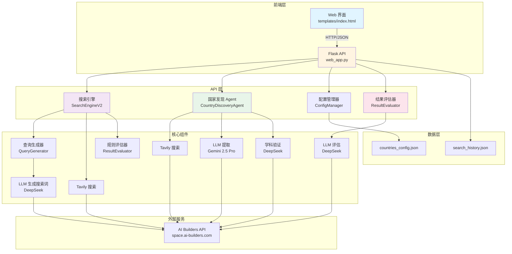
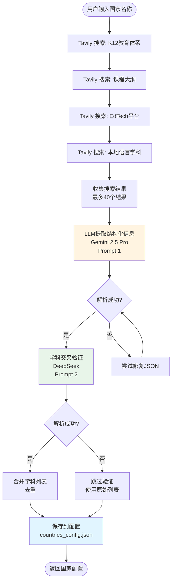
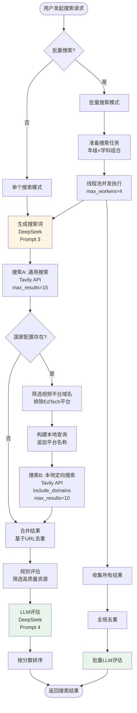
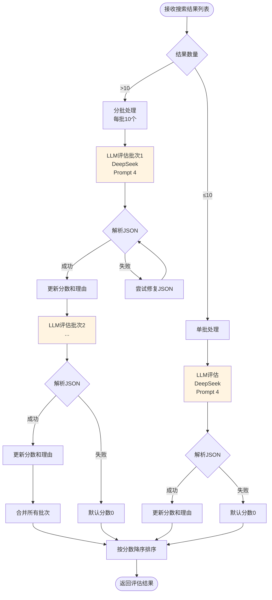
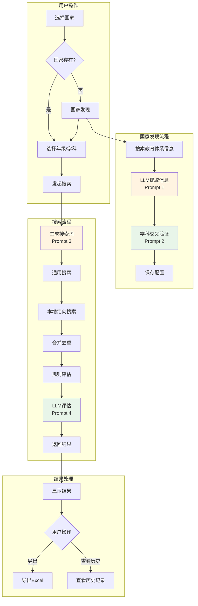

# K12 视频搜索系统 V3 - 完整 SOP 文档（含流程图和提示词）

## 📋 文档信息

- **版本**: V3.1.0
- **最后更新**: 2025-12-29
- **作者**: AI Assistant
- **状态**: ✅ 生产就绪

---

## 📑 目录

1. [系统概述](#1-系统概述)
2. [系统架构](#2-系统架构)
3. [完整流程图](#3-完整流程图)
4. [LLM 提示词完整清单](#4-llm-提示词完整清单)
5. [核心组件说明](#5-核心组件说明)
6. [API 接口文档](#6-api-接口文档)
7. [数据模型](#7-数据模型)
8. [使用流程](#8-使用流程)
9. [错误处理与优化](#9-错误处理与优化)
10. [部署与配置](#10-部署与配置)

---

## 1. 系统概述

### 1.1 项目目标

K12 视频搜索系统 V3 是一个**AI 驱动的国家自动接入系统**，旨在为不同国家的 K12 教育体系自动搜索高质量的教育视频资源。

### 1.2 核心特性

1. **AI 驱动的国家自动接入**：通过 UI 交互，AI 自动调研并配置新国家的教育体系信息
2. **智能搜索词生成**：根据国家、年级、学科自动生成本地语言的搜索词
3. **混合搜索策略**：通用搜索（YouTube）+ 本地定向搜索（本地视频平台）
4. **结果评估**：使用 LLM 对搜索结果进行 0-10 分评分，并提供推荐理由
5. **学科交叉验证**：自动验证和补充遗漏的核心学科
6. **批量搜索**：支持"全部"选项，自动批量搜索所有年级/学科组合（并发执行）
7. **历史管理**：支持搜索历史筛选和批量导出 Excel

### 1.3 技术栈

- **后端框架**: Flask 2.3+
- **数据验证**: Pydantic 2.0+
- **LLM API**: AI Builders API (DeepSeek, Gemini 2.5 Pro)
- **搜索引擎**: Tavily Search (通过 AI Builders API)
- **数据处理**: Pandas 2.0+, OpenPyXL 3.1+
- **并发处理**: ThreadPoolExecutor

---

## 2. 系统架构

### 2.1 整体架构图



---

## 3. 完整流程图

### 3.1 国家发现流程（Country Discovery）



### 3.2 搜索流程（Search Flow）



### 3.3 结果评估流程（Result Evaluation）



### 3.4 完整系统流程图



---

## 4. LLM 提示词完整清单

### 4.1 提示词总览表

| 序号 | 提示词名称 | 使用场景 | LLM 模型 | Temperature | Max Tokens | 返回格式 | 禁用工具 |
|------|-----------|---------|----------|-------------|------------|----------|---------|
| 1 | 国家信息提取 | 从搜索结果提取国家教育体系信息 | Gemini 2.5 Pro | 0.2 | 4000 | JSON 对象 | ❌ |
| 2 | 学科交叉验证 | 验证和补充遗漏的核心学科 | DeepSeek | 0.2 | 1000 | JSON 数组 | ✅ |
| 3 | 搜索词生成 | 根据国家/年级/学科生成搜索词 | DeepSeek | 0.3 | 100 | 纯文本 | ✅ |
| 4 | 结果评估 | 对搜索结果评分和推荐 | DeepSeek | 0.3 | 2000 | JSON 数组 | ✅ |

---

### 4.2 提示词 1: 国家信息提取（Country Profile Extraction）

**文件位置**: `discovery_agent.py` (第 114-191 行)

**用途**: 从 Tavily 搜索结果中提取国家 K12 教育体系的结构化信息

**模型**: Gemini 2.5 Pro

**参数配置**:
- `temperature`: 0.2
- `max_tokens`: 4000
- `tool_choice`: 默认（允许工具调用）

**调用方法**: `client.call_gemini()`

#### System Prompt

```
你是一个教育体系分析专家。你的任务是分析搜索结果，提取指定国家的 K12 教育体系信息。

**关键要求**：
1. **年级表达必须使用当地语言**：例如印尼是 "Kelas 1-12"，菲律宾是 "Kindergarten, Grade 1-12"，日本是 "小学1年生-6年生, 中学1年生-3年生"
2. **学科名称必须使用当地语言**：例如印尼是 "Matematika, IPA, IPS"，菲律宾是 "Math, Science, Filipino, Araling Panlipunan"，日本是 "国語, 算数, 理科, 社会"
3. **语言代码**：使用 ISO 639-1 标准（如：id, en, ja, fil, ms）
4. **国家代码**：使用 ISO 3166-1 alpha-2 标准（如：ID, PH, JP, MY, SG）

请仔细分析搜索结果，提取准确的信息。
```

#### User Prompt

```
请分析以下关于 {country_name} 的 K12 教育体系搜索结果，提取以下信息：

**需要提取的信息**：
1. **国家代码**（ISO 3166-1 alpha-2，如：ID, PH, JP）
2. **国家名称**（英文标准名称）
3. **国家中文名称**（中文标准名称，如：菲律宾、日本、印尼）
4. **主要语言代码**（ISO 639-1，如：id, en, ja）
5. **年级表达列表**（每个年级包含当地语言名称和中文名称）
6. **核心学科列表**（每个学科包含当地语言名称和中文名称）
7. **EdTech 域名白名单**（该国的在线教育平台域名，包括两类）：
   a. **EdTech 平台**：如 Khan Academy, Ruangguru, Zenius, Coursera 等在线教育平台
   b. **本地视频托管平台**：如 Rutube（俄罗斯）, Bilibili（中国）, Vidio（印尼）, Dailymotion（法国）等本地视频平台
8. **额外说明**（如有）

**搜索结果**：
{search_context}

**重要**：
- 年级和学科名称必须使用**当地语言**，同时提供对应的中文翻译
- 如果搜索结果中没有明确信息，请基于该国的教育体系常识进行合理推断
- 年级列表应该覆盖 K12 的所有年级（通常是 12-13 个年级）
- 学科列表应该包含该国的核心学科（至少 5-8 个）
- **域名提取**：必须同时提取 EdTech 平台和本地视频托管平台两类域名，确保覆盖该国的主要在线教育资源平台

**重要**：请只返回有效的 JSON 对象，不要包含任何其他文本、解释或 markdown 标记。直接返回 JSON，格式如下：

{
    "country_code": "PH",
    "country_name": "Philippines",
    "country_name_zh": "菲律宾",
    "language_code": "en",
    "grades": [
        {"local_name": "Kindergarten", "zh_name": "幼儿园"},
        {"local_name": "Grade 1", "zh_name": "一年级"},
        {"local_name": "Grade 2", "zh_name": "二年级"},
        ...
    ],
    "subjects": [
        {"local_name": "Math", "zh_name": "数学"},
        {"local_name": "Science", "zh_name": "科学"},
        ...
    ],
    "domains": [
        "deped.gov.ph",
        "khanacademy.org",
        "rutube.ru",
        "bilibili.com"
    ],
    "notes": "菲律宾使用英语和菲律宾语双语教学"
}

**注意**：
- language_code 必须是单个字符串（如 "en"），不是数组
- grades 和 subjects 必须是对象数组，每个对象包含 local_name 和 zh_name
- 直接返回 JSON，不要添加任何前缀或后缀
```

**参数说明**:
- `{country_name}`: 国家名称（英文，如 "Philippines", "Japan"）
- `{search_context}`: 搜索结果上下文（前20个结果的标题、URL、摘要）

**返回格式**:
```json
{
    "country_code": "PH",
    "country_name": "Philippines",
    "country_name_zh": "菲律宾",
    "language_code": "en",
    "grades": [
        {"local_name": "Kindergarten", "zh_name": "幼儿园"},
        ...
    ],
    "subjects": [
        {"local_name": "Math", "zh_name": "数学"},
        ...
    ],
    "domains": ["deped.gov.ph", "khanacademy.org"],
    "notes": "..."
}
```

---

### 4.3 提示词 2: 学科交叉验证（Subject Cross-Verification）

**文件位置**: `discovery_agent.py` (第 263-306 行)

**用途**: 审查已提取的学科列表，找出遗漏的核心学科

**模型**: DeepSeek

**参数配置**:
- `temperature`: 0.2
- `max_tokens`: 1000
- `tool_choice`: "none"
- `tools`: None

**调用方法**: `client.call_llm(model="deepseek")`

#### System Prompt

```
你是一个{country_name}的 K12 教育体系专家。你的任务是审查已提取的学科列表，对比该国官方 K12 课程大纲，找出被遗漏的核心学科（Core Subjects）。

**重要原则**：
1. 只识别**核心学科**（Core Subjects），这些学科通常是：
   - 语言类：母语、外语、地方语言
   - 数学类：数学、算术
   - 科学类：自然科学、物理、化学、生物
   - 社会类：历史、地理、社会研究、公民教育
   - 艺术类：音乐、美术、艺术
   - 体育类：体育、健康
   - 技术类：信息技术、技术教育
   - 价值观类：道德教育、宗教教育

2. **不要**包括选修课、兴趣班、课外活动等非核心学科

3. 如果当前列表已经完整，返回空数组

4. 每个遗漏的学科必须包含：
   - local_name：使用该国当地语言的学科名称
   - zh_name：对应的中文名称

5. 只返回 JSON 数组，不要其他文字
```

#### User Prompt

```
请审查以下关于 {country_name} 的 K12 教育体系已提取的学科列表：

**当前学科列表**：
{current_subjects_list}

**任务**：
对比 {country_name} 的官方 K12 课程大纲，找出被遗漏的核心学科。

**要求**：
1. 只识别核心学科（Core Subjects），不包括选修课
2. 如果列表已经完整，返回空数组 []
3. 每个遗漏的学科必须使用当地语言名称，并提供中文翻译
4. 只返回 JSON 数组格式，不要其他文字

**返回格式**（JSON 数组）：
[
    {"local_name": "学科当地语言名称", "zh_name": "学科中文名称"},
    {"local_name": "另一个学科", "zh_name": "另一个学科中文"}
]

如果列表完整，返回：[]
```

**参数说明**:
- `{country_name}`: 国家名称（英文）
- `{current_subjects_list}`: 当前学科列表（格式：`"学科名 (中文名)"`）

**返回格式**:
```json
[
    {"local_name": "Pendidikan Agama", "zh_name": "宗教教育"},
    {"local_name": "Seni Budaya", "zh_name": "艺术"}
]
```

**如果列表完整，返回**:
```json
[]
```

---

### 4.4 提示词 3: 搜索词生成（Query Generation）

**文件位置**: `search_engine_v2.py` (第 279-299 行)

**用途**: 根据国家、年级、学期、学科生成本地语言的搜索词

**模型**: DeepSeek（默认），降级：Gemini 2.5 Pro

**参数配置**:
- `temperature`: 0.3
- `max_tokens`: 100
- `tool_choice`: "none"
- `tools`: None

**调用方法**: `client.call_llm(model="deepseek")`

#### System Prompt

```
你是一个专业的搜索词生成专家，专门为教育视频资源生成高质量的搜索词。
你的任务是根据国家、年级、学期、学科信息，生成使用{language}语言的搜索词。

重要原则：
1. 使用目标国家的官方语言或常用语言
2. 使用该国家教育系统中常用的术语
3. 优先使用"playlist"、"课程"、"教学视频"等关键词
4. 搜索词应该简洁、准确、有效
5. 只返回搜索词，不要其他解释
```

#### User Prompt

```
请为以下教育视频搜索生成搜索词：

国家：{country}
年级：{grade}
学期：{semester or "不指定"}
学科：{subject}
语言：{language}

请生成一个简洁有效的搜索词，使用{language}语言，优先包含"playlist"或"课程"等关键词。

只返回搜索词，不要其他文字。
```

**参数说明**:
- `{language}`: 根据国家自动映射
  - ID → id (印尼语)
  - CN → zh (中文)
  - US → en (英语)
  - MY → ms (马来语)
  - SG → en (新加坡英语)
- `{country}`: 国家代码（如：ID, CN, US）
- `{grade}`: 年级（如：Kelas 1, Grade 1, 一年级）
- `{semester}`: 学期（如：1, Semester 1）或"不指定"
- `{subject}`: 学科（如：Matematika, Mathematics, 数学）

**返回格式**: 纯文本搜索词

**示例输入**:
- 国家：ID
- 年级：Kelas 3
- 学期：不指定
- 学科：Matematika
- 语言：id

**示例输出**:
```
playlist matematika kelas 3 SD kurikulum merdeka
```

---

### 4.5 提示词 4: 结果评估（Result Evaluation）

**文件位置**: `result_evaluator.py` (第 94-152 行)

**用途**: 对搜索结果进行评分（0-10分）和推荐

**模型**: DeepSeek

**参数配置**:
- `temperature`: 0.3
- `max_tokens`: 2000
- `tool_choice`: "none"
- `tools`: None

**调用方法**: `client.call_llm(model="deepseek")`

#### System Prompt

```
你是一个教育内容质量评估专家。你的任务是对搜索结果进行评分和推荐。

**重要说明**：
你只能根据提供的标题、URL 和摘要（Snippet）信息进行评估。这些信息通常不包含播放次数、具体发布日期等元数据，请基于可见信息进行合理判断。

**评分标准（0-10分）**：
1. **内容相关性**（0-4分）：内容是否与指定的国家、年级、学科匹配
   - 标题和摘要中是否包含相关关键词
   - 是否明确针对目标年级和学科
   - URL 路径是否暗示教育内容

2. **来源权威性**（0-3分）：内容来源是否可靠
   - 是否来自知名教育平台（如 Khan Academy、Ruangguru、Zenius 等）
   - 是否来自官方教育频道或机构
   - URL 域名是否可信

3. **标题匹配度**（0-3分）：标题是否清晰、专业、符合教育内容特征
   - 标题是否明确说明是课程、播放列表或系列内容
   - 是否包含年级、学科等关键信息
   - 标题是否专业、规范

**评分规则**：
- 9-10分：非常优秀，强烈推荐（高度相关 + 权威来源 + 清晰标题）
- 7-8分：良好，推荐使用（相关 + 来源可靠 + 标题清晰）
- 5-6分：一般，可以使用（基本相关，但可能缺少某些要素）
- 3-4分：较差，不推荐（相关性低或来源不可靠）
- 0-2分：很差，不建议使用（完全不相关或来源可疑）

**重要**：在推荐理由中，请明确指出你是基于提供的摘要（Snippet）信息进行评估的，不要编造不存在的播放次数或日期信息。
```

#### User Prompt

```
请评估以下搜索结果，这些结果是为 **{country}** 的 **{grade}** 年级 **{subject}** 学科搜索的。

**搜索结果**：
{results_context}

**评估要求**：
1. 为每个结果评分（0-10分），基于内容相关性、来源权威性和标题匹配度
2. 提供简短的推荐理由（1-2句话），明确指出是基于摘要信息评估的
3. **重要**：不要编造播放次数、发布日期等不存在的元数据信息
4. 如果摘要信息不足，请基于标题和 URL 进行合理推断

请以 JSON 数组格式返回结果，格式如下：
[
    {
        "index": 1,
        "score": 8.5,
        "recommendation_reason": "基于摘要判断：内容高度相关，来自知名教育平台，标题清晰明确"
    },
    {
        "index": 2,
        "score": 6.0,
        "recommendation_reason": "基于摘要判断：基本相关，但来源信息不足"
    }
]

**重要**：
- 只返回 JSON 数组，不要包含其他文本
- 推荐理由中必须包含"基于摘要判断"或类似说明
- 不要使用工具调用，直接返回 JSON 文本
```

**参数说明**:
- `{country}`: 国家代码（如：ID, PH）
- `{grade}`: 年级（如：Kelas 3, Grade 2）
- `{subject}`: 学科（如：Matematika, Mathematics）
- `{results_context}`: 搜索结果上下文（格式：`结果 {i+1}:\n标题: {title}\nURL: {url}\n摘要: {snippet[:300]}`）

**返回格式**:
```json
[
    {
        "index": 1,
        "score": 8.5,
        "recommendation_reason": "基于摘要判断：内容高度相关，来自知名教育平台，标题清晰明确"
    },
    {
        "index": 2,
        "score": 6.0,
        "recommendation_reason": "基于摘要判断：基本相关，但来源信息不足"
    }
]
```

**批量处理**: 每次最多评估 10 个结果，如果结果超过 10 个，会分批处理。

---

## 5. 核心组件说明

### 5.1 CountryDiscoveryAgent（国家发现 Agent）

**文件**: `discovery_agent.py`

**职责**: AI 驱动的国家信息调研系统

**主要方法**:
- `discover_country_profile(country_name: str) -> CountryProfile`: 调研国家教育体系信息
- `verify_and_enrich_subjects(profile: CountryProfile, country_name: str) -> CountryProfile`: 学科交叉验证

**流程**:
1. 使用 Tavily 搜索国家教育体系信息（4个查询）
2. 收集搜索结果（最多40个）
3. 使用 LLM（Gemini 2.5 Pro）提取结构化信息（Prompt 1）
4. 使用 LLM（DeepSeek）验证和补充学科（Prompt 2）
5. 保存到配置文件

### 5.2 SearchEngineV2（搜索引擎）

**文件**: `search_engine_v2.py`

**职责**: 执行教育视频搜索

**主要方法**:
- `search(request: SearchRequest) -> SearchResponse`: 执行搜索

**流程**:
1. 生成搜索词（QueryGenerator，Prompt 3）
2. 执行混合搜索：
   - 搜索A：通用搜索（Tavily，max_results=15）
   - 搜索B：本地定向搜索（如果国家配置中有域名，Tavily + include_domains，max_results=10）
3. 合并结果并去重（基于URL）
4. 规则评估（筛选高质量资源）
5. LLM评估（ResultEvaluator，Prompt 4）
6. 返回结果

### 5.3 QueryGenerator（查询生成器）

**文件**: `search_engine_v2.py`

**职责**: 使用 AI 生成本地语言的搜索词

**主要方法**:
- `generate_query(request: SearchRequest) -> str`: 生成搜索词

**流程**:
1. 确定目标语言（根据国家代码映射）
2. 构建 System Prompt 和 User Prompt（Prompt 3）
3. 调用 LLM（DeepSeek）生成搜索词
4. 清理响应（移除引号）
5. 如果失败，降级为默认搜索词

### 5.4 ResultEvaluator（结果评估器）

**文件**: `result_evaluator.py`

**职责**: 使用 LLM 对搜索结果进行评分和推荐

**主要方法**:
- `evaluate_results(results: List[SearchResult], country: str, grade: str, subject: str) -> List[SearchResult]`: 评估搜索结果

**流程**:
1. 分批处理（每批10个结果）
2. 对每批调用 LLM（DeepSeek，Prompt 4）
3. 解析 JSON 响应
4. 更新结果的 score 和 recommendation_reason
5. 按分数降序排序
6. 返回评估后的结果

### 5.5 ConfigManager（配置管理器）

**文件**: `config_manager.py`

**职责**: 管理国家配置数据

**主要方法**:
- `get_country_config(country_code: str) -> Optional[CountryConfig]`: 获取国家配置
- `update_country_config(profile: CountryProfile) -> None`: 更新国家配置
- `get_all_countries() -> List[Dict]`: 获取所有国家列表

**数据存储**: `countries_config.json`

---

## 6. API 接口文档

### 6.1 搜索 API

**端点**: `POST /api/search`

**请求体**:
```json
{
    "country": "ID",
    "grade": "Kelas 3",
    "semester": "1",
    "subject": "Matematika",
    "language": "id"
}
```

**响应**:
```json
{
    "success": true,
    "query": "playlist matematika kelas 3 SD kurikulum merdeka",
    "results": [
        {
            "title": "...",
            "url": "...",
            "snippet": "...",
            "score": 8.5,
            "recommendation_reason": "...",
            "is_selected": false
        }
    ],
    "total_count": 5,
    "playlist_count": 4,
    "video_count": 1,
    "message": "搜索成功",
    "timestamp": "2025-12-29T10:00:00"
}
```

### 6.2 国家发现 API

**端点**: `POST /api/discover_country`

**请求体**:
```json
{
    "country_name": "Philippines"
}
```

**响应**:
```json
{
    "success": true,
    "message": "成功调研国家: Philippines",
    "profile": {
        "country_code": "PH",
        "country_name": "Philippines",
        ...
    }
}
```

### 6.3 获取国家配置 API

**端点**: `GET /api/config/<country_code>`

**响应**:
```json
{
    "success": true,
    "config": {
        "country_code": "PH",
        "country_name": "Philippines",
        ...
    }
}
```

### 6.4 导出 Excel API

**端点**: `POST /api/export_excel`

**请求体**:
```json
{
    "selected_results": [...],
    "search_params": {...}
}
```

**响应**: Excel 文件（二进制流）

---

## 7. 数据模型

### 7.1 CountryProfile

```python
class CountryProfile(BaseModel):
    country_code: str
    country_name: str
    country_name_zh: str = ""
    language_code: str
    grades: List[Dict[str, str]]  # [{"local_name": "...", "zh_name": "..."}]
    subjects: List[Dict[str, str]]  # [{"local_name": "...", "zh_name": "..."}]
    domains: List[str]  # ["ruangguru.com", "vidio.com"]
    notes: str = ""
```

### 7.2 SearchRequest

```python
class SearchRequest(BaseModel):
    country: str
    grade: str
    semester: Optional[str] = None
    subject: str
    language: Optional[str] = None
```

### 7.3 SearchResult

```python
class SearchResult(BaseModel):
    title: str
    url: str
    snippet: str = ""
    source: str = "规则"
    score: float = 0.0
    recommendation_reason: str = ""
    is_selected: bool = False
```

### 7.4 SearchResponse

```python
class SearchResponse(BaseModel):
    success: bool
    query: str
    results: List[SearchResult]
    total_count: int = 0
    playlist_count: int = 0
    video_count: int = 0
    message: str = ""
    timestamp: str
```

---

## 8. 使用流程

### 8.1 添加新国家

1. 在 Web 界面输入国家名称（英文）
2. 点击"国家发现"按钮
3. 系统自动执行：
   - Tavily 搜索教育体系信息
   - LLM 提取结构化信息（Prompt 1）
   - 学科交叉验证（Prompt 2）
   - 保存配置
4. 配置自动保存到 `countries_config.json`

### 8.2 执行搜索

1. 选择国家（如果不存在，先执行国家发现）
2. 选择年级和学科
3. 点击"搜索"按钮
4. 系统自动执行：
   - 生成搜索词（Prompt 3）
   - 执行混合搜索（通用 + 本地定向）
   - 规则评估
   - LLM 评估（Prompt 4）
5. 显示结果（按分数排序）

### 8.3 批量搜索

1. 选择国家
2. 年级选择"全部"或学科选择"全部"
3. 点击"搜索"按钮
4. 系统自动：
   - 生成所有年级×学科组合
   - 使用线程池并发执行（max_workers=4）
   - 收集所有结果并去重
   - 批量 LLM 评估
5. 显示合并后的结果

---

## 9. 错误处理与优化

### 9.1 JSON 解析错误处理

**问题**: LLM 返回的 JSON 可能格式不正确（单引号、markdown 标记等）

**解决方案**:
1. 使用正则表达式提取 JSON 块
2. 移除 markdown 代码块标记（```json, ```）
3. 尝试修复单引号（替换为双引号）
4. 如果仍然失败，使用正则表达式提取关键字段

**位置**:
- `discovery_agent.py`: `_parse_llm_response()`, `_parse_missing_subjects()`
- `result_evaluator.py`: `_parse_evaluation_response()`

### 9.2 LLM 调用失败处理

**问题**: LLM API 可能返回空内容或失败

**解决方案**:
1. DeepSeek 失败时，自动降级到 Gemini 2.5 Pro
2. 如果评估失败，保留原始结果（分数为0）
3. 如果搜索词生成失败，使用默认搜索词

**位置**:
- `search_engine_v2.py`: `QueryGenerator.generate_query()`
- `result_evaluator.py`: `_evaluate_batch()`

### 9.3 并发控制

**问题**: 批量搜索时可能触发 API 速率限制

**解决方案**:
- 使用 `ThreadPoolExecutor`，限制并发数为 4
- 每个任务独立处理错误，不影响其他任务

**位置**: `web_app.py`: `_batch_search()`

---

## 10. 部署与配置

### 10.1 环境变量

创建 `.env` 文件：

```bash
AI_BUILDER_TOKEN=your_token_here
```

### 10.2 依赖安装

```bash
pip install -r requirements_v3.txt
```

### 10.3 启动应用

```bash
python3 web_app.py
```

或使用启动脚本：

```bash
./start_web_app.sh
```

### 10.4 日志文件

- **搜索系统日志**: `search_system.log`
- **Web 应用日志**: `web_app.log`

### 10.5 配置文件

- **国家配置**: `countries_config.json`
- **搜索历史**: `search_history.json`

---

## 📝 附录

### A. 提示词最佳实践

1. **明确输出格式**: 在 System Prompt 和 User Prompt 中都明确指定 JSON 格式
2. **禁用工具调用**: 对于需要纯文本输出的场景，设置 `tool_choice="none"` 和 `tools=None`
3. **温度设置**: 
   - 提取任务：0.2（更准确）
   - 生成任务：0.3（平衡创造性和准确性）
4. **错误处理**: 始终准备降级方案和默认值

### B. 模型选择建议

- **DeepSeek**: 用于搜索词生成和结果评估（成本低，速度快）
- **Gemini 2.5 Pro**: 用于复杂的信息提取任务（理解能力强）

### C. 性能优化

1. **批量处理**: 结果评估时，每批处理 10 个结果
2. **并发控制**: 批量搜索时，限制并发数为 4
3. **结果缓存**: 国家配置保存在 JSON 文件中，避免重复调研
4. **去重机制**: 基于 URL 去重，避免重复结果

---

## 📚 参考文档

- [Flask 文档](https://flask.palletsprojects.com/)
- [Pydantic 文档](https://docs.pydantic.dev/)
- [AI Builders API 文档](https://space.ai-builders.com/)
- [Tavily Search API 文档](https://tavily.com/)

---

**文档版本**: V3.1.0  
**最后更新**: 2025-12-29  
**维护者**: AI Assistant

