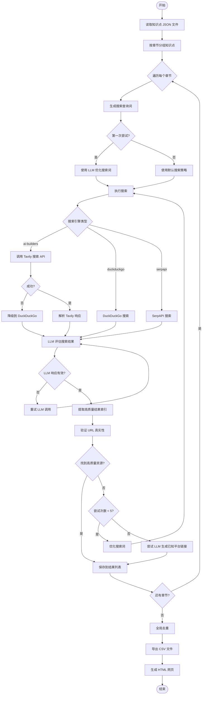
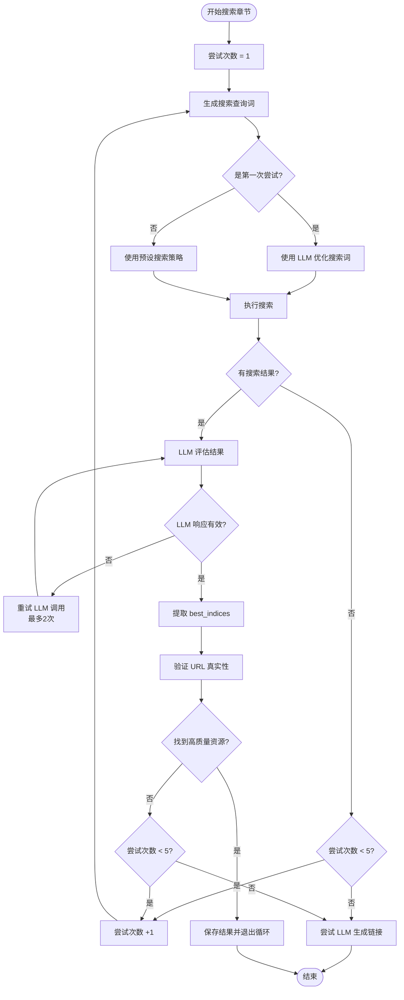
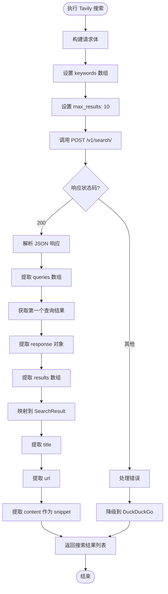
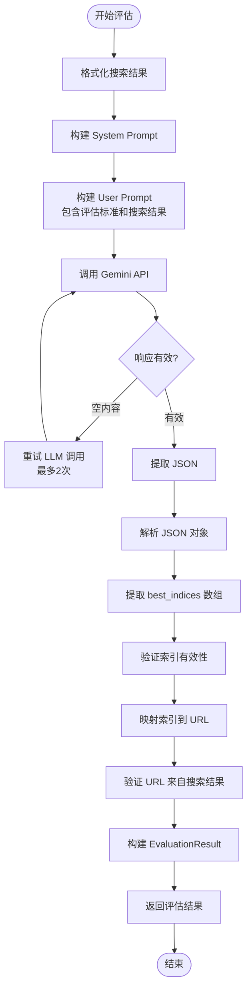

# 印尼 K12 视频课程库搜索系统 SOP 文档

## 📋 目录

1. [系统概述](#系统概述)
2. [系统架构](#系统架构)
3. [流程图](#流程图)
4. [API 接口](#api-接口)
5. [提示词设计](#提示词设计)
6. [数据模型](#数据模型)
7. [关键组件](#关键组件)
8. [使用流程](#使用流程)
9. [错误处理与优化](#错误处理与优化)

---

## 系统概述

### 目标
为印尼 K12 教育知识点自动搜索高质量的视频播放列表（Playlist），而不是单个碎片化视频。

### 核心策略
- **按章节搜索**：遍历每个 Chapter（章节），而不是每个 Topic（知识点）
- **智能搜索循环**：每个章节最多尝试 5 次"搜索-评估-修正"循环
- **质量优先**：优先选择播放列表、教育频道、EdTech 平台资源
- **全局去重**：确保最终输出的 URL 不重复

### 技术栈
- Python 3.x
- Pydantic（数据模型）
- AI Builders API（LLM 调用 + Tavily 搜索）
- Tavily Search（主要搜索引擎，为 RAG 优化）
- DuckDuckGo Search（搜索引擎，降级方案）
- Requests（HTTP 请求）

---

## 系统架构

```
┌─────────────────────────────────────────────────────────────┐
│                    SearchStrategist                          │
│                  (主搜索策略器)                               │
└───────────────┬─────────────────────────────────────────────┘
                │
        ┌───────┴───────┐
        │               │
┌───────▼──────┐  ┌─────▼──────────┐
│ QueryGenerator│  │ SearchHunter   │
│ (查询生成器)  │  │ (搜索执行器)   │
└───────┬──────┘  └─────┬──────────┘
        │               │
        │               │
┌───────▼───────────────▼──────────┐
│      ResultInspector             │
│      (结果评估器 - LLM)          │
└──────────────────────────────────┘
```

### 核心组件

1. **SearchStrategist**：主控制器，协调整个搜索流程
2. **QueryGenerator**：生成和优化搜索查询词
3. **SearchHunter**：执行实际搜索（支持 Tavily、DuckDuckGo、SerpAPI）
4. **ResultInspector**：使用 LLM 评估搜索结果质量
5. **AIBuildersClient**：AI Builders API 客户端（LLM + Tavily）

---

## 流程图

### 主流程图



### 单章节搜索循环详细流程



### Tavily 搜索执行详细流程



### LLM 评估流程



---

## API 接口

### 1. AI Builders API

#### 基础信息
- **Base URL**: `https://space.ai-builders.com/backend`
- **认证方式**: Bearer Token（从环境变量 `AI_BUILDER_TOKEN` 读取）
- **模型**: `gemini-2.5-pro`

#### 接口列表

##### 1.1 LLM 调用接口

**端点**: `POST /v1/chat/completions`

**请求头**:
```json
{
  "Authorization": "Bearer {AI_BUILDER_TOKEN}",
  "Content-Type": "application/json"
}
```

**请求体**:
```json
{
  "model": "gemini-2.5-pro",
  "messages": [
    {
      "role": "system",
      "content": "{system_prompt}"
    },
    {
      "role": "user",
      "content": "{user_prompt}"
    }
  ],
  "max_tokens": 8000,
  "temperature": 0.3
}
```

**响应格式**:
```json
{
  "id": "chatcmpl-xxx",
  "object": "chat.completion",
  "created": 1234567890,
  "model": "gemini-2.5-pro",
  "choices": [
    {
      "index": 0,
      "message": {
        "role": "assistant",
        "content": "{response_text}"
      },
      "finish_reason": "stop"
    }
  ],
  "usage": {
    "prompt_tokens": 100,
    "completion_tokens": 200,
    "total_tokens": 300
  }
}
```

##### 1.2 Tavily 搜索 API

**端点**: `POST /v1/search/`

**请求头**:
```json
{
  "Authorization": "Bearer {AI_BUILDER_TOKEN}",
  "Content-Type": "application/json"
}
```

**请求体**:
```json
{
  "keywords": ["搜索查询词"],
  "max_results": 10
}
```

**参数说明**:
- `keywords`: 字符串数组，至少包含一个关键词（必需）
- `max_results`: 整数，每个关键词返回的最大结果数（1-20，默认 6）

**响应格式**:
```json
{
  "queries": [
    {
      "keyword": "搜索查询词",
      "response": {
        "query": "搜索查询词",
        "results": [
          {
            "title": "搜索结果标题",
            "url": "https://example.com/page",
            "content": "搜索结果内容摘要...",
            "score": 0.85
          }
        ],
        "answer": null,
        "images": [],
        "response_time": 0.5,
        "request_id": "xxx"
      }
    }
  ],
  "combined_answer": null,
  "errors": null
}
```

**响应解析**:
1. 从 `queries[0].response.results` 提取搜索结果数组
2. 每个结果包含：`title`, `url`, `content`, `score`
3. `content` 字段包含详细内容，优先作为 `snippet` 使用

### 2. DuckDuckGo Search API（降级方案）

#### 使用方式
- **库**: `duckduckgo-search` (Python)
- **方法**: `DDGS().text()`
- **参数**:
  - `query`: 搜索查询词
  - `max_results`: 最大结果数（默认 10）
  - `region`: 地区（'id' 表示印尼）
  - `safesearch`: 安全搜索级别（'moderate'）

**返回格式**:
```python
[
  {
    "title": "标题",
    "href": "URL",
    "body": "摘要"
  }
]
```

### 3. SerpAPI（可选）

#### 接口
```
GET https://serpapi.com/search
```

**参数**:
- `q`: 搜索查询词
- `api_key`: SerpAPI 密钥
- `engine`: "google"
- `gl`: "id"（印尼地区）
- `num`: 结果数量

---

## 提示词设计

### 提示词总览表

| 序号 | 提示词名称 | 使用场景 | LLM 模型 | Temperature | Max Tokens | 返回格式 |
|------|-----------|---------|----------|-------------|------------|----------|
| 1 | 查询生成优化 | 第一次尝试时优化搜索词 | gemini-2.5-pro | 0.3 | 500 | JSON 数组 |
| 2 | 结果评估 | 评估搜索结果质量 | gemini-2.5-pro | 0.2 | 2000 | JSON 对象 |
| 3 | LLM 生成链接 | 补充策略：生成已知平台链接 | gemini-2.5-pro | 0.3 | 1000 | JSON 对象 |

---

### 1. 查询生成提示词（LLM 优化搜索词）

**使用场景**: 第一次尝试时，使用 LLM 生成优化的搜索查询词

**完整提示词**:
```
请为以下章节生成3个最佳的印尼语搜索查询词，用于在 YouTube 和印尼教育平台（如 Ruangguru, Quipper, Zenius, Pahamify）上搜索数学教学视频。

年级：{grade_level}（小学1-2年级）
学科：{subject}
章节：{chapter_title}

要求：
1. 使用简单、常用的印尼语关键词
2. 适合小学1-2年级学生的内容
3. 优先包含 "playlist"、"materi lengkap"、"video pembelajaran lengkap"、"full course" 等关键词
4. 每个查询词不超过10个单词
5. 确保搜索词能匹配到完整的播放列表或课程合集

请只返回一个 JSON 数组，包含3个搜索词字符串，不要其他文字：
["搜索词1", "搜索词2", "搜索词3"]
```

**参数**:
- `max_tokens`: 500
- `temperature`: 0.3

**示例输入**:
```
年级：Fase A (Kelas 1-2)（小学1-2年级）
学科：Matematika
章节：Bilangan
```

**示例输出**:
```json
["playlist matematika kelas 1 bilangan lengkap", "video pembelajaran lengkap matematika kelas 1 bilangan", "materi lengkap matematika kelas 1 bilangan"]
```

---

### 2. 结果评估提示词（核心提示词）

**使用场景**: 评估搜索结果，判断是否有高质量的视频资源

**System Prompt**:
```
你是印尼 K12 教育视频资源评估专家，专门为小学1-2年级（Fase A）寻找数学教学视频资源。
你的任务是识别高质量的、适合小学生的数学教学视频资源，包括播放列表、课程合集、教育频道等。
```

**User Prompt**:
```
请评估以下搜索结果，找出适合印尼小学1-2年级（Fase A）数学教学的视频资源。

**目标信息：**
- 年级：{grade_level}（小学1-2年级）
- 学科：{subject}（数学）
- 章节：{chapter_title}

**评估标准（按优先级，请宽松评估）：**
1. ✅ **最优先**：YouTube 播放列表（URL 包含 "playlist" 或 "list="）
2. ✅ **优先**：YouTube 频道页面（包含 "channel" 或 "c/" 或 "@"），特别是教育频道
3. ✅ **优先**：EdTech 网站（ruangguru.com, quipper.com, zenius.net, pahamify.com, kelaspintar.id 等）的任何相关页面
4. ✅ **优先**：YouTube 视频页面（youtube.com/watch），如果标题和描述显示是数学教学视频
5. ✅ **可接受**：任何包含数学教学内容的视频资源页面
6. ✅ **可接受**：教育博客、教学资源网站的相关页面
7. ❌ **排除**：纯 PDF 文档链接、试卷下载网站
8. ❌ **排除**：明显不相关的内容（如娱乐、新闻等）

**重要提示：**
- 对于小学1-2年级，内容应该基础、简单、有趣
- 印尼语教学视频优先
- 如果找到相关资源，即使不是完美的播放列表，也可以选择

**搜索结果：**
{results_text}

**请以 JSON 格式返回评估结果：**
{
    "is_good_batch": true/false,  // 是否有可用的视频资源？
    "best_indices": [1, 3, 5], // 高质量结果的索引（从1开始，最多5个），必须严格对应上面搜索结果中的索引
    "feedback": "评估反馈和建议"
}

**重要**：
1. best_indices 必须是上面搜索结果中实际存在的索引（1, 2, 3...）
2. 不要生成或编造 URL，只能从上面提供的搜索结果中选择
3. 如果找到3个以上相关资源，选择最相关的3-5个
4. 只返回 JSON，不要包含任何其他文字说明或 markdown 代码块标记
```

**参数**:
- `max_tokens`: 2000
- `temperature`: 0.2

**响应格式**:
```json
{
  "is_good_batch": true,
  "best_indices": [1, 3, 5],
  "feedback": "找到了3个高质量资源：1个 YouTube 播放列表和2个教育平台页面，都包含适合小学1-2年级的数学教学内容。"
}
```

**results_text 格式示例**:
```
结果 1:
标题: SMP Kelas 7 - Bilangan Bulat
URL: https://www.youtube.com/playlist?list=PL8RYU-tvzS5hoQOvt7CIeRD-4nyF5T5sD
内容: Mengenal Bilangan Bulat - Matematika - Kelas 7 - SMP - Pras Academy (part 1) · Membandingkan Bilangan Bulat - Kelas 7 SMP - Pras Academy ( part 2 ) · Perkalian...

结果 2:
标题: BILANGAN BULAT KELAS 7
URL: https://www.youtube.com/watch?v=i-x431EIdTM
内容: ### Description
2128 views
Posted: 2 Sep 2024
BILANGAN BULAT KELAS 7 
Apa itu bilangan bulat positif dan bilangan bulat negatif? 
Kali ini kak nunu membahas matematika SMP kelas 7 kurikulum merdeka tentang memahami bilangan bulat...
```

---

### 3. LLM 生成平台链接提示词（补充策略）

**使用场景**: 当所有搜索尝试都失败时，使用 LLM 生成已知教育平台的直接链接

**完整提示词**:
```
请为以下章节提供印尼主要教育平台（Ruangguru, Quipper, Zenius, Pahamify, Kelas Pintar）的直接链接。

年级：{grade_level}（小学1-2年级）
学科：{subject}
章节：{chapter_title}

请提供这些平台的课程页面或播放列表链接。如果不知道确切链接，请提供平台主页和搜索建议。

请以 JSON 格式返回：
{
    "links": [
        {"platform": "平台名称", "url": "链接", "description": "描述"},
        ...
    ]
}

只返回 JSON，不要其他文字。
```

**参数**:
- `max_tokens`: 1000
- `temperature`: 0.3

**响应格式**:
```json
{
  "links": [
    {
      "platform": "Ruangguru",
      "url": "https://www.ruangguru.com/matematika/kelas-1/bilangan",
      "description": "Ruangguru 数学课程页面"
    },
    {
      "platform": "YouTube",
      "url": "https://www.youtube.com/results?search_query=matematika+kelas+1+bilangan",
      "description": "YouTube 搜索结果页面"
    }
  ]
}
```

---

## 数据模型

### 1. SearchResult
```python
class SearchResult(BaseModel):
    title: str          # 搜索结果标题
    url: str           # 结果URL
    snippet: str       # 结果摘要（默认空字符串，Tavily 返回的 content 字段）
```

### 2. EvaluationResult
```python
class EvaluationResult(BaseModel):
    is_good_batch: bool        # 是否有高质量资源
    best_urls: List[str]       # 提取出的URL列表
    feedback: str              # 评估反馈和建议
```

### 3. ChapterInfo
```python
class ChapterInfo(BaseModel):
    grade_level: str           # 年级（如 "Fase A (Kelas 1-2)"）
    subject: str               # 学科（如 "Matematika"）
    chapter_title: str         # 章节标题（如 "Bilangan"）
    topics_count: int          # 该章节下的知识点数量
```

### 4. PlaylistRecord（最终输出）
```python
class PlaylistRecord(BaseModel):
    grade_level: str           # 年级
    subject: str               # 学科
    chapter_title: str         # 章节标题
    playlist_url: str          # 播放列表URL
    search_query: str          # 使用的搜索词
    attempt_number: int        # 第几次尝试成功（默认1）
    reason: str                # 选择理由（默认空字符串）
```

---

## 关键组件

### 1. AIBuildersClient

**职责**: 封装 AI Builders API 调用（LLM + Tavily 搜索）

**主要方法**:
- `call_gemini(prompt, system_prompt, max_tokens, temperature)`: 调用 LLM
- `search(query, max_results, region, search_depth, include_domains)`: 调用 Tavily 搜索 API

**配置**:
- Base URL: `https://space.ai-builders.com/backend`
- 模型: `gemini-2.5-pro`
- 认证: Bearer Token

**Tavily 搜索实现**:
```python
def search(self, query: str, max_results: int = 10, ...) -> List[SearchResult]:
    endpoint = f"{self.base_url}/v1/search/"
    payload = {
        "keywords": [query],
        "max_results": min(max_results, 20)
    }
    # 解析响应：queries[0].response.results
```

---

### 2. QueryGenerator

**职责**: 生成和优化搜索查询词

**主要方法**:
- `generate_initial_query(chapter_info, attempt, llm_client)`: 生成初始查询
  - 第一次尝试：使用 LLM 优化
  - 后续尝试：使用预设策略
- `refine_query(original_query, feedback, attempt)`: 根据反馈优化查询

**搜索策略**:
- **尝试 1**: `playlist matematika kelas 1 {chapter}`, `playlist materi lengkap matematika kelas 1 {chapter}`, `video pembelajaran lengkap matematika kelas 1 {chapter}`, `materi lengkap matematika kelas 1 {chapter}`
- **尝试 2**: `playlist lengkap matematika kelas 1 {chapter}`, `kumpulan video lengkap matematika kelas 1 {chapter}`, `full course matematika kelas 1 {chapter}`, `ruangguru playlist matematika kelas 1 {chapter}`
- **尝试 3-5**: `zenius playlist matematika kelas 1 {chapter}`, `quipper playlist matematika kelas 1 {chapter}`, `pahamify playlist matematika kelas 1 {chapter}`, `kelas pintar matematika kelas 1 {chapter}`

---

### 3. SearchHunter

**职责**: 执行实际搜索

**支持的搜索引擎**:
1. **ai-builders**（优先，使用 Tavily）
2. **duckduckgo**（降级方案）
3. **serpapi**（可选）

**降级机制**:
- 如果 Tavily 搜索失败，自动降级到 DuckDuckGo
- 如果 DuckDuckGo 也失败，返回空列表

---

### 4. ResultInspector

**职责**: 使用 LLM 评估搜索结果质量

**主要方法**:
- `evaluate_results(search_results, chapter_info)`: 评估搜索结果
- `_format_results_for_llm(results)`: 格式化搜索结果供 LLM 评估（包含 title, url, content）
- `_extract_json_from_response(response_text)`: 从 LLM 响应中提取 JSON

**评估流程**:
1. 格式化搜索结果（标题、URL、内容摘要，优先使用 Tavily 的 content 字段）
2. 调用 LLM 评估（带重试机制，最多重试2次）
3. 提取 `best_indices`（高质量结果索引）
4. 从搜索结果中提取真实 URL
5. 验证 URL 真实性（确保来自搜索结果）

**重试机制**:
- LLM 调用失败或返回空内容时，自动重试
- 最多重试 2 次
- 每次重试间隔 2 秒

---

### 5. SearchStrategist

**职责**: 主控制器，协调整个搜索流程

**主要方法**:
- `search_for_playlists(syllabus_data)`: 主函数
- `_group_by_chapter(knowledge_points)`: 按章节分组
- `_search_chapter(chapter_info, max_attempts)`: 为单个章节搜索
- `_try_llm_generated_links(chapter_info)`: 补充策略

**搜索循环逻辑**:
```python
for attempt in range(1, max_attempts + 1):
    1. 生成搜索查询词
    2. 执行搜索（Tavily）
    3. LLM 评估结果（带重试）
    4. 如果找到高质量资源 → 保存并跳出
    5. 否则 → 继续下一次尝试
```

---

## 使用流程

### 1. 环境配置

创建 `.env` 文件：
```bash
AI_BUILDER_TOKEN=your_token_here
```

### 2. 运行搜索

```bash
# 使用默认文件（1-2年级）
python3 search_strategist.py

# 或指定文件
python3 search_strategist.py "path/to/knowledge_points.json"
```

### 3. 生成网页

```bash
# 使用默认文件
python3 generate_web_view.py

# 或指定 CSV 文件
python3 generate_web_view.py "path/to/playlists.csv"
```

### 4. 输出文件

- **CSV 文件**: `*_playlists.csv`
  - 包含：年级、学科、章节、URL、搜索词、尝试次数、理由
  
- **HTML 文件**: `*_playlists.html`
  - 表格形式展示所有结果
  - 包含：国家、学科、年级、URL 地址、搜索次数、理由

---

## 错误处理与优化

### 1. 搜索失败处理
- Tavily API 失败 → 降级到 DuckDuckGo
- DuckDuckGo 失败 → 返回空列表，继续下一次尝试

### 2. LLM 调用失败处理
- **空响应处理**：检测到空内容时自动重试（最多2次）
- **JSON 解析失败**：尝试修复常见的 JSON 格式问题
  - 移除 markdown 代码块标记
  - 提取 JSON 对象部分
  - 处理格式错误

### 3. URL 验证
- 确保 URL 来自真实搜索结果
- 过滤掉 LLM 生成的假 URL
- 验证索引有效性（确保在搜索结果范围内）

### 4. 性能优化
- **延迟控制**：每个章节搜索后延迟 1 秒，避免请求过快
- **去重机制**：使用 `Set[str]` 维护全局唯一 URL 集合
- **早期退出**：找到高质量资源后立即跳出循环

### 5. LLM 评估稳定性优化
- **重试机制**：LLM 返回空内容时自动重试（最多2次）
- **超时设置**：LLM 调用超时设置为 300 秒
- **错误日志**：详细的调试信息帮助定位问题

---

## 日志输出格式

### 日志级别标识
- `[🔍 策略]`: 查询生成
- `[📝 查询]`: 搜索词显示
- `[🤖 尝试]`: 搜索尝试
- `[🔍 搜索]`: 执行搜索
- `[✅ 搜索]`: 搜索成功（Tavily 找到结果）
- `[❌ 错误]`: 搜索失败
- `[🔄 降级]`: 搜索引擎降级
- `[🕵️ 评估]`: 结果评估
- `[✅ 评估]`: 发现高质量资源
- `[⚠️ 评估]`: 未发现高质量资源
- `[🔄 修正]`: 查询优化
- `[✅ 成功]`: 锁定播放列表
- `[⚠️ 反馈]`: LLM 反馈
- `[❌ 失败]`: 达到最大尝试次数
- `[🔄 补充策略]`: LLM 生成链接
- `[🔍 调试]`: 调试信息

---

## 已知问题和限制

### 1. LLM 评估稳定性
- **问题**: 有时返回空内容（content 为空字符串）
- **影响**: 导致评估失败，需要重试多次
- **解决方案**: 
  - 已添加重试机制（最多2次）
  - 添加详细的错误日志
  - 建议简化评估提示词以减少 token 使用

### 2. Tavily 搜索参数限制
- **问题**: OpenAPI 规范中只支持 `keywords` 和 `max_results` 参数
- **影响**: `include_domains` 和 `search_depth` 参数可能不生效
- **解决方案**: 
  - 当前实现中保留这些参数接口，但实际请求中不包含
  - 如需域名限制，可在搜索词中手动添加（如 "site:youtube.com playlist"）

### 3. DuckDuckGo 搜索质量
- **问题**: 有时返回不相关结果
- **影响**: 部分章节可能找不到高质量资源
- **解决方案**: 优先使用 Tavily，DuckDuckGo 仅作为降级方案

### 4. 网络稳定性
- **问题**: API 调用偶尔出现连接错误
- **处理**: 捕获异常，继续下一次尝试

---

## 未来优化方向

1. **优化 LLM 评估提示词**：简化提示词，减少 token 使用，提高稳定性
2. **集成更多搜索引擎**：Google Custom Search API、Bing Search API
3. **优化搜索词策略**：使用更精准的印尼语教育关键词
4. **增强评估标准**：更智能的内容相关性判断
5. **缓存机制**：缓存搜索结果，避免重复搜索
6. **批量处理**：支持批量处理多个知识点文件
7. **结果质量评分**：为每个结果添加质量评分

---

## 附录

### A. 文件结构
```
Indonesia/
├── search_strategist.py          # 主搜索脚本
├── generate_web_view.py          # 网页生成脚本
├── run_search_and_view.py       # 一键运行脚本
├── create_demo_data.py          # 演示数据生成
├── test_tavily_search.py        # Tavily 接口测试脚本
├── test_small_search.py         # 小范围功能测试脚本
├── TEST_RESULTS.md              # 测试结果报告
├── SOP_SEARCH_SYSTEM.md         # 本文档
├── .env                          # 环境变量配置
├── requirements_search.txt       # 依赖列表
└── Knowledge Point/
    ├── *_knowledge_points.json   # 输入：知识点数据
    ├── *_playlists.csv           # 输出：搜索结果
    └── *_playlists.html          # 输出：网页展示
```

### B. 依赖包
```
pydantic>=2.0.0
requests>=2.31.0
python-dotenv>=1.0.0
duckduckgo-search>=4.0.0
```

### C. 环境变量
- `AI_BUILDER_TOKEN`: AI Builders API 令牌（必需）
- `SERPAPI_KEY`: SerpAPI 密钥（可选）

---

## 快速参考

### 关键配置

| 配置项 | 值 | 说明 |
|--------|-----|------|
| 最大尝试次数 | 5 | 每个章节最多尝试5次搜索 |
| 搜索结果数量 | 10 | 每次搜索返回前10个结果 |
| 评估返回数量 | 最多5个 | LLM 评估后最多选择5个高质量资源 |
| 搜索区域 | id | 印尼地区 |
| LLM 模型 | gemini-2.5-pro | AI Builders 使用的模型 |
| LLM 重试次数 | 2 | LLM 调用失败时的最大重试次数 |

### 关键文件路径

| 文件类型 | 默认路径 | 说明 |
|----------|---------|------|
| 输入文件 | `Knowledge Point/*_knowledge_points.json` | 知识点数据 |
| CSV 输出 | `Knowledge Point/*_playlists.csv` | 搜索结果 |
| HTML 输出 | `Knowledge Point/*_playlists.html` | 网页展示 |
| 环境变量 | `.env` | API Token 配置 |

### 常用命令

```bash
# 运行搜索
python3 search_strategist.py

# 测试 Tavily 接口
python3 test_tavily_search.py "搜索查询词"

# 小范围测试
python3 test_small_search.py

# 生成网页
python3 generate_web_view.py

# 一键运行（搜索+生成网页）
python3 run_search_and_view.py
```

---

**文档版本**: 2.0  
**最后更新**: 2025-01-XX  
**维护者**: AI Assistant  
**更新内容**: 
- 更新为 Tavily 搜索接口
- 添加完整的 Mermaid 流程图
- 完善提示词文档
- 添加错误处理和优化说明
