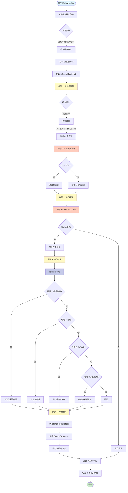
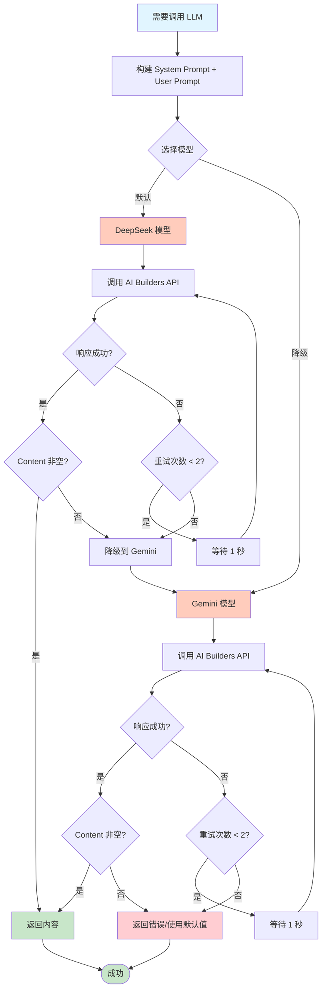

# 教育视频搜索系统 V2 - 完整 SOP 文档

## 📋 目录

1. [系统概述](#系统概述)
2. [系统架构](#系统架构)
3. [完整流程图](#完整流程图)
4. [核心组件详解](#核心组件详解)
5. [LLM 提示词完整清单](#llm-提示词完整清单)
6. [数据模型](#数据模型)
7. [API 接口](#api-接口)
8. [使用流程](#使用流程)
9. [错误处理与降级机制](#错误处理与降级机制)
10. [日志输出规范](#日志输出规范)

---

## 系统概述

### 目标
基于国家、年级、学期、学科搜索高质量的教育视频资源，使用 AI 生成本地语言的搜索词，提供 Web 界面和历史记录功能。

### 核心特性
- **智能搜索词生成**：使用 AI 根据国家、年级、学期、学科自动生成本地语言的搜索词
- **Web 界面**：友好的用户界面，支持选择国家、年级、学科等条件
- **历史记录**：自动保存搜索历史，可以快速查看之前的搜索结果
- **完整日志**：所有搜索过程都有详细的日志输出
- **规则匹配兜底**：使用硬规则筛选高质量资源，确保即使 LLM 失败也能找到结果

### 技术栈
- **后端**：Python 3.x + Flask
- **前端**：HTML + CSS + JavaScript
- **数据模型**：Pydantic
- **LLM API**：AI Builders API (DeepSeek / Gemini)
- **搜索引擎**：Tavily Search API
- **存储**：JSON 文件（历史记录）

---

## 系统架构

```
┌─────────────────────────────────────────────────────────────┐
│                      Web Application                        │
│                    (Flask + HTML/JS)                        │
└───────────────────────┬─────────────────────────────────────┘
                        │
                        │ HTTP Request
                        ▼
┌─────────────────────────────────────────────────────────────┐
│                    SearchEngineV2                            │
│                  (主搜索引擎)                                │
└───────────────┬─────────────────────────────────────────────┘
                │
        ┌───────┴───────┐
        │               │
┌───────▼──────┐  ┌─────▼──────────┐
│QueryGenerator│  │ ResultEvaluator│
│(AI搜索词生成)│  │ (规则匹配评估)  │
└───────┬──────┘  └─────┬──────────┘
        │               │
        │               │
┌───────▼───────────────▼──────────┐
│      AIBuildersClient             │
│  (LLM API + Tavily Search API)    │
└───────────────────────────────────┘
```

### 核心组件

1. **SearchEngineV2**：主搜索引擎类，协调整个搜索流程
2. **QueryGenerator**：使用 AI 生成本地语言的搜索词
3. **ResultEvaluator**：使用规则匹配筛选高质量资源
4. **AIBuildersClient**：AI Builders API 客户端（LLM + Tavily）
5. **Web Application**：Flask Web 应用，提供 API 和界面

---

## 完整流程图

### 主流程图



### LLM 调用流程图



### 规则匹配流程图

```mermaid
flowchart TD
    Start[开始评估] --> Loop[遍历每个搜索结果]
    Loop --> GetURL[获取 URL 和 Title]
    GetURL --> Rule1{规则 1: 播放列表?}
    
    Rule1 -->|youtube.com/playlist<br/>或 list= 参数| Match1[标记: 规则-播放列表]
    Rule1 -->|否| Rule2{规则 2: 频道?}
    
    Rule2 -->|youtube.com/c/<br/>youtube.com/channel/<br/>youtube.com/@| CheckEdu{包含教育关键词?}
    CheckEdu -->|是| Match2[标记: 规则-频道]
    CheckEdu -->|否| Rule3{规则 3: EdTech?}
    
    Rule3 -->|ruangguru.com<br/>zenius.net<br/>等| Match3[标记: 规则-EdTech]
    Rule3 -->|否| Rule4{规则 4: 系列视频?}
    
    Rule4 -->|youtube.com/watch<br/>+ 系列关键词| Match4[标记: 规则-系列视频]
    Rule4 -->|否| Skip[跳过此结果]
    
    Match1 --> AddResult[添加到结果列表]
    Match2 --> AddResult
    Match3 --> AddResult
    Match4 --> AddResult
    
    AddResult --> Next{还有结果?}
    Skip --> Next
    Next -->|是| Loop
    Next -->|否| Return[返回筛选后的结果]
    Return --> End([结束])
    
    style Start fill:#e1f5ff
    style End fill:#c8e6c9
    style Match1 fill:#c8e6c9
    style Match2 fill:#c8e6c9
    style Match3 fill:#c8e6c9
    style Match4 fill:#c8e6c9
    style Skip fill:#ffcdd2
```

---

## 核心组件详解

### 1. SearchEngineV2

**职责**：主搜索引擎类，协调整个搜索流程

**主要方法**：
- `search(request: SearchRequest) -> SearchResponse`：执行完整搜索流程

**工作流程**：
1. 接收搜索请求（国家/年级/学期/学科）
2. 调用 QueryGenerator 生成搜索词
3. 调用 Tavily API 执行搜索
4. 调用 ResultEvaluator 评估结果
5. 统计并返回结果

### 2. QueryGenerator

**职责**：使用 AI 生成本地语言的搜索词

**主要方法**：
- `generate_query(request: SearchRequest) -> str`：生成搜索词

**工作流程**：
1. 根据国家确定语言
2. 构建 System Prompt 和 User Prompt
3. 调用 LLM 生成搜索词
4. 清理和返回搜索词
5. 如果失败，降级为默认搜索词

### 3. ResultEvaluator

**职责**：使用规则匹配筛选高质量资源

**主要方法**：
- `evaluate_results(search_results: List[SearchResult]) -> List[SearchResult]`：评估和筛选结果

**规则优先级**：
1. YouTube 播放列表（最高优先级）
2. YouTube 频道页面
3. EdTech 网站
4. 系列视频

### 4. AIBuildersClient

**职责**：AI Builders API 客户端

**主要方法**：
- `call_llm(...)`：调用 LLM API
- `search(...)`：调用 Tavily Search API

**特性**：
- 支持模型降级（DeepSeek → Gemini）
- 自动重试机制
- 完整的错误处理

---

## LLM 提示词完整清单

### 提示词 1: 搜索词生成 (QueryGenerator)

**用途**：根据国家、年级、学期、学科生成搜索词

**模型**：DeepSeek（降级：Gemini）

**System Prompt**：

```
你是一个专业的搜索词生成专家，专门为教育视频资源生成高质量的搜索词。
你的任务是根据国家、年级、学期、学科信息，生成使用{language}语言的搜索词。

重要原则：
1. 使用目标国家的官方语言或常用语言
2. 使用该国家教育系统中常用的术语
3. 优先使用"playlist"、"课程"、"教学视频"等关键词
4. 搜索词应该简洁、准确、有效
5. 只返回搜索词，不要其他解释
```

**User Prompt**：

```
请为以下教育视频搜索生成搜索词：

国家：{country}
年级：{grade}
学期：{semester or "不指定"}
学科：{subject}
语言：{language}

请生成一个简洁有效的搜索词，使用{language}语言，优先包含"playlist"或"课程"等关键词。

只返回搜索词，不要其他文字。
```

**参数说明**：
- `{language}`：根据国家自动映射（ID→id, CN→zh, US→en）
- `{country}`：国家代码（如：ID, CN, US）
- `{grade}`：年级（如：1, Kelas 1, Grade 1）
- `{semester}`：学期（如：1, Semester 1）或"不指定"
- `{subject}`：学科（如：Matematika, Mathematics, 数学）

**示例输入**：
```
国家：ID
年级：1
学期：1
学科：Matematika
语言：id
```

**示例输出**：
```
playlist matematika kelas 1 semester 1
```

**降级策略**：
- 如果 LLM 调用失败，使用默认格式：`{subject} {grade} playlist {semester?}`

---

## 数据模型

### SearchRequest

```python
class SearchRequest(BaseModel):
    """搜索请求"""
    country: str          # 国家代码（如：ID, CN, US）
    grade: str            # 年级（如：1, 2, 3 或 Kelas 1, Grade 1）
    semester: Optional[str]  # 学期（如：1, 2 或 Semester 1），可选
    subject: str          # 学科（如：Matematika, Mathematics, 数学）
    language: Optional[str]  # 搜索语言（如：id, en, zh），可选，自动检测
```

**示例**：
```json
{
    "country": "ID",
    "grade": "1",
    "semester": "1",
    "subject": "Matematika"
}
```

### SearchResult

```python
class SearchResult(BaseModel):
    """单个搜索结果"""
    title: str      # 搜索结果标题
    url: str        # 结果URL
    snippet: str    # 结果摘要
    source: str     # 来源（规则-播放列表/规则-频道/规则-EdTech/规则-系列视频）
```

**示例**：
```json
{
    "title": "Matematika Kelas 1 SD - Playlist Lengkap",
    "url": "https://www.youtube.com/playlist?list=PLxxx",
    "snippet": "Kumpulan video pembelajaran matematika untuk kelas 1...",
    "source": "规则-播放列表"
}
```

### SearchResponse

```python
class SearchResponse(BaseModel):
    """搜索响应"""
    success: bool              # 是否成功
    query: str                 # 使用的搜索词
    results: List[SearchResult]  # 搜索结果列表
    total_count: int           # 结果总数
    playlist_count: int        # 播放列表数量
    video_count: int           # 视频数量
    message: str               # 消息
    timestamp: str             # 时间戳（ISO 格式）
```

**示例**：
```json
{
    "success": true,
    "query": "playlist matematika kelas 1 semester 1",
    "results": [...],
    "total_count": 10,
    "playlist_count": 5,
    "video_count": 3,
    "message": "搜索成功",
    "timestamp": "2024-01-01T12:00:00"
}
```

---

## API 接口

### 1. POST /api/search

**功能**：执行搜索

**请求体**：
```json
{
    "country": "ID",
    "grade": "1",
    "semester": "1",
    "subject": "Matematika"
}
```

**响应**：
```json
{
    "success": true,
    "query": "playlist matematika kelas 1 semester 1",
    "results": [
        {
            "title": "...",
            "url": "...",
            "snippet": "...",
            "source": "规则-播放列表"
        }
    ],
    "total_count": 10,
    "playlist_count": 5,
    "video_count": 3,
    "message": "搜索成功",
    "timestamp": "2024-01-01T12:00:00"
}
```

### 2. GET /api/history

**功能**：获取所有历史记录

**响应**：
```json
{
    "success": true,
    "history": [
        {
            "timestamp": "2024-01-01T12:00:00",
            "request": {...},
            "response": {...}
        }
    ]
}
```

### 3. GET /api/history/<index>

**功能**：获取特定历史记录

**响应**：
```json
{
    "success": true,
    "item": {
        "timestamp": "2024-01-01T12:00:00",
        "request": {...},
        "response": {...}
    }
}
```

---

## 使用流程

### Web 界面使用

1. **启动应用**
   ```bash
   python3 web_app.py
   ```

2. **访问界面**
   - 打开浏览器访问 `http://localhost:5000`

3. **执行搜索**
   - 选择国家（下拉菜单）
   - 输入年级（文本输入）
   - 输入学期（可选，文本输入）
   - 输入学科（文本输入）
   - 点击"开始搜索"按钮

4. **查看结果**
   - 搜索结果实时显示在下方
   - 显示统计信息（总数/播放列表/视频）
   - 每个结果包含标题、URL、摘要、来源

5. **查看历史**
   - 右侧显示搜索历史
   - 点击历史记录可重新加载结果

### 命令行使用

```python
from search_engine_v2 import SearchEngineV2, SearchRequest

# 初始化搜索引擎
engine = SearchEngineV2()

# 构建搜索请求
request = SearchRequest(
    country="ID",
    grade="1",
    semester="1",
    subject="Matematika"
)

# 执行搜索
result = engine.search(request)

# 查看结果
print(f"搜索词: {result.query}")
print(f"找到 {result.total_count} 个结果")
print(f"播放列表: {result.playlist_count} 个")
print(f"视频: {result.video_count} 个")

for r in result.results:
    print(f"- {r.title}: {r.url}")
```

---

## 错误处理与降级机制

### LLM 调用降级

1. **第一优先级**：DeepSeek 模型
2. **降级方案**：如果 DeepSeek 失败，自动切换到 Gemini
3. **最终降级**：如果所有 LLM 失败，使用默认搜索词格式

### 搜索 API 降级

1. **主要方案**：Tavily Search API
2. **错误处理**：如果 API 调用失败，返回错误信息，不进行降级（因为 Tavily 是唯一可用的搜索 API）

### 规则匹配兜底

- 即使 LLM 生成搜索词失败，规则匹配仍然可以筛选出高质量资源
- 规则匹配不依赖 LLM，完全基于 URL 和标题的硬规则

---

## 日志输出规范

### 日志格式

所有日志都遵循以下格式：

```
[步骤 X] 步骤名称...
    [🔍/✅/⚠️/❌ 类型] 具体信息...
```

### 日志示例

```
================================================================================
🔍 开始搜索
================================================================================
国家: ID
年级: 1
学期: 1
学科: Matematika
================================================================================

[步骤 1] 生成搜索词...
    [🤖 AI 生成] 正在为 ID/1/Matematika 生成搜索词...
    [✅ AI 生成] 搜索词: "playlist matematika kelas 1 semester 1"

[步骤 2] 执行搜索...
    [🔍 搜索] 查询: "playlist matematika kelas 1 semester 1"
    [✅ 搜索] 找到 20 个结果

[步骤 3] 评估结果...
    [📋 评估] 正在评估 20 个搜索结果...
    [✅ 评估] 找到 5 个高质量资源

[步骤 4] 统计结果...
    [📊 统计] 播放列表: 2 个
    [📊 统计] 视频: 2 个
    [📊 统计] 总计: 5 个
```

### 日志类型说明

- `🔍`：信息/调试
- `✅`：成功
- `⚠️`：警告
- `❌`：错误

---

## 规则匹配详细说明

### 规则 1: YouTube 播放列表

**匹配条件**：
- URL 包含 `youtube.com/playlist`
- 或 URL 包含 `youtube.com/watch` 且包含 `list=` 参数

**优先级**：最高（100% 确定）

**标记**：`规则-播放列表`

### 规则 2: YouTube 频道页面

**匹配条件**：
- URL 包含以下任一模式：
  - `youtube.com/c/`
  - `youtube.com/channel/`
  - `youtube.com/@`
- 且标题包含教育相关关键词：
  - `education`, `belajar`, `pembelajaran`, `tutorial`, `课程`, `教学`

**优先级**：高

**标记**：`规则-频道`

### 规则 3: EdTech 网站

**匹配条件**：
- URL 包含以下任一域名：
  - `ruangguru.com`
  - `zenius.net`
  - `quipper.com`
  - `pahamify.com`
  - `kelaspintar.id`
  - `khanacademy.org`
  - `coursera.org`
  - `edx.org`

**优先级**：高

**标记**：`规则-EdTech`

### 规则 4: 系列视频

**匹配条件**：
- URL 包含 `youtube.com/watch`
- 且标题包含以下任一关键词：
  - `part`, `bagian`, `episode`, `seri`, `series`
  - `full`, `lengkap`, `complete`, `playlist`, `kumpulan`
  - `第`, `集`, `系列`

**优先级**：中

**标记**：`规则-系列视频`

---

## 国家与语言映射

| 国家代码 | 国家名称 | 语言代码 | 语言名称 |
|---------|---------|---------|---------|
| ID | 印尼 | id | 印尼语 |
| CN | 中国 | zh | 中文 |
| US | 美国 | en | 英语 |
| MY | 马来西亚 | ms | 马来语 |
| SG | 新加坡 | en | 英语 |
| IN | 印度 | en | 英语 |

---

## 文件结构

```
.
├── search_engine_v2.py      # 新版搜索引擎核心
│   ├── SearchEngineV2       # 主搜索引擎类
│   ├── QueryGenerator       # AI 搜索词生成器
│   ├── ResultEvaluator      # 结果评估器
│   └── AIBuildersClient     # API 客户端
│
├── web_app.py               # Flask Web 应用
│   ├── /                    # 主页
│   ├── /api/search          # 搜索 API
│   ├── /api/history         # 历史记录 API
│   └── /api/history/<id>    # 特定历史记录
│
├── templates/
│   └── index.html           # 前端界面
│
├── search_history.json       # 历史记录存储（自动生成）
│
├── requirements_web.txt     # 依赖项
│
└── SOP_V2_COMPLETE.md       # 本文档
```

---

## 环境变量

### 必需

- `AI_BUILDER_TOKEN`：AI Builders API 令牌

### 设置方法

```bash
# 方法 1: 环境变量
export AI_BUILDER_TOKEN="your_token_here"

# 方法 2: .env 文件
echo "AI_BUILDER_TOKEN=your_token_here" > .env
```

---

## 依赖安装

```bash
pip install -r requirements_web.txt
```

**依赖项**：
- `flask>=2.3.0`
- `flask-cors>=4.0.0`
- `requests>=2.31.0`
- `pydantic>=2.0.0`
- `python-dotenv>=1.0.0`

---

## 快速开始

### 1. 安装依赖

```bash
pip install -r requirements_web.txt
```

### 2. 设置环境变量

```bash
export AI_BUILDER_TOKEN="your_token_here"
```

### 3. 启动 Web 应用

```bash
python3 web_app.py
```

### 4. 访问界面

打开浏览器访问 `http://localhost:5000`

---

## 故障排除

### 问题 1: LLM 返回空内容

**原因**：可能是 Gemini 的安全设置限制

**解决方案**：
- 系统会自动降级到 DeepSeek
- 如果 DeepSeek 也失败，使用默认搜索词格式

### 问题 2: Tavily API 调用失败

**原因**：API 密钥无效或网络问题

**解决方案**：
- 检查 `AI_BUILDER_TOKEN` 是否正确设置
- 检查网络连接
- 查看日志中的详细错误信息

### 问题 3: 搜索结果为空

**原因**：搜索词不准确或确实没有相关资源

**解决方案**：
- 尝试不同的年级或学期
- 使用更通用的学科名称
- 检查规则匹配是否过于严格

---

## 性能优化建议

1. **缓存搜索词**：相同条件的搜索可以缓存生成的搜索词
2. **批量搜索**：支持批量搜索多个条件
3. **异步处理**：对于大量搜索，可以使用异步处理
4. **结果缓存**：缓存搜索结果，避免重复搜索

---

## 未来改进方向

1. **多语言支持**：扩展更多国家和语言
2. **搜索结果评分**：使用 LLM 对搜索结果进行评分和排序
3. **批量搜索**：支持一次搜索多个条件
4. **结果导出**：支持导出搜索结果为 CSV/JSON
5. **用户自定义规则**：允许用户自定义规则匹配条件
6. **搜索结果预览**：集成视频预览功能

---

## 版本历史

### V2.0 (当前版本)
- 重构搜索策略：从知识点搜索改为国家/年级/学期搜索
- 添加 Web 界面
- 添加历史记录功能
- 使用 AI 生成本地语言搜索词
- 完整的日志输出

### V1.0 (旧版本)
- 基于知识点的搜索
- 命令行界面
- LLM 结果评估
- 规则匹配兜底机制

---

## 联系与支持

如有问题或建议，请查看：
- 代码仓库
- 文档目录
- 日志文件

---

**文档版本**：V2.0  
**最后更新**：2024-01-01  
**维护者**：AI Assistant

