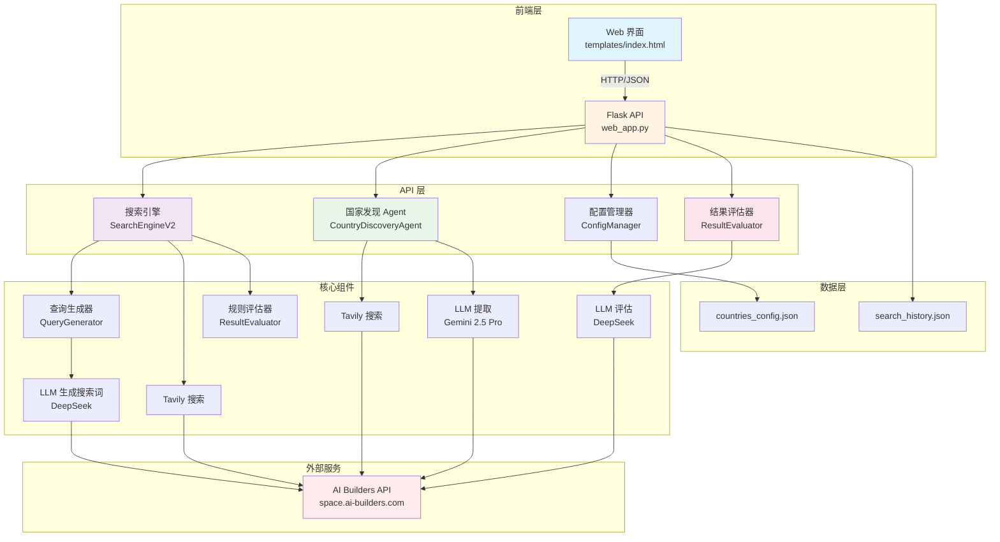
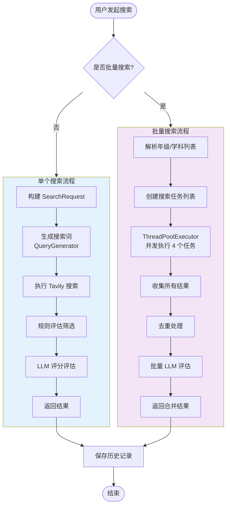
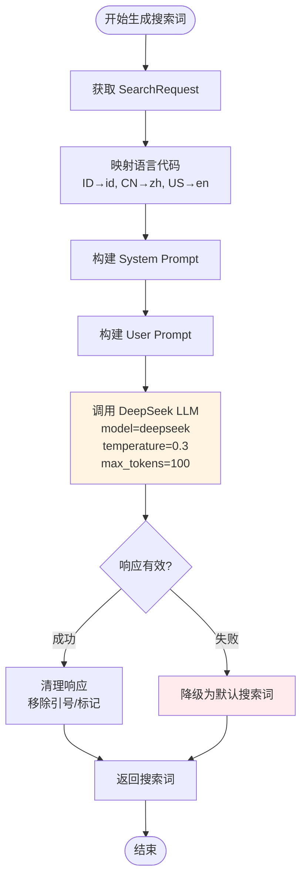
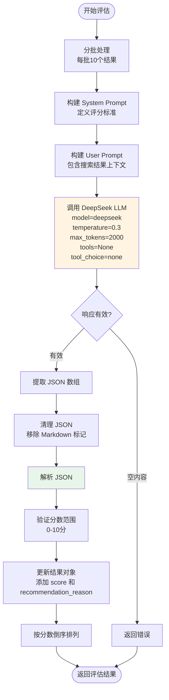
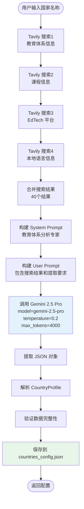
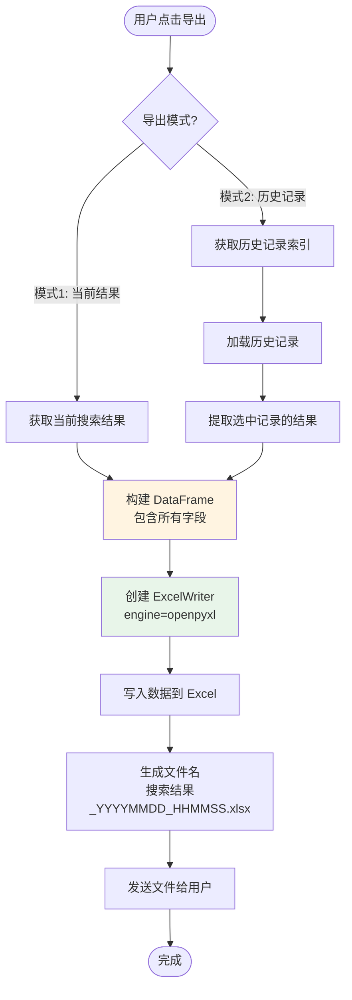

# K12 视频搜索系统 V3 - 完整 SOP 文档

## 📋 文档信息

- **版本**: V3.0.0
- **最后更新**: 2025-12-29
- **作者**: AI Assistant
- **状态**: ✅ 生产就绪

---

## 📑 目录

1. [系统概述](#1-系统概述)
2. [系统架构](#2-系统架构)
3. [完整流程图](#3-完整流程图)
4. [LLM 提示词完整清单](#4-llm-提示词完整清单)
5. [API 接口文档](#5-api-接口文档)
6. [数据模型](#6-数据模型)
7. [核心组件说明](#7-核心组件说明)
8. [使用流程](#8-使用流程)
9. [错误处理与优化](#9-错误处理与优化)
10. [部署与配置](#10-部署与配置)

---

## 1. 系统概述

### 1.1 项目目标

K12 视频搜索系统 V3 是一个**AI 驱动的国家自动接入系统**，旨在为不同国家的 K12 教育体系自动搜索高质量的教育视频资源。

### 1.2 核心特性

1. **AI 驱动的国家自动接入**：通过 UI 交互，AI 自动调研并配置新国家的教育体系信息
2. **智能搜索词生成**：根据国家、年级、学科自动生成本地语言的搜索词
3. **结果评估**：使用 LLM 对搜索结果进行 0-10 分评分，并提供推荐理由
4. **批量搜索**：支持"全部"选项，自动批量搜索所有年级/学科组合（并发执行）
5. **历史管理**：支持搜索历史筛选和批量导出 Excel

### 1.3 技术栈

- **后端框架**: Flask 2.3+
- **数据验证**: Pydantic 2.0+
- **LLM API**: AI Builders API (DeepSeek, Gemini 2.5 Pro)
- **搜索引擎**: Tavily Search (通过 AI Builders API)
- **数据处理**: Pandas 2.0+, OpenPyXL 3.1+
- **并发处理**: ThreadPoolExecutor

---

## 2. 系统架构

### 2.1 整体架构图



### 2.2 组件说明

| 组件 | 文件 | 职责 |
|------|------|------|
| **Web 应用** | `web_app.py` | Flask 应用，提供 RESTful API 和 Web 界面 |
| **搜索引擎** | `search_engine_v2.py` | 核心搜索逻辑，包含查询生成和结果评估 |
| **国家发现 Agent** | `discovery_agent.py` | AI 驱动的国家信息调研和配置 |
| **配置管理器** | `config_manager.py` | 管理国家配置文件的读写 |
| **结果评估器** | `result_evaluator.py` | 使用 LLM 对搜索结果进行评分和推荐 |
| **前端界面** | `templates/index.html` | 用户交互界面 |

---

## 3. 完整流程图

### 3.1 主搜索流程



### 3.2 搜索词生成流程



### 3.3 结果评估流程



### 3.4 国家发现流程



### 3.5 Excel 导出流程



---

## 4. LLM 提示词完整清单

### 4.1 提示词总览表

| 序号 | 提示词名称 | 使用场景 | LLM 模型 | Temperature | Max Tokens | 返回格式 | 禁用工具 |
|------|-----------|---------|----------|-------------|------------|----------|---------|
| 1 | 搜索词生成 | 根据国家/年级/学科生成搜索词 | DeepSeek | 0.3 | 100 | 纯文本 | ✅ |
| 2 | 结果评估 | 对搜索结果评分和推荐 | DeepSeek | 0.3 | 2000 | JSON 数组 | ✅ |
| 3 | 国家信息提取 | 从搜索结果提取国家教育体系信息 | Gemini 2.5 Pro | 0.2 | 4000 | JSON 对象 | ❌ |

---

### 4.2 提示词 1: 搜索词生成（QueryGenerator）

**文件位置**: `search_engine_v2.py` (第 212-232 行)

**用途**: 根据国家、年级、学期、学科生成本地语言的搜索词

**模型**: DeepSeek（默认），降级：Gemini 2.5 Pro

**参数配置**:
- `temperature`: 0.3
- `max_tokens`: 100
- `tool_choice`: "none"
- `tools`: None

**System Prompt**:
```
你是一个专业的搜索词生成专家，专门为教育视频资源生成高质量的搜索词。
你的任务是根据国家、年级、学期、学科信息，生成使用{language}语言的搜索词。

重要原则：
1. 使用目标国家的官方语言或常用语言
2. 使用该国家教育系统中常用的术语
3. 优先使用"playlist"、"课程"、"教学视频"等关键词
4. 搜索词应该简洁、准确、有效
5. 只返回搜索词，不要其他解释
```

**User Prompt**:
```
请为以下教育视频搜索生成搜索词：

国家：{country}
年级：{grade}
学期：{semester or "不指定"}
学科：{subject}
语言：{language}

请生成一个简洁有效的搜索词，使用{language}语言，优先包含"playlist"或"课程"等关键词。

只返回搜索词，不要其他文字。
```

**参数说明**:
- `{language}`: 根据国家自动映射
  - ID → id (印尼语)
  - CN → zh (中文)
  - US → en (英语)
  - MY → ms (马来语)
  - SG → en (新加坡英语)
- `{country}`: 国家代码（如：ID, CN, US）
- `{grade}`: 年级（如：Kelas 1, Grade 1, 一年级）
- `{semester}`: 学期（如：1, Semester 1）或"不指定"
- `{subject}`: 学科（如：Matematika, Mathematics, 数学）

**示例输入**:
```
国家：ID
年级：Kelas 6
学期：不指定
学科：Matematika
语言：id
```

**示例输出**:
```
playlist matematika kelas 6 SD kurikulum merdeka
```

**错误处理**:
- 如果 LLM 调用失败，降级为默认搜索词：`{subject} {grade} playlist`
- 如果有学期信息，追加：`semester {semester}`

---

### 4.3 提示词 2: 结果评估（ResultEvaluator）

**文件位置**: `result_evaluator.py` (第 94-152 行)

**用途**: 对搜索结果进行 0-10 分评分，并提供推荐理由

**模型**: DeepSeek（强制使用，避免 Gemini 的 forced_tool 问题）

**参数配置**:
- `temperature`: 0.3
- `max_tokens`: 2000
- `tool_choice`: "none"
- `tools`: None（明确禁用工具）

**System Prompt**:
```
你是一个教育内容质量评估专家。你的任务是对搜索结果进行评分和推荐。

**重要说明**：
你只能根据提供的标题、URL 和摘要（Snippet）信息进行评估。这些信息通常不包含播放次数、具体发布日期等元数据，请基于可见信息进行合理判断。

**评分标准（0-10分）**：
1. **内容相关性**（0-4分）：内容是否与指定的国家、年级、学科匹配
   - 标题和摘要中是否包含相关关键词
   - 是否明确针对目标年级和学科
   - URL 路径是否暗示教育内容

2. **来源权威性**（0-3分）：内容来源是否可靠
   - 是否来自知名教育平台（如 Khan Academy、Ruangguru、Zenius 等）
   - 是否来自官方教育频道或机构
   - URL 域名是否可信

3. **标题匹配度**（0-3分）：标题是否清晰、专业、符合教育内容特征
   - 标题是否明确说明是课程、播放列表或系列内容
   - 是否包含年级、学科等关键信息
   - 标题是否专业、规范

**评分规则**：
- 9-10分：非常优秀，强烈推荐（高度相关 + 权威来源 + 清晰标题）
- 7-8分：良好，推荐使用（相关 + 来源可靠 + 标题清晰）
- 5-6分：一般，可以使用（基本相关，但可能缺少某些要素）
- 3-4分：较差，不推荐（相关性低或来源不可靠）
- 0-2分：很差，不建议使用（完全不相关或来源可疑）

**重要**：在推荐理由中，请明确指出你是基于提供的摘要（Snippet）信息进行评估的，不要编造不存在的播放次数或日期信息。
```

**User Prompt**:
```
请评估以下搜索结果，这些结果是为 **{country}** 的 **{grade}** 年级 **{subject}** 学科搜索的。

**搜索结果**：
{results_context}

**评估要求**：
1. 为每个结果评分（0-10分），基于内容相关性、来源权威性和标题匹配度
2. 提供简短的推荐理由（1-2句话），明确指出是基于摘要信息评估的
3. **重要**：不要编造播放次数、发布日期等不存在的元数据信息
4. 如果摘要信息不足，请基于标题和 URL 进行合理推断

请以 JSON 数组格式返回结果，格式如下：
[
    {
        "index": 1,
        "score": 8.5,
        "recommendation_reason": "基于摘要判断：内容高度相关，来自知名教育平台，标题清晰明确"
    },
    {
        "index": 2,
        "score": 6.0,
        "recommendation_reason": "基于摘要判断：基本相关，但来源信息不足"
    }
]

**重要**：
- 只返回 JSON 数组，不要包含其他文本
- 推荐理由中必须包含"基于摘要判断"或类似说明
- 不要使用工具调用，直接返回 JSON 文本
```

**参数说明**:
- `{country}`: 国家代码（如：ID, PH, CN）
- `{grade}`: 年级（如：Kelas 6, Grade 2）
- `{subject}`: 学科（如：Matematika, Mathematics）
- `{results_context}`: 格式化的搜索结果上下文，每个结果包含：
  ```
  结果 1:
  标题: {title}
  URL: {url}
  摘要: {snippet[:300]}
  ```

**返回格式**:
```json
[
    {
        "index": 1,
        "score": 8.5,
        "recommendation_reason": "基于摘要判断：内容高度相关，来自知名教育平台，标题清晰明确"
    }
]
```

**错误处理**:
- JSON 解析失败时，尝试修复单引号问题
- 如果修复失败，返回默认评估（分数 0.0，理由"评估解析失败"）

---

### 4.4 提示词 3: 国家信息提取（CountryDiscoveryAgent）

**文件位置**: `discovery_agent.py` (第 95-164 行)

**用途**: 从搜索结果中提取国家的 K12 教育体系信息

**模型**: Gemini 2.5 Pro

**参数配置**:
- `temperature`: 0.2（较低温度以确保准确性）
- `max_tokens`: 4000
- `tool_choice`: "none"
- `tools`: None

**System Prompt**:
```
你是一个教育体系分析专家。你的任务是分析搜索结果，提取指定国家的 K12 教育体系信息。

**关键要求**：
1. **年级表达必须使用当地语言**：例如印尼是 "Kelas 1-12"，菲律宾是 "Kindergarten, Grade 1-12"，日本是 "小学1年生-6年生, 中学1年生-3年生"
2. **学科名称必须使用当地语言**：例如印尼是 "Matematika, IPA, IPS"，菲律宾是 "Math, Science, Filipino, Araling Panlipunan"，日本是 "国語, 算数, 理科, 社会"
3. **语言代码**：使用 ISO 639-1 标准（如：id, en, ja, fil, ms）
4. **国家代码**：使用 ISO 3166-1 alpha-2 标准（如：ID, PH, JP, MY, SG）

请仔细分析搜索结果，提取准确的信息。
```

**User Prompt**:
```
请分析以下关于 {country_name} 的 K12 教育体系搜索结果，提取以下信息：

**需要提取的信息**：
1. **国家代码**（ISO 3166-1 alpha-2，如：ID, PH, JP）
2. **国家名称**（英文标准名称）
3. **国家中文名称**（中文标准名称，如：菲律宾、日本、印尼）
4. **主要语言代码**（ISO 639-1，如：id, en, ja）
5. **年级表达列表**（每个年级包含当地语言名称和中文名称）
6. **核心学科列表**（每个学科包含当地语言名称和中文名称）
7. **EdTech 域名白名单**（该国的在线教育平台域名）
8. **额外说明**（如有）

**搜索结果**：
{search_context}

**重要**：
- 年级和学科名称必须使用**当地语言**，同时提供对应的中文翻译
- 如果搜索结果中没有明确信息，请基于该国的教育体系常识进行合理推断
- 年级列表应该覆盖 K12 的所有年级（通常是 12-13 个年级）
- 学科列表应该包含该国的核心学科（至少 5-8 个）

**重要**：请只返回有效的 JSON 对象，不要包含任何其他文本、解释或 markdown 标记。直接返回 JSON，格式如下：

{
    "country_code": "PH",
    "country_name": "Philippines",
    "country_name_zh": "菲律宾",
    "language_code": "en",
    "grades": [
        {"local_name": "Kindergarten", "zh_name": "幼儿园"},
        {"local_name": "Grade 1", "zh_name": "一年级"},
        {"local_name": "Grade 2", "zh_name": "二年级"},
        ...
    ],
    "subjects": [
        {"local_name": "Math", "zh_name": "数学"},
        {"local_name": "Science", "zh_name": "科学"},
        ...
    ],
    "domains": ["deped.gov.ph", "khanacademy.org"],
    "notes": "菲律宾使用英语和菲律宾语双语教学"
}

**注意**：
- language_code 必须是单个字符串（如 "en"），不是数组
- grades 和 subjects 必须是对象数组，每个对象包含 local_name 和 zh_name
- 直接返回 JSON，不要添加任何前缀或后缀
```

**参数说明**:
- `{country_name}`: 国家名称（如：Philippines, Indonesia, Japan）
- `{search_context}`: 合并后的搜索结果上下文（40个结果）

**返回格式**:
```json
{
    "country_code": "PH",
    "country_name": "Philippines",
    "country_name_zh": "菲律宾",
    "language_code": "en",
    "grades": [
        {"local_name": "Kindergarten", "zh_name": "幼儿园"},
        {"local_name": "Grade 1", "zh_name": "一年级"},
        ...
    ],
    "subjects": [
        {"local_name": "Math", "zh_name": "数学"},
        {"local_name": "Science", "zh_name": "科学"},
        ...
    ],
    "domains": ["deped.gov.ph", "khanacademy.org"],
    "notes": "额外说明"
}
```

---

## 5. API 接口文档

### 5.1 AI Builders API

**Base URL**: `https://space.ai-builders.com/backend`

**认证方式**: Bearer Token（从环境变量 `AI_BUILDER_TOKEN` 读取）

**支持的模型**:
- `deepseek`: Fast and cost-effective chat completions（纯文本生成）
- `gemini-2.5-pro`: Direct access to Google's Gemini model
- `grok-4-fast`: Passthrough to X.AI's Grok API
- `gpt-5`: Passthrough to OpenAI-compatible providers

**参考文档**: https://space.ai-builders.com/backend/openapi.json

---

### 5.2 LLM 调用接口

**端点**: `POST /v1/chat/completions`

**请求头**:
```json
{
  "Authorization": "Bearer {AI_BUILDER_TOKEN}",
  "Content-Type": "application/json"
}
```

**请求体**:
```json
{
  "model": "deepseek",
  "messages": [
    {
      "role": "system",
      "content": "{system_prompt}"
    },
    {
      "role": "user",
      "content": "{user_prompt}"
    }
  ],
  "max_tokens": 2000,
  "temperature": 0.3,
  "tool_choice": "none",
  "tools": null
}
```

**查询参数**:
- `debug`: `true`（可选，用于获取 orchestrator 执行跟踪）

**响应格式**:
```json
{
  "id": "chatcmpl-xxx",
  "object": "chat.completion",
  "created": 1234567890,
  "model": "deepseek",
  "choices": [
    {
      "index": 0,
      "message": {
        "role": "assistant",
        "content": "{response_text}"
      },
      "finish_reason": "stop"
    }
  ],
  "usage": {
    "prompt_tokens": 100,
    "completion_tokens": 200,
    "total_tokens": 300
  },
  "orchestrator_trace": {
    "rounds": [...],
    "executions": [...]
  }
}
```

---

### 5.3 Tavily 搜索接口

**端点**: `POST /v1/search/`

**请求体**:
```json
{
  "keywords": ["搜索词1", "搜索词2"],
  "max_results": 20
}
```

**响应格式**:
```json
{
  "queries": [
    {
      "keyword": "搜索词1",
      "response": {
        "query": "搜索词1",
        "results": [
          {
            "url": "https://...",
            "title": "标题",
            "content": "内容摘要",
            "score": 0.85
          }
        ]
      }
    }
  ],
  "combined_answer": null,
  "errors": null
}
```

---

### 5.4 Web 应用 API 接口

#### 5.4.1 搜索 API

**端点**: `POST /api/search`

**请求体**:
```json
{
  "country": "ID",
  "grade": "Kelas 6",
  "semester": null,
  "subject": "Matematika",
  "language": null
}
```

**响应**:
```json
{
  "success": true,
  "query": "playlist matematika kelas 6 SD kurikulum merdeka",
  "results": [
    {
      "title": "MATEMATIKA KELAS 6 SD",
      "url": "https://www.youtube.com/playlist?list=...",
      "snippet": "摘要内容...",
      "source": "Tavily",
      "score": 8.5,
      "recommendation_reason": "基于摘要判断：内容高度相关...",
      "is_selected": false
    }
  ],
  "total_count": 12,
  "playlist_count": 10,
  "video_count": 2,
  "message": "搜索成功",
  "timestamp": "2025-12-29T12:00:00"
}
```

#### 5.4.2 国家发现 API

**端点**: `POST /api/discover_country`

**请求体**:
```json
{
  "country_name": "Philippines"
}
```

**响应**:
```json
{
  "success": true,
  "message": "成功调研国家: Philippines",
  "profile": {
    "country_code": "PH",
    "country_name": "Philippines",
    "country_name_zh": "菲律宾",
    "language_code": "en",
    "grades": [...],
    "subjects": [...],
    "domains": [...]
  }
}
```

#### 5.4.3 导出 Excel API

**端点**: `POST /api/export_excel`

**请求体（模式1：当前搜索结果）**:
```json
{
  "selected_results": [
    {
      "title": "...",
      "url": "...",
      "score": 8.5,
      "recommendation_reason": "...",
      "snippet": "..."
    }
  ],
  "search_params": {
    "country": "ID",
    "grade": "Kelas 6",
    "subject": "Matematika",
    "timestamp": "2025-12-29T12:00:00"
  }
}
```

**请求体（模式2：历史记录）**:
```json
{
  "selected_history_indices": [0, 1, 2]
}
```

**响应**: Excel 文件（二进制流，Content-Type: `application/vnd.openxmlformats-officedocument.spreadsheetml.sheet`）

---

## 6. 数据模型

### 6.1 SearchRequest

**文件位置**: `search_engine_v2.py`

```python
class SearchRequest(BaseModel):
    country: str                    # 国家代码（如：ID, CN, US）
    grade: str                      # 年级（如：1, Kelas 1, Grade 1）
    semester: Optional[str] = None   # 学期（如：1, Semester 1）
    subject: str                    # 学科（如：Matematika, Mathematics）
    language: Optional[str] = None  # 搜索语言（如：id, en, zh）
```

### 6.2 SearchResult

**文件位置**: `search_engine_v2.py`

```python
class SearchResult(BaseModel):
    title: str                      # 搜索结果标题
    url: str                        # 结果URL
    snippet: str = ""               # 结果摘要
    source: str = "规则"            # 来源（规则/LLM/Tavily）
    score: float = 0.0              # 评估分数（0-10分）
    recommendation_reason: str = "" # 推荐理由
    is_selected: bool = False       # 是否被人工选中
```

### 6.3 SearchResponse

**文件位置**: `search_engine_v2.py`

```python
class SearchResponse(BaseModel):
    success: bool                   # 是否成功
    query: str                      # 使用的搜索词
    results: List[SearchResult]     # 搜索结果列表
    total_count: int = 0            # 结果总数
    playlist_count: int = 0         # 播放列表数量
    video_count: int = 0            # 视频数量
    message: str = ""               # 消息
    timestamp: str                  # 时间戳
```

### 6.4 CountryProfile

**文件位置**: `discovery_agent.py`

```python
class CountryProfile(BaseModel):
    country_code: str               # ISO 3166-1 alpha-2
    country_name: str               # 英文标准名称
    country_name_zh: str            # 中文标准名称
    language_code: str              # ISO 639-1
    grades: List[Dict[str, str]]    # [{"local_name": "...", "zh_name": "..."}]
    subjects: List[Dict[str, str]] # [{"local_name": "...", "zh_name": "..."}]
    domains: List[str] = []        # EdTech 域名白名单
    notes: str = ""                 # 额外说明
```

---

## 7. 核心组件说明

### 7.1 SearchEngineV2

**文件**: `search_engine_v2.py`

**职责**: 核心搜索引擎，协调查询生成、搜索执行和结果评估

**主要方法**:
- `search(request: SearchRequest) -> SearchResponse`: 执行完整搜索流程

**工作流程**:
1. 使用 `QueryGenerator` 生成搜索词
2. 调用 Tavily API 执行搜索
3. 使用 `ResultEvaluator`（规则匹配）筛选高质量资源
4. 返回 `SearchResponse`

---

### 7.2 QueryGenerator

**文件**: `search_engine_v2.py`

**职责**: 使用 LLM 生成本地语言的搜索词

**主要方法**:
- `generate_query(request: SearchRequest) -> str`: 生成搜索词

**工作流程**:
1. 根据国家映射语言代码
2. 构建 System Prompt 和 User Prompt
3. 调用 DeepSeek LLM 生成搜索词
4. 清理响应并返回
5. 如果失败，降级为默认搜索词

---

### 7.3 ResultEvaluator（规则评估）

**文件**: `search_engine_v2.py`

**职责**: 使用规则匹配筛选高质量资源

**主要方法**:
- `evaluate_results(search_results: List[SearchResult]) -> List[SearchResult]`: 评估和筛选结果

**规则优先级**:
1. YouTube 播放列表（100% 确定）
2. YouTube 频道页面（包含教育关键词）
3. EdTech 网站（白名单域名）
4. YouTube 系列视频（标题包含系列关键词）

---

### 7.4 ResultEvaluator（LLM 评估）

**文件**: `result_evaluator.py`

**职责**: 使用 LLM 对搜索结果进行评分和推荐

**主要方法**:
- `evaluate_results(results, country, grade, subject) -> List[SearchResult]`: 批量评估结果

**工作流程**:
1. 分批处理（每批10个结果）
2. 构建评估 Prompt
3. 调用 DeepSeek LLM（强制使用，避免 forced_tool）
4. 解析 JSON 响应
5. 更新结果对象的 score 和 recommendation_reason
6. 按分数倒序排列

---

### 7.5 CountryDiscoveryAgent

**文件**: `discovery_agent.py`

**职责**: AI 驱动的国家信息调研和配置

**主要方法**:
- `discover_country_profile(country_name: str) -> CountryProfile`: 调研国家信息

**工作流程**:
1. 执行 4 次 Tavily 搜索（教育体系、课程、EdTech、本地语言）
2. 合并搜索结果（40个结果）
3. 调用 Gemini 2.5 Pro 提取结构化信息
4. 解析 JSON 并验证
5. 返回 `CountryProfile`

---

### 7.6 ConfigManager

**文件**: `config_manager.py`

**职责**: 管理国家配置文件的读写

**主要方法**:
- `get_country_config(country_code: str) -> Optional[CountryConfig]`: 获取国家配置
- `update_country_config(profile: CountryProfile) -> None`: 更新国家配置
- `get_all_countries() -> List[Dict]`: 获取所有国家列表

---

## 8. 使用流程

### 8.1 单个搜索流程

1. **用户输入搜索条件**
   - 选择国家（如：Indonesia）
   - 选择年级（如：Kelas 6）
   - 选择学科（如：Matematika）
   - 可选：选择学期

2. **系统处理**
   - 生成搜索词（AI）
   - 执行搜索（Tavily）
   - 规则筛选（高质量资源）
   - LLM 评分（0-10分）

3. **返回结果**
   - 显示搜索结果列表
   - 显示评分和推荐理由
   - 支持选择导出

### 8.2 批量搜索流程

1. **用户选择"全部"**
   - 年级选择"全部"（ALL）
   - 或学科选择"全部"（ALL）

2. **系统处理**
   - 解析年级/学科列表
   - 创建搜索任务（N × M 个任务）
   - 并发执行（ThreadPoolExecutor，4个并发）
   - 收集并去重结果
   - 批量 LLM 评估

3. **返回结果**
   - 显示合并后的结果
   - 按评分排序
   - 支持批量导出

### 8.3 国家发现流程

1. **用户输入国家名称**
   - 在 UI 中输入国家名称（如：Philippines）

2. **系统处理**
   - 执行 4 次 Tavily 搜索
   - 调用 Gemini 2.5 Pro 提取信息
   - 保存到配置文件

3. **返回结果**
   - 显示国家配置信息
   - 自动更新下拉框选项

---

## 9. 错误处理与优化

### 9.1 LLM 调用错误处理

**问题**: Gemini 2.5 Pro 被配置为 `forced_tool: "search"`，导致评估失败

**解决方案**:
- 评估任务强制使用 DeepSeek 模型
- 明确设置 `tools: None` 和 `tool_choice: "none"`
- 使用 `search_engine_v2.py` 中的 `call_llm()` 方法

**代码位置**:
- `result_evaluator.py` 第 157-163 行

---

### 9.2 JSON 解析错误处理

**问题**: LLM 返回的 JSON 格式不规范（单引号、Markdown 标记等）

**解决方案**:
- 增强 JSON 清理逻辑（移除 Markdown 代码块标记）
- 尝试修复单引号问题
- 提供详细的错误日志

**代码位置**:
- `result_evaluator.py` 第 204-291 行

---

### 9.3 并发搜索优化

**问题**: 批量搜索串行执行，速度慢

**解决方案**:
- 使用 `ThreadPoolExecutor` 并发执行
- 控制并发数为 4，避免 API 速率限制
- 改进日志输出，清晰显示任务进度

**代码位置**:
- `web_app.py` 第 288-317 行

---

### 9.4 依赖管理

**问题**: pandas 和 openpyxl 未安装，Excel 导出失败

**解决方案**:
- 在 `requirements_v3.txt` 中添加依赖
- 改进导入检测逻辑（同时检测 pandas 和 openpyxl）
- 提供清晰的错误提示

**代码位置**:
- `web_app.py` 第 15-22 行
- `requirements_v3.txt`

---

## 10. 部署与配置

### 10.1 环境要求

- Python 3.9+
- Flask 2.3+
- 所有依赖见 `requirements_v3.txt`

### 10.2 环境变量

**必需**:
- `AI_BUILDER_TOKEN`: AI Builders API 令牌

**可选**:
- `.env` 文件支持（通过 `python-dotenv`）

### 10.3 安装步骤

```bash
# 1. 安装依赖
pip install -r requirements_v3.txt

# 2. 设置环境变量
export AI_BUILDER_TOKEN="your_token_here"
# 或创建 .env 文件
echo "AI_BUILDER_TOKEN=your_token_here" > .env

# 3. 启动 Web 应用
python3 web_app.py
```

### 10.4 启动脚本

**文件**: `start_web_app.sh`

```bash
#!/bin/bash
export AI_BUILDER_TOKEN="your_token_here"
python3 web_app.py
```

### 10.5 访问地址

- **Web 界面**: http://localhost:5000
- **API 文档**: http://localhost:5000/api/countries

---

## 11. 关键配置说明

### 11.1 模型选择策略

| 任务类型 | 推荐模型 | 原因 |
|---------|---------|------|
| 搜索词生成 | DeepSeek | 快速、成本低、纯文本生成 |
| 结果评估 | DeepSeek | 避免 forced_tool 问题 |
| 国家信息提取 | Gemini 2.5 Pro | 需要高质量的结构化提取 |

### 11.2 并发配置

- **批量搜索并发数**: 4（避免 API 速率限制）
- **评估批次大小**: 10（每批评估的结果数）

### 11.3 速率限制

- Tavily 搜索：无明确限制，但建议控制并发
- LLM 调用：根据 AI Builders API 限制

---

## 12. 故障排查

### 12.1 评估功能返回空内容

**症状**: LLM 返回空内容，评分全部为 0

**原因**: Gemini 2.5 Pro 被配置为 `forced_tool: "search"`

**解决方案**:
1. 检查 `result_evaluator.py` 是否使用 DeepSeek 模型
2. 确认 `tools: None` 和 `tool_choice: "none"` 已设置
3. 查看日志中的 `orchestrator_trace` 确认模型选择

### 12.2 JSON 解析失败

**症状**: "Expecting property name enclosed in double quotes"

**原因**: LLM 返回的 JSON 格式不规范

**解决方案**:
1. 查看日志中的原始响应
2. 检查 JSON 清理逻辑是否正常工作
3. 尝试修复单引号问题

### 12.3 Excel 导出失败

**症状**: "pandas 未安装，无法导出 Excel"

**解决方案**:
1. 运行 `pip install pandas openpyxl`
2. 重启 Web 应用
3. 验证导入：`python3 -c "import pandas; import openpyxl"`

---

## 13. 性能指标

### 13.1 搜索性能

- **单个搜索**: 约 5-10 秒（包含 LLM 评估）
- **批量搜索（10个任务）**: 约 15-30 秒（并发执行）
- **国家发现**: 约 20-40 秒（4次搜索 + LLM 提取）

### 13.2 评估性能

- **每批评估（10个结果）**: 约 3-5 秒
- **批量评估（100个结果）**: 约 30-50 秒

---

## 14. 更新日志

### V3.0.0 (2025-12-29)

**新增功能**:
- ✅ AI 驱动的国家自动接入系统
- ✅ LLM 结果评估功能（0-10分评分）
- ✅ 批量搜索并发优化
- ✅ Excel 导出功能
- ✅ 历史记录管理

**Bug 修复**:
- ✅ 修复评估功能 forced_tool 问题（改用 DeepSeek）
- ✅ 增强 JSON 解析容错性
- ✅ 改进错误处理和日志输出

**性能优化**:
- ✅ 批量搜索并发执行（4个并发）
- ✅ 评估批次处理（每批10个）

---

## 15. 参考资源

- **AI Builders API 文档**: https://space.ai-builders.com/backend/openapi.json
- **Tavily Search**: https://tavily.com/
- **Flask 文档**: https://flask.palletsprojects.com/
- **Pydantic 文档**: https://docs.pydantic.dev/

---

## 附录 A: 完整代码文件清单

| 文件 | 说明 |
|------|------|
| `web_app.py` | Flask Web 应用主文件 |
| `search_engine_v2.py` | 搜索引擎核心逻辑 |
| `result_evaluator.py` | LLM 结果评估器 |
| `discovery_agent.py` | 国家发现 Agent |
| `config_manager.py` | 配置管理器 |
| `templates/index.html` | 前端界面 |
| `countries_config.json` | 国家配置文件 |
| `search_history.json` | 搜索历史记录 |
| `requirements_v3.txt` | Python 依赖列表 |

---

## 附录 B: 关键代码片段

### B.1 强制使用 DeepSeek 进行评估

```python
# result_evaluator.py 第 157-163 行
llm_response = self.client.call_llm(
    prompt=user_prompt,
    system_prompt=system_prompt,
    max_tokens=2000,
    temperature=0.3,
    model="deepseek"  # 明确指定 deepseek，避免 forced_tool
)
```

### B.2 并发批量搜索

```python
# web_app.py 第 288-317 行
with ThreadPoolExecutor(max_workers=4) as executor:
    future_to_task = {
        executor.submit(_single_search_task, grade_item, subject_item, task_id): (grade_item, subject_item, task_id)
        for grade_item, subject_item, task_id in search_tasks
    }
    
    for future in as_completed(future_to_task):
        # 收集结果...
```

---

**文档结束**

---

*本文档由 AI Assistant 自动生成，最后更新于 2025-12-29*

