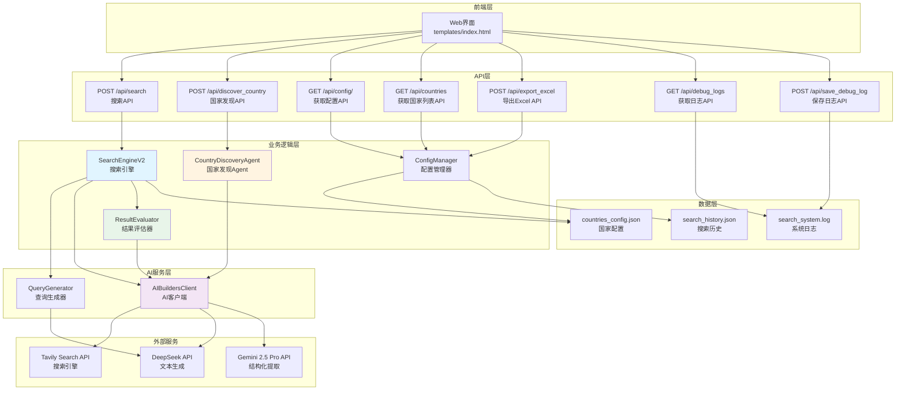
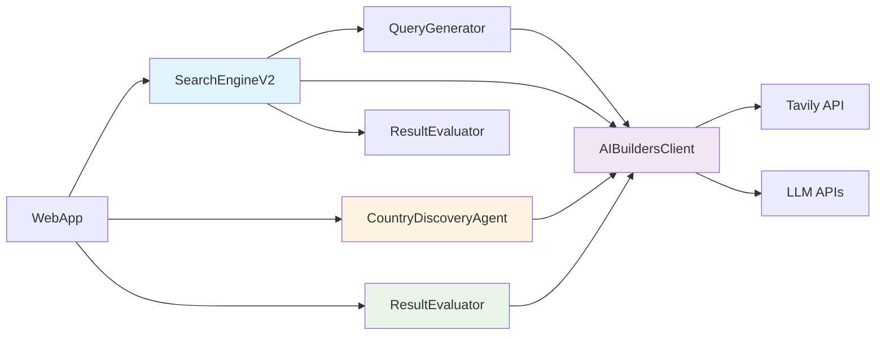
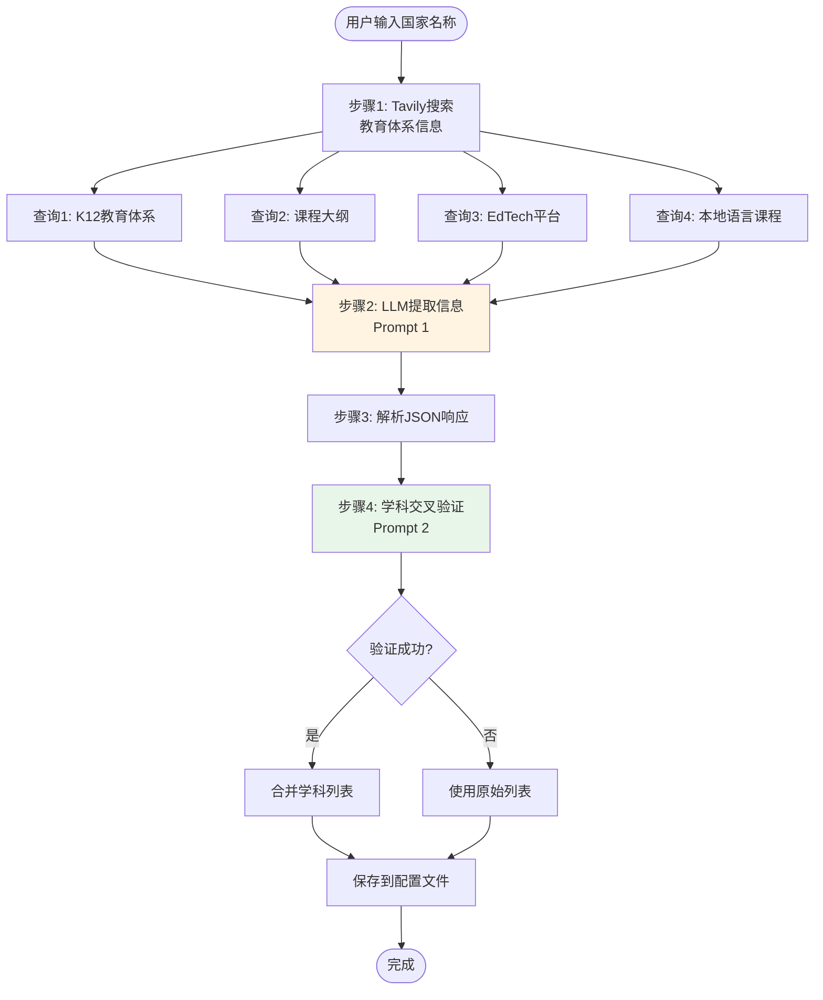
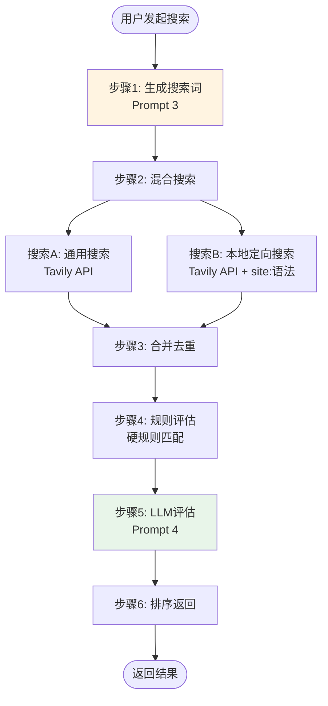
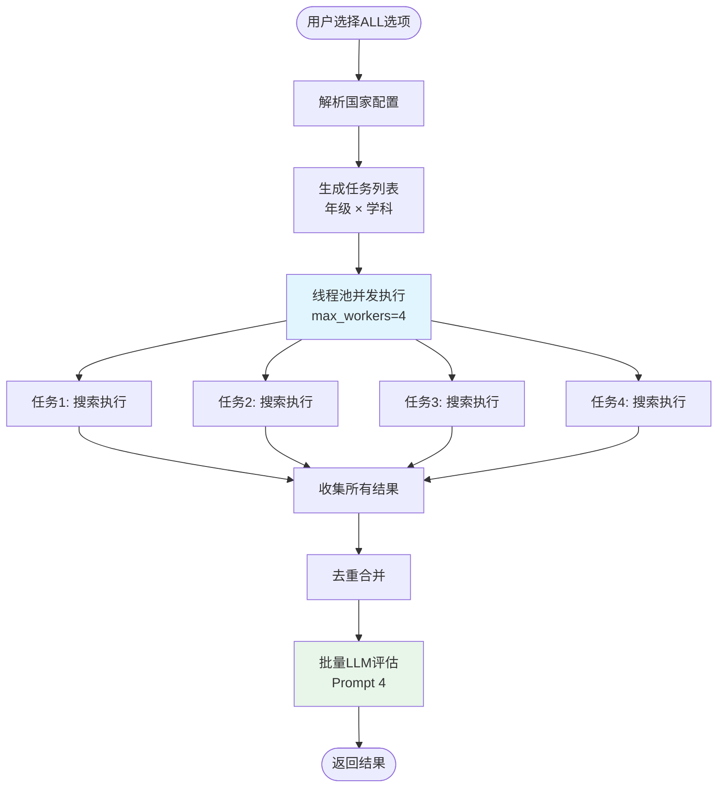
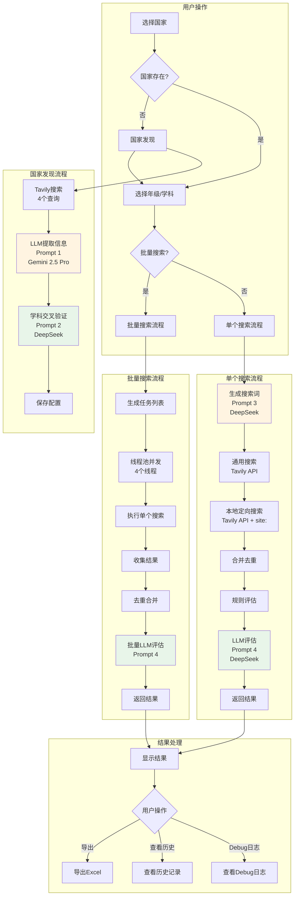

# K12 视频搜索系统 V3.1.0 - 完整 SOP 文档

## 📋 文档信息

- **版本**: V3.1.0
- **最后更新**: 2025-12-29
- **状态**: ✅ 生产就绪
- **作者**: AI Assistant

---

## 📑 目录

1. [系统概述](#1-系统概述)
2. [系统架构](#2-系统架构)
3. [完整流程图](#3-完整流程图)
4. [LLM 提示词完整清单](#4-llm-提示词完整清单)
5. [API 接口文档](#5-api-接口文档)
6. [核心组件说明](#6-核心组件说明)
7. [数据模型](#7-数据模型)
8. [使用流程](#8-使用流程)
9. [错误处理与优化](#9-错误处理与优化)
10. [部署与配置](#10-部署与配置)

---

## 1. 系统概述

### 1.1 项目目标

K12 视频搜索系统 V3.1.0 是一个**AI 驱动的国家自动接入系统**，旨在为不同国家的 K12 教育体系自动搜索高质量的教育视频资源。

### 1.2 核心特性

1. **AI 驱动的国家自动接入**：通过 UI 交互，AI 自动调研并配置新国家的教育体系信息
2. **智能搜索词生成**：根据国家、年级、学科自动生成本地语言的搜索词
3. **混合搜索策略**：通用搜索（YouTube）+ 本地定向搜索（本地视频平台）
4. **结果评估**：使用 LLM 对搜索结果进行 0-10 分评分，并提供推荐理由
5. **学科交叉验证**：自动验证和补充遗漏的核心学科
6. **批量搜索**：支持"全部"选项，自动批量搜索所有年级/学科组合（并发执行）
7. **历史管理**：支持搜索历史筛选和批量导出 Excel
8. **Debug日志系统**：完整的日志记录和导出功能

### 1.3 技术栈

- **后端框架**: Flask 2.3+
- **数据验证**: Pydantic 2.0+
- **LLM API**: AI Builders API (DeepSeek, Gemini 2.5 Pro)
- **搜索引擎**: Tavily Search (通过 AI Builders API)
- **数据处理**: Pandas 2.0+, OpenPyXL 3.1+
- **并发处理**: ThreadPoolExecutor
- **日志系统**: Python logging + 自定义日志工具

---

## 2. 系统架构

### 2.1 整体架构图



### 2.2 核心组件关系



---

## 3. 完整流程图

### 3.1 国家发现流程



### 3.2 搜索流程



### 3.3 批量搜索流程



### 3.4 完整系统流程图



---

## 4. LLM 提示词完整清单

### 4.1 提示词总览表

| 序号 | 提示词名称 | 使用场景 | LLM 模型 | Temperature | Max Tokens | 返回格式 | 禁用工具 | 文件位置 |
|------|-----------|---------|----------|-------------|------------|----------|---------|----------|
| 1 | 国家信息提取 | 从搜索结果提取国家教育体系信息 | Gemini 2.5 Pro | 0.2 | 4000 | JSON 对象 | ❌ | `discovery_agent.py:114-191` |
| 2 | 学科交叉验证 | 验证和补充遗漏的核心学科 | DeepSeek | 0.2 | 1000 | JSON 数组 | ✅ | `discovery_agent.py:263-306` |
| 3 | 搜索词生成 | 根据国家/年级/学科生成搜索词 | DeepSeek | 0.3 | 100 | 纯文本 | ✅ | `search_engine_v2.py:368-388` |
| 4 | 结果评估 | 对搜索结果评分和推荐 | DeepSeek | 0.3 | 2000 | JSON 数组 | ✅ | `result_evaluator.py:94-152` |

---

### 4.2 提示词 1: 国家信息提取（Country Profile Extraction）

**文件位置**: `discovery_agent.py` (第 114-191 行)

**用途**: 从 Tavily 搜索结果中提取国家 K12 教育体系的结构化信息

**模型**: Gemini 2.5 Pro

**参数配置**:
- `temperature`: 0.2
- `max_tokens`: 4000
- `tool_choice`: 默认（允许工具调用）

**调用方法**: `client.call_gemini()`

**API端点**: `POST https://space.ai-builders.com/backend/v1/chat/completions`

**请求参数**:
```json
{
  "model": "gemini-2.5-pro",
  "messages": [
    {
      "role": "system",
      "content": "<System Prompt>"
    },
    {
      "role": "user",
      "content": "<User Prompt>"
    }
  ],
  "max_tokens": 4000,
  "temperature": 0.2
}
```

#### System Prompt

```
你是一个教育体系分析专家。你的任务是分析搜索结果，提取指定国家的 K12 教育体系信息。

**关键要求**：
1. **年级表达必须使用当地语言**：例如印尼是 "Kelas 1-12"，菲律宾是 "Kindergarten, Grade 1-12"，日本是 "小学1年生-6年生, 中学1年生-3年生"
2. **学科名称必须使用当地语言**：例如印尼是 "Matematika, IPA, IPS"，菲律宾是 "Math, Science, Filipino, Araling Panlipunan"，日本是 "国語, 算数, 理科, 社会"
3. **语言代码**：使用 ISO 639-1 标准（如：id, en, ja, fil, ms）
4. **国家代码**：使用 ISO 3166-1 alpha-2 标准（如：ID, PH, JP, MY, SG）

请仔细分析搜索结果，提取准确的信息。
```

#### User Prompt

```
请分析以下关于 {country_name} 的 K12 教育体系搜索结果，提取以下信息：

**需要提取的信息**：
1. **国家代码**（ISO 3166-1 alpha-2，如：ID, PH, JP）
2. **国家名称**（英文标准名称）
3. **国家中文名称**（中文标准名称，如：菲律宾、日本、印尼）
4. **主要语言代码**（ISO 639-1，如：id, en, ja）
5. **年级表达列表**（每个年级包含当地语言名称和中文名称）
6. **核心学科列表**（每个学科包含当地语言名称和中文名称）
7. **EdTech 域名白名单**（该国的在线教育平台域名，包括两类）：
   a. **EdTech 平台**：如 Khan Academy, Ruangguru, Zenius, Coursera 等在线教育平台
   b. **本地视频托管平台**：如 Rutube（俄罗斯）, Bilibili（中国）, Vidio（印尼）, Dailymotion（法国）等本地视频平台
8. **额外说明**（如有）

**搜索结果**：
{search_context}

**重要**：
- 年级和学科名称必须使用**当地语言**，同时提供对应的中文翻译
- 如果搜索结果中没有明确信息，请基于该国的教育体系常识进行合理推断
- 年级列表应该覆盖 K12 的所有年级（通常是 12-13 个年级）
- 学科列表应该包含该国的核心学科（至少 5-8 个）
- **域名提取**：必须同时提取 EdTech 平台和本地视频托管平台两类域名，确保覆盖该国的主要在线教育资源平台

**重要**：请只返回有效的 JSON 对象，不要包含任何其他文本、解释或 markdown 标记。直接返回 JSON，格式如下：

{
    "country_code": "PH",
    "country_name": "Philippines",
    "country_name_zh": "菲律宾",
    "language_code": "en",
    "grades": [
        {"local_name": "Kindergarten", "zh_name": "幼儿园"},
        {"local_name": "Grade 1", "zh_name": "一年级"},
        {"local_name": "Grade 2", "zh_name": "二年级"},
        ...
    ],
    "subjects": [
        {"local_name": "Math", "zh_name": "数学"},
        {"local_name": "Science", "zh_name": "科学"},
        ...
    ],
    "domains": [
        "deped.gov.ph",
        "khanacademy.org",
        "rutube.ru",
        "bilibili.com"
    ],
    "notes": "菲律宾使用英语和菲律宾语双语教学"
}

**注意**：
- language_code 必须是单个字符串（如 "en"），不是数组
- grades 和 subjects 必须是对象数组，每个对象包含 local_name 和 zh_name
- 直接返回 JSON，不要添加任何前缀或后缀
```

**输入变量**:
- `{country_name}`: 国家名称（英文，如 "Philippines", "Japan", "Indonesia"）
- `{search_context}`: Tavily 搜索结果上下文（前20个结果的标题、URL、摘要）

**输出格式**: JSON 对象

**示例输出**:
```json
{
    "country_code": "ID",
    "country_name": "Indonesia",
    "country_name_zh": "印尼",
    "language_code": "id",
    "grades": [
        {"local_name": "Taman Kanak-kanak", "zh_name": "幼儿园"},
        {"local_name": "Kelas 1", "zh_name": "一年级"},
        ...
    ],
    "subjects": [
        {"local_name": "Matematika", "zh_name": "数学"},
        {"local_name": "Bahasa Indonesia", "zh_name": "印尼语"},
        ...
    ],
    "domains": [
        "ruangguru.com",
        "zenius.net",
        "vidio.com",
        "khanacademy.org"
    ],
    "notes": "..."
}
```

---

### 4.3 提示词 2: 学科交叉验证（Subject Cross-Verification）

**文件位置**: `discovery_agent.py` (第 263-306 行)

**用途**: 审查已提取的学科列表，找出被遗漏的核心学科

**模型**: DeepSeek

**参数配置**:
- `temperature`: 0.2
- `max_tokens`: 1000
- `tool_choice`: "none"（禁用工具调用）
- `tools`: None

**调用方法**: `client.call_llm(model="deepseek")`

**API端点**: `POST https://space.ai-builders.com/backend/v1/chat/completions`

**请求参数**:
```json
{
  "model": "deepseek",
  "messages": [
    {
      "role": "system",
      "content": "<System Prompt>"
    },
    {
      "role": "user",
      "content": "<User Prompt>"
    }
  ],
  "max_tokens": 1000,
  "temperature": 0.2,
  "tool_choice": "none",
  "tools": null
}
```

#### System Prompt

```
你是一个{country_name}的 K12 教育体系专家。你的任务是审查已提取的学科列表，对比该国官方 K12 课程大纲，找出被遗漏的核心学科（Core Subjects）。

**重要原则**：
1. 只识别**核心学科**（Core Subjects），这些学科通常是：
   - 语言类：母语、外语、地方语言
   - 数学类：数学、算术
   - 科学类：自然科学、物理、化学、生物
   - 社会类：历史、地理、社会研究、公民教育
   - 艺术类：音乐、美术、艺术
   - 体育类：体育、健康
   - 技术类：信息技术、技术教育
   - 价值观类：道德教育、宗教教育

2. **不要**包括选修课、兴趣班、课外活动等非核心学科

3. 如果当前列表已经完整，返回空数组

4. 每个遗漏的学科必须包含：
   - local_name：使用该国当地语言的学科名称
   - zh_name：对应的中文名称

5. 只返回 JSON 数组，不要其他文字
```

#### User Prompt

```
请审查以下关于 {country_name} 的 K12 教育体系已提取的学科列表：

**当前学科列表**：
{current_subjects_list}

**任务**：
对比 {country_name} 的官方 K12 课程大纲，找出被遗漏的核心学科。

**要求**：
1. 只识别核心学科（Core Subjects），不包括选修课
2. 如果列表已经完整，返回空数组 []
3. 每个遗漏的学科必须使用当地语言名称，并提供中文翻译
4. 只返回 JSON 数组格式，不要其他文字

**返回格式**（JSON 数组）：
[
    {"local_name": "学科当地语言名称", "zh_name": "学科中文名称"},
    {"local_name": "另一个学科", "zh_name": "另一个学科中文"}
]

如果列表完整，返回：[]
```

**输入变量**:
- `{country_name}`: 国家名称（英文）
- `{current_subjects_list}`: 当前学科列表（格式：`- 学科名 (中文名)`）

**输出格式**: JSON 数组

**示例输出**:
```json
[
    {"local_name": "Pendidikan Jasmani", "zh_name": "体育"},
    {"local_name": "Seni Budaya", "zh_name": "艺术"}
]
```

---

### 4.4 提示词 3: 搜索词生成（Query Generation）

**文件位置**: `search_engine_v2.py` (第 368-388 行)

**用途**: 根据国家、年级、学期、学科生成本地语言的搜索词

**模型**: DeepSeek

**参数配置**:
- `temperature`: 0.3
- `max_tokens`: 100
- `tool_choice`: "none"（禁用工具调用）
- `tools`: None

**调用方法**: `client.call_llm(model="deepseek")`

**API端点**: `POST https://space.ai-builders.com/backend/v1/chat/completions`

**请求参数**:
```json
{
  "model": "deepseek",
  "messages": [
    {
      "role": "system",
      "content": "<System Prompt>"
    },
    {
      "role": "user",
      "content": "<User Prompt>"
    }
  ],
  "max_tokens": 100,
  "temperature": 0.3,
  "tool_choice": "none",
  "tools": null
}
```

#### System Prompt

```
你是一个专业的搜索词生成专家，专门为教育视频资源生成高质量的搜索词。
你的任务是根据国家、年级、学期、学科信息，生成使用{language}语言的搜索词。

重要原则：
1. 使用目标国家的官方语言或常用语言
2. 使用该国家教育系统中常用的术语
3. 优先使用"playlist"、"课程"、"教学视频"等关键词
4. 搜索词应该简洁、准确、有效
5. 只返回搜索词，不要其他解释
```

#### User Prompt

```
请为以下教育视频搜索生成搜索词：

国家：{country}
年级：{grade}
学期：{semester or "不指定"}
学科：{subject}
语言：{language}

请生成一个简洁有效的搜索词，使用{language}语言，优先包含"playlist"或"课程"等关键词。

只返回搜索词，不要其他文字。
```

**输入变量**:
- `{country}`: 国家代码（如：ID, CN, US）
- `{grade}`: 年级（如：1, Kelas 1, Grade 1）
- `{semester}`: 学期（如：1, Semester 1）或"不指定"
- `{subject}`: 学科（如：Matematika, Mathematics, 数学）
- `{language}`: 语言代码（如：id, en, zh）

**输出格式**: 纯文本（搜索词）

**示例输出**:
```
Matematika Kelas 6 playlist
```

---

### 4.5 提示词 4: 结果评估（Result Evaluation）

**文件位置**: `result_evaluator.py` (第 94-152 行)

**用途**: 对搜索结果进行评分和推荐

**模型**: DeepSeek

**参数配置**:
- `temperature`: 0.3
- `max_tokens`: 2000
- `tool_choice`: "none"（禁用工具调用）
- `tools`: None

**调用方法**: `client.call_llm(model="deepseek")`

**API端点**: `POST https://space.ai-builders.com/backend/v1/chat/completions`

**请求参数**:
```json
{
  "model": "deepseek",
  "messages": [
    {
      "role": "system",
      "content": "<System Prompt>"
    },
    {
      "role": "user",
      "content": "<User Prompt>"
    }
  ],
  "max_tokens": 2000,
  "temperature": 0.3,
  "tool_choice": "none",
  "tools": null
}
```

#### System Prompt

```
你是一个教育内容质量评估专家。你的任务是对搜索结果进行评分和推荐。

**重要说明**：
你只能根据提供的标题、URL 和摘要（Snippet）信息进行评估。这些信息通常不包含播放次数、具体发布日期等元数据，请基于可见信息进行合理判断。

**评分标准（0-10分）**：
1. **内容相关性**（0-4分）：内容是否与指定的国家、年级、学科匹配
   - 标题和摘要中是否包含相关关键词
   - 是否明确针对目标年级和学科
   - URL 路径是否暗示教育内容

2. **来源权威性**（0-3分）：内容来源是否可靠
   - 是否来自知名教育平台（如 Khan Academy、Ruangguru、Zenius 等）
   - 是否来自官方教育频道或机构
   - URL 域名是否可信

3. **标题匹配度**（0-3分）：标题是否清晰、专业、符合教育内容特征
   - 标题是否明确说明是课程、播放列表或系列内容
   - 是否包含年级、学科等关键信息
   - 标题是否专业、规范

**评分规则**：
- 9-10分：非常优秀，强烈推荐（高度相关 + 权威来源 + 清晰标题）
- 7-8分：良好，推荐使用（相关 + 来源可靠 + 标题清晰）
- 5-6分：一般，可以使用（基本相关，但可能缺少某些要素）
- 3-4分：较差，不推荐（相关性低或来源不可靠）
- 0-2分：很差，不建议使用（完全不相关或来源可疑）

**重要**：在推荐理由中，请明确指出你是基于提供的摘要（Snippet）信息进行评估的，不要编造不存在的播放次数或日期信息。
```

#### User Prompt

```
请评估以下搜索结果，这些结果是为 **{country}** 的 **{grade}** 年级 **{subject}** 学科搜索的。

**搜索结果**：
{results_context}

**评估要求**：
1. 为每个结果评分（0-10分），基于内容相关性、来源权威性和标题匹配度
2. 提供简短的推荐理由（1-2句话），明确指出是基于摘要信息评估的
3. **重要**：不要编造播放次数、发布日期等不存在的元数据信息
4. 如果摘要信息不足，请基于标题和 URL 进行合理推断

请以 JSON 数组格式返回结果，格式如下：
[
    {
        "index": 1,
        "score": 8.5,
        "recommendation_reason": "基于摘要判断：内容高度相关，来自知名教育平台，标题清晰明确"
    },
    {
        "index": 2,
        "score": 6.0,
        "recommendation_reason": "基于摘要判断：基本相关，但来源信息不足"
    }
]

**重要**：
- 只返回 JSON 数组，不要包含其他文本
- 推荐理由中必须包含"基于摘要判断"或类似说明
- 不要使用工具调用，直接返回 JSON 文本
```

**输入变量**:
- `{country}`: 国家代码（如：ID, CN, US）
- `{grade}`: 年级（如：Kelas 6, Grade 6）
- `{subject}`: 学科（如：Matematika, Mathematics）
- `{results_context}`: 搜索结果上下文（格式：`结果 N:\n标题: ...\nURL: ...\n摘要: ...`）

**输出格式**: JSON 数组

**示例输出**:
```json
[
    {
        "index": 1,
        "score": 9.0,
        "recommendation_reason": "基于摘要判断：内容高度相关，明确针对Kelas 6 SD Matematika，来自知名教育平台Ruangguru，标题清晰专业"
    },
    {
        "index": 2,
        "score": 7.5,
        "recommendation_reason": "基于摘要判断：内容相关，来自YouTube教育频道，标题包含年级和学科信息"
    }
]
```

---

## 5. API 接口文档

### 5.1 搜索 API

**端点**: `POST /api/search`

**请求体**:
```json
{
  "country": "ID",
  "grade": "Kelas 6",
  "semester": "1",
  "subject": "Matematika",
  "language": "id"
}
```

**批量搜索请求体**:
```json
{
  "country": "ID",
  "grade": "ALL",
  "subject": "ALL",
  "semester": "1"
}
```

**响应**:
```json
{
  "success": true,
  "query": "Matematika Kelas 6 playlist",
  "results": [
    {
      "title": "...",
      "url": "...",
      "snippet": "...",
      "score": 9.0,
      "recommendation_reason": "...",
      "is_selected": false
    }
  ],
  "total_count": 8,
  "playlist_count": 5,
  "video_count": 3,
  "message": "搜索成功",
  "timestamp": "2025-12-29T19:00:00",
  "debug_logs": [...]
}
```

**调用流程**:
1. 接收请求参数
2. 判断是否批量搜索（`grade` 或 `subject` 为 "ALL"）
3. 单个搜索：调用 `SearchEngineV2.search()`
4. 批量搜索：调用 `_batch_search()`，使用线程池并发执行
5. 评估结果：调用 `ResultEvaluator.evaluate_results()`
6. 保存历史记录
7. 返回响应

---

### 5.2 国家发现 API

**端点**: `POST /api/discover_country`

**请求体**:
```json
{
  "country_name": "Philippines"
}
```

**响应**:
```json
{
  "success": true,
  "message": "成功调研国家: Philippines",
  "profile": {
    "country_code": "PH",
    "country_name": "Philippines",
    "country_name_zh": "菲律宾",
    "language_code": "en",
    "grades": [...],
    "subjects": [...],
    "domains": [...],
    "notes": "..."
  }
}
```

**调用流程**:
1. 接收国家名称
2. 调用 `CountryDiscoveryAgent.discover_country_profile()`
3. 执行 Tavily 搜索（4个查询）
4. 调用 LLM 提取信息（Prompt 1）
5. 调用 LLM 验证学科（Prompt 2）
6. 保存到配置文件
7. 返回响应

---

### 5.3 获取国家配置 API

**端点**: `GET /api/config/<country_code>`

**响应**:
```json
{
  "success": true,
  "config": {
    "country_code": "ID",
    "country_name": "Indonesia",
    "language_code": "id",
    "grades": [...],
    "subjects": [...],
    "domains": [...]
  }
}
```

---

### 5.4 获取所有国家列表 API

**端点**: `GET /api/countries`

**响应**:
```json
{
  "success": true,
  "countries": [
    {"country_code": "ID", "country_name": "Indonesia"}
  ]
}
```

---

### 5.5 导出 Excel API

**端点**: `POST /api/export_excel`

**请求体（模式1：当前搜索结果）**:
```json
{
  "selected_results": [...],
  "search_params": {...}
}
```

**请求体（模式2：历史记录）**:
```json
{
  "selected_history_indices": [0, 1, 2]
}
```

**响应**: Excel 文件（二进制流）

---

### 5.6 获取 Debug 日志 API

**端点**: `GET /api/debug_logs`

**查询参数**:
- `lines`: 返回最后N行日志（默认1000）
- `since`: ISO格式时间戳，只返回此时间之后的日志
- `level`: 日志级别过滤（DEBUG, INFO, WARNING, ERROR）

**响应**:
```json
{
  "success": true,
  "logs": [
    {
      "timestamp": "2025-12-29 19:00:00",
      "isoTimestamp": "2025-12-29T19:00:00Z",
      "logger": "web_app",
      "level": "info",
      "message": "..."
    }
  ],
  "total_lines": 693,
  "returned_lines": 100
}
```

---

### 5.7 保存 Debug 日志 API

**端点**: `POST /api/save_debug_log`

**请求体**:
```json
{
  "log_text": "...",
  "filename": "debug_log_2025-12-29T19-00-00.txt",
  "date_dir": "2025-12-29"
}
```

**响应**:
```json
{
  "success": true,
  "message": "日志已保存",
  "file_path": "logs/2025-12-29/debug_log_2025-12-29T19-00-00.txt",
  "filename": "debug_log_2025-12-29T19-00-00.txt"
}
```

---

## 6. 核心组件说明

### 6.1 SearchEngineV2

**职责**: 执行搜索流程

**主要方法**:
- `search(request: SearchRequest) -> SearchResponse`: 执行搜索

**流程**:
1. 生成搜索词（调用 `QueryGenerator.generate_query()`）
2. 执行通用搜索（调用 `AIBuildersClient.search()`）
3. 执行本地定向搜索（如果国家配置中有域名列表）
4. 合并去重
5. 规则评估（调用 `ResultEvaluator.evaluate_results()`）
6. 返回结果

**文件位置**: `search_engine_v2.py`

---

### 6.2 CountryDiscoveryAgent

**职责**: 国家信息自动调研

**主要方法**:
- `discover_country_profile(country_name: str) -> CountryProfile`: 调研国家信息
- `verify_and_enrich_subjects(profile: CountryProfile, country_name: str) -> CountryProfile`: 验证和补充学科

**流程**:
1. Tavily 搜索（4个查询）
2. LLM 提取信息（Prompt 1）
3. 解析 JSON 响应
4. 学科交叉验证（Prompt 2）
5. 返回配置

**文件位置**: `discovery_agent.py`

---

### 6.3 ResultEvaluator

**职责**: 使用 LLM 评估搜索结果质量

**主要方法**:
- `evaluate_results(results: List[SearchResult], country: str, grade: str, subject: str) -> List[SearchResult]`: 评估结果

**流程**:
1. 批量评估（每次10个结果）
2. 调用 LLM（Prompt 4）
3. 解析评估结果
4. 更新结果分数和推荐理由
5. 按分数排序

**文件位置**: `result_evaluator.py`

---

### 6.4 QueryGenerator

**职责**: 生成搜索词

**主要方法**:
- `generate_query(request: SearchRequest) -> str`: 生成搜索词

**流程**:
1. 确定语言（根据国家代码映射）
2. 构建 System Prompt 和 User Prompt
3. 调用 LLM（Prompt 3）
4. 清理响应（移除引号）
5. 返回搜索词

**文件位置**: `search_engine_v2.py`

---

### 6.5 AIBuildersClient

**职责**: AI Builders API 客户端

**主要方法**:
- `call_llm(prompt: str, system_prompt: Optional[str] = None, max_tokens: int = 2000, temperature: float = 0.3, model: str = "deepseek") -> str`: 调用 LLM
- `call_gemini(prompt: str, system_prompt: Optional[str] = None, max_tokens: int = 8000, temperature: float = 0.3, model: str = "gemini-2.5-pro") -> str`: 调用 Gemini
- `search(query: str, max_results: int = 20, include_domains: Optional[List[str]] = None) -> List[SearchResult]`: 调用 Tavily 搜索

**API端点**:
- LLM API: `POST https://space.ai-builders.com/backend/v1/chat/completions`
- Tavily API: `POST https://space.ai-builders.com/backend/v1/search/`

**文件位置**: `search_engine_v2.py`, `search_strategist.py`

---

## 7. 数据模型

### 7.1 SearchRequest

```python
class SearchRequest(BaseModel):
    country: str  # 国家代码（如：ID, CN, US）
    grade: str  # 年级（如：1, 2, 3 或 Kelas 1, Grade 1）
    semester: Optional[str]  # 学期（如：1, 2 或 Semester 1）
    subject: str  # 学科（如：Matematika, Mathematics, 数学）
    language: Optional[str]  # 搜索语言（如：id, en, zh）
```

### 7.2 SearchResult

```python
class SearchResult(BaseModel):
    title: str  # 搜索结果标题
    url: str  # 结果URL
    snippet: str  # 结果摘要
    source: str  # 来源（规则/LLM）
    score: float  # 评估分数（0-10分）
    recommendation_reason: str  # 推荐理由
    is_selected: bool  # 是否被人工选中
```

### 7.3 CountryProfile

```python
class CountryProfile(BaseModel):
    country_code: str  # 国家代码（ISO 3166-1 alpha-2）
    country_name: str  # 国家名称（英文）
    country_name_zh: str  # 国家名称（中文）
    language_code: str  # 主要语言代码（ISO 639-1）
    grades: List[Dict[str, str]]  # 年级列表，每个元素包含 local_name 和 zh_name
    subjects: List[Dict[str, str]]  # 核心学科列表，每个元素包含 local_name 和 zh_name
    domains: List[str]  # EdTech 域名白名单
    notes: str  # 额外说明
```

---

## 8. 使用流程

### 8.1 添加新国家

1. 打开 Web 界面
2. 点击"添加国家"按钮
3. 输入国家名称（英文，如 "Philippines"）
4. 点击"开始调研"
5. 等待 AI 自动调研（约30-60秒）
6. 调研完成后，国家自动添加到下拉列表

### 8.2 执行搜索

1. 选择国家
2. 选择年级（或选择"全部"）
3. 选择学科（或选择"全部"）
4. 可选：选择学期
5. 点击"开始搜索"
6. 等待搜索结果（单个搜索约10-20秒，批量搜索时间取决于任务数量）
7. 查看结果，可以：
   - 查看评分和推荐理由
   - 选中结果
   - 导出 Excel
   - 查看 Debug 日志

### 8.3 批量搜索

1. 选择国家
2. 年级选择"全部"
3. 学科选择"全部"
4. 点击"开始搜索"
5. 系统自动：
   - 读取国家配置中的所有年级和学科
   - 生成任务列表（年级 × 学科）
   - 使用线程池并发执行（最多4个并发）
   - 收集所有结果
   - 去重合并
   - 批量评估
   - 返回结果

---

## 9. 错误处理与优化

### 9.1 LLM 调用错误处理

1. **JSON 解析失败**:
   - 尝试修复单引号
   - 尝试提取 JSON 块
   - 使用正则表达式提取关键字段

2. **空响应**:
   - DeepSeek 失败时自动降级到 Gemini
   - 记录详细错误日志

3. **工具调用问题**:
   - 明确设置 `tool_choice: "none"` 和 `tools: null`
   - 使用 DeepSeek 进行纯文本生成任务

### 9.2 搜索错误处理

1. **Tavily API 失败**:
   - 记录错误日志
   - 返回空结果列表
   - 继续执行后续流程

2. **本地搜索失败**:
   - 如果本地搜索失败，继续使用通用搜索结果
   - 记录警告日志

### 9.3 批量搜索优化

1. **并发控制**:
   - 使用 `ThreadPoolExecutor`，`max_workers=4`
   - 避免触发 API 速率限制

2. **错误隔离**:
   - 单个任务失败不影响其他任务
   - 记录每个任务的错误信息

---

## 10. 部署与配置

### 10.1 环境变量

```bash
# AI Builders API Token
AI_BUILDER_TOKEN=your_token_here
```

### 10.2 依赖安装

```bash
pip install -r requirements_v3.txt
```

### 10.3 启动服务

```bash
# 方式1: 直接启动
python3 web_app.py

# 方式2: 使用重启脚本
./restart_web_app_fix.sh
```

### 10.4 文件结构

```
Indonesia/
├── core/                    # 核心代码
│   ├── discovery_agent.py   # 国家发现Agent
│   ├── search_engine_v2.py  # 搜索引擎
│   ├── result_evaluator.py  # 结果评估器
│   ├── config_manager.py    # 配置管理器
│   └── logger_utils.py      # 日志工具
├── templates/               # 前端模板
│   └── index.html          # 主页面
├── data/                   # 数据文件
│   └── config/
│       ├── countries_config.json  # 国家配置
│       └── search_history.json    # 搜索历史
├── logs/                   # 日志文件
│   └── YYYY-MM-DD/        # 按日期分类的日志
├── docs/                   # 文档
├── scripts/                # 脚本
└── web_app.py             # Web应用入口
```

### 10.5 日志系统

- **日志文件**: `search_system.log`
- **日志级别**: INFO, WARNING, ERROR
- **日志格式**: `YYYY-MM-DD HH:MM:SS - logger_name - LEVEL - message`
- **Debug日志导出**: 保存到 `logs/YYYY-MM-DD/` 目录

---

## 11. API 调用详情

### 11.1 AI Builders API 调用

#### LLM API 调用

**端点**: `POST https://space.ai-builders.com/backend/v1/chat/completions`

**请求头**:
```
Authorization: Bearer {AI_BUILDER_TOKEN}
Content-Type: application/json
```

**请求体**:
```json
{
  "model": "deepseek" | "gemini-2.5-pro",
  "messages": [
    {
      "role": "system",
      "content": "<system_prompt>"
    },
    {
      "role": "user",
      "content": "<user_prompt>"
    }
  ],
  "max_tokens": <max_tokens>,
  "temperature": <temperature>,
  "tool_choice": "none",
  "tools": null
}
```

**查询参数**:
- `debug`: `true`（用于获取 orchestrator_trace）

**响应格式**:
```json
{
  "choices": [
    {
      "message": {
        "content": "<response_text>"
      },
      "finish_reason": "stop"
    }
  ],
  "usage": {
    "prompt_tokens": <number>,
    "completion_tokens": <number>,
    "total_tokens": <number>
  },
  "orchestrator_trace": {...}
}
```

#### Tavily Search API 调用

**端点**: `POST https://space.ai-builders.com/backend/v1/search/`

**请求头**:
```
Authorization: Bearer {AI_BUILDER_TOKEN}
Content-Type: application/json
```

**请求体**:
```json
{
  "keywords": ["<query>"],
  "max_results": <max_results>
}
```

**响应格式**:
```json
{
  "queries": [
    {
      "keyword": "<query>",
      "response": {
        "results": [
          {
            "title": "<title>",
            "url": "<url>",
            "content": "<snippet>"
          }
        ]
      }
    }
  ]
}
```

**本地搜索增强**:
- 如果提供 `include_domains`，查询会自动添加 `site:domain1 OR site:domain2` 语法
- 最多使用5个域名（避免查询过长）

---

## 12. 性能优化

### 12.1 并发处理

- **批量搜索**: 使用 `ThreadPoolExecutor`，`max_workers=4`
- **任务隔离**: 单个任务失败不影响其他任务

### 12.2 缓存机制

- **国家配置**: 读取后缓存在内存中
- **搜索结果**: 不缓存（每次都是实时搜索）

### 12.3 日志优化

- **日志级别**: 生产环境使用 INFO 级别
- **日志轮转**: 日志文件自动追加，不自动清理
- **Debug日志**: 按日期分类保存

---

## 13. 故障排查

### 13.1 LLM 调用失败

**症状**: 返回空响应或工具调用

**排查步骤**:
1. 检查 `tool_choice` 和 `tools` 参数是否正确设置
2. 查看 `orchestrator_trace` 是否有 `forced_tool` 配置
3. 尝试切换到 DeepSeek 模型
4. 查看详细日志输出

### 13.2 搜索无结果

**症状**: 搜索结果为空

**排查步骤**:
1. 检查搜索词是否正确生成
2. 检查 Tavily API 是否正常
3. 检查本地搜索的 `site:` 语法是否正确
4. 查看 Debug 日志中的详细搜索过程

### 13.3 批量搜索失败

**症状**: 部分任务失败

**排查步骤**:
1. 检查并发数是否过高（触发速率限制）
2. 查看每个任务的错误日志
3. 检查网络连接是否稳定

---

## 14. 版本历史

### V3.1.0 (2025-12-29)

- ✅ 添加学科交叉验证功能
- ✅ 优化本地搜索逻辑（移除 EdTech 过滤，优化查询生成）
- ✅ 添加结果评估功能（LLM 评分）
- ✅ 添加批量搜索功能（支持"全部"选项）
- ✅ 添加 Debug 日志系统
- ✅ 优化文件结构组织
- ✅ 添加日志导出功能（按时间段）

### V3.0.0 (2025-12-28)

- ✅ 重构搜索引擎架构
- ✅ 添加国家自动发现功能
- ✅ 实现混合搜索策略

---

**文档完成日期**: 2025-12-29  
**状态**: ✅ 完整且最新


