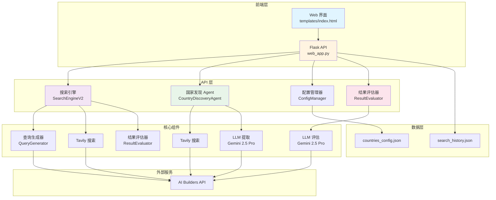
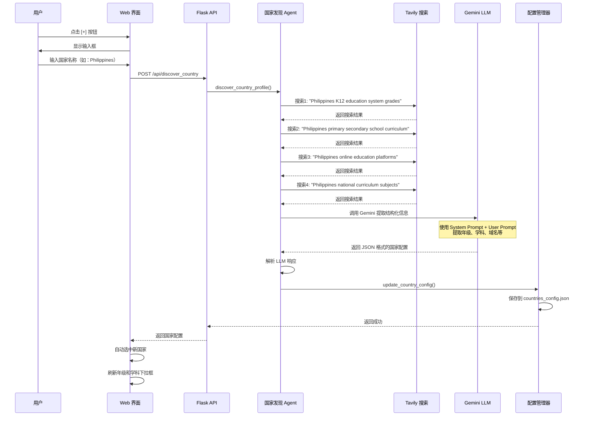
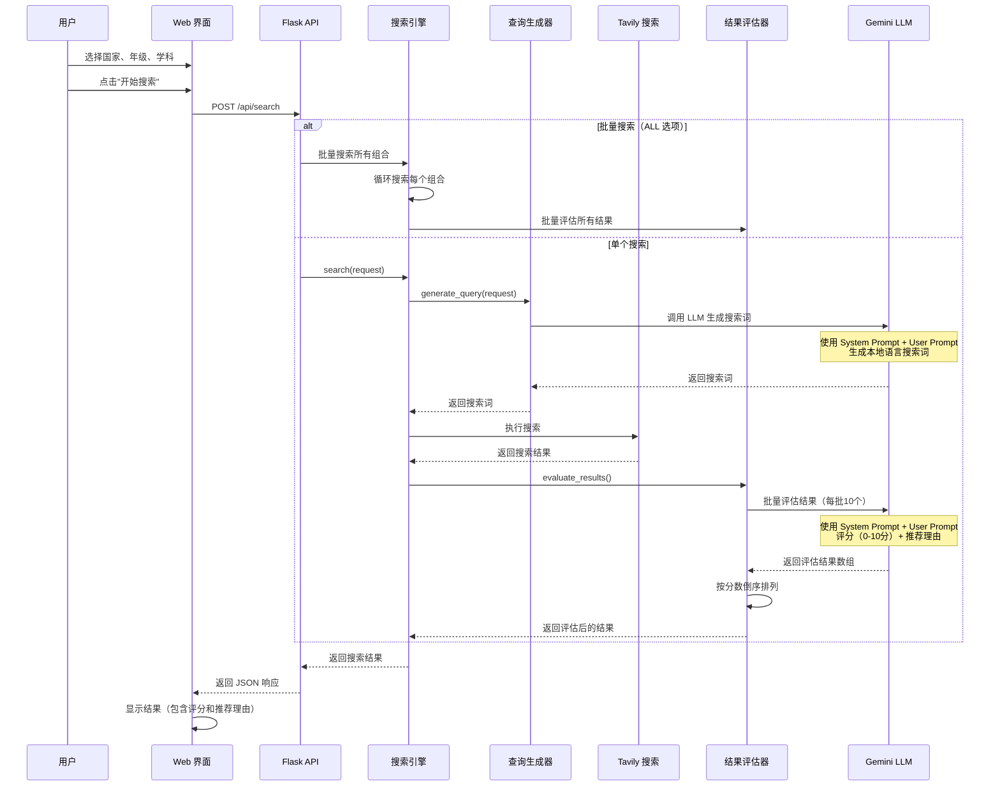
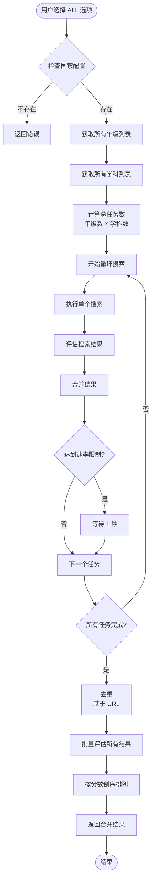
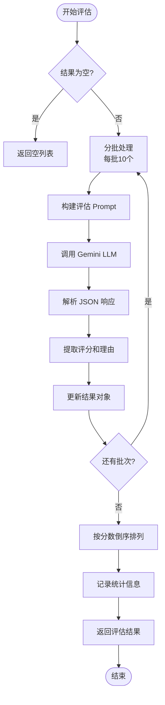
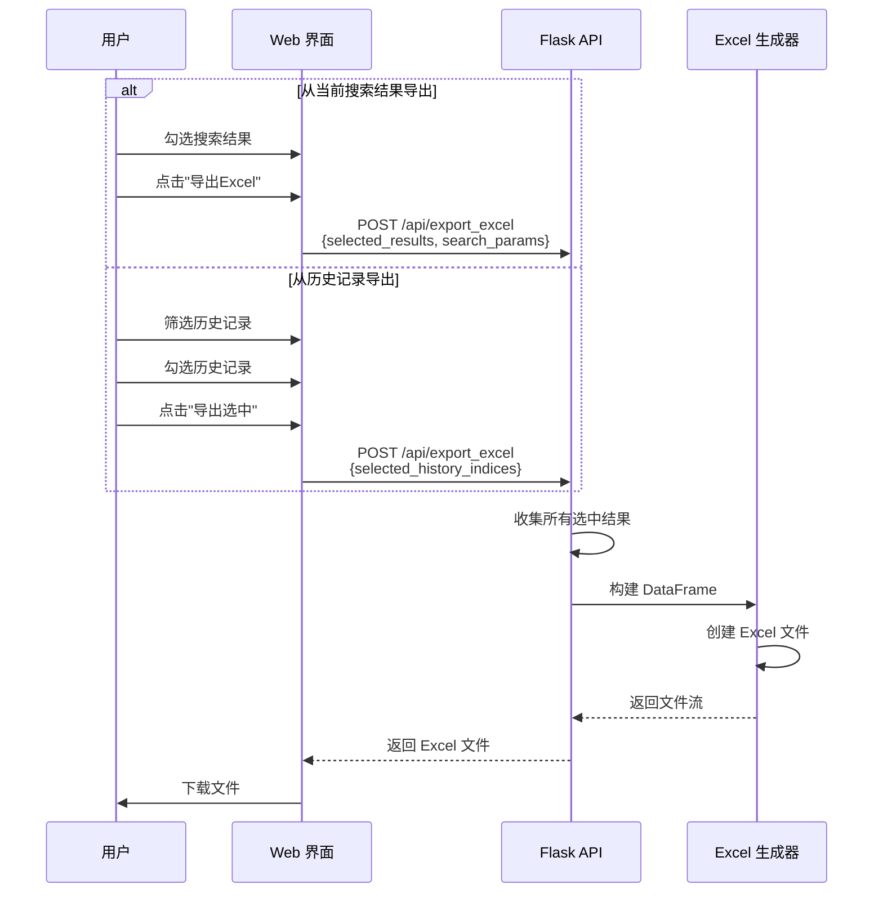

# K12 视频搜索系统 V3 - 完整技术文档

## 📋 目录

1. [系统概述](#系统概述)
2. [系统架构](#系统架构)
3. [核心流程](#核心流程)
4. [数据模型](#数据模型)
5. [API 接口](#api-接口)
6. [LLM 提示词完整清单](#llm-提示词完整清单)
7. [技术栈](#技术栈)
8. [部署指南](#部署指南)

---

## 系统概述

### 项目目标

K12 视频搜索系统 V3 是一个**AI 驱动的国家自动接入系统**，旨在为不同国家的 K12 教育体系自动搜索高质量的教育视频资源。

### 核心特性

1. **AI 驱动的国家自动接入**：通过 UI 交互，AI 自动调研并配置新国家的教育体系信息
2. **智能搜索**：根据国家、年级、学科自动生成本地语言的搜索词
3. **结果评估**：使用 LLM 对搜索结果进行 0-10 分评分，并提供推荐理由
4. **批量搜索**：支持"全部"选项，自动批量搜索所有年级/学科组合
5. **历史管理**：支持搜索历史筛选和批量导出

### 版本信息

- **版本**: V3.0.0
- **发布日期**: 2024-12-28
- **主要变更**: 
  - 新增 AI 驱动的国家发现功能
  - 新增结果评估功能
  - 新增历史记录筛选和批量导出功能

---

## 系统架构

### 整体架构图



### 组件说明

| 组件 | 文件 | 职责 |
|------|------|------|
| **Web 应用** | `web_app.py` | Flask 应用，提供 RESTful API 和 Web 界面 |
| **搜索引擎** | `search_engine_v2.py` | 核心搜索逻辑，包含查询生成和结果评估 |
| **国家发现 Agent** | `discovery_agent.py` | AI 驱动的国家信息调研和配置 |
| **配置管理器** | `config_manager.py` | 管理国家配置文件的读写 |
| **结果评估器** | `result_evaluator.py` | 使用 LLM 对搜索结果进行评分和推荐 |
| **前端界面** | `templates/index.html` | 用户交互界面 |

---

## 核心流程

### 1. 国家发现流程



### 2. 搜索流程



### 3. 批量搜索流程



### 4. 结果评估流程



### 5. 导出流程



---

## 数据模型

### 1. CountryProfile（国家配置）

```python
class CountryProfile(BaseModel):
    """国家教育体系配置"""
    country_code: str                    # ISO 3166-1 alpha-2（如：ID, PH, JP）
    country_name: str                    # 国家名称（英文）
    country_name_zh: str                  # 国家名称（中文）
    language_code: str                    # ISO 639-1（如：id, en, ja）
    grades: List[Dict[str, str]]         # 年级列表，每个元素包含：
                                          #   - local_name: 当地语言名称
                                          #   - zh_name: 中文名称
    subjects: List[Dict[str, str]]       # 学科列表，每个元素包含：
                                          #   - local_name: 当地语言名称
                                          #   - zh_name: 中文名称
    domains: List[str]                    # EdTech 域名白名单
    notes: str                            # 额外说明
```

**示例**：
```json
{
  "country_code": "PH",
  "country_name": "Philippines",
  "country_name_zh": "菲律宾",
  "language_code": "en",
  "grades": [
    {"local_name": "Kindergarten", "zh_name": "幼儿园"},
    {"local_name": "Grade 1", "zh_name": "一年级"},
    ...
  ],
  "subjects": [
    {"local_name": "Math", "zh_name": "数学"},
    {"local_name": "Science", "zh_name": "科学"},
    ...
  ],
  "domains": ["deped.gov.ph", "khanacademy.org"],
  "notes": "菲律宾使用英语和菲律宾语双语教学"
}
```

### 2. SearchRequest（搜索请求）

```python
class SearchRequest(BaseModel):
    """搜索请求"""
    country: str                          # 国家代码（如：ID, PH, JP）
    grade: str                            # 年级（如：1, Kelas 1, Grade 1）
    semester: Optional[str]               # 学期（如：1, Semester 1）
    subject: str                          # 学科（如：Matematika, Math）
    language: Optional[str]                # 搜索语言（如：id, en, zh）
```

### 3. SearchResult（搜索结果）

```python
class SearchResult(BaseModel):
    """单个搜索结果"""
    title: str                            # 搜索结果标题
    url: str                              # 结果URL
    snippet: str                          # 结果摘要
    source: str                           # 来源（规则/LLM）
    score: float                          # 评估分数（0-10分）
    recommendation_reason: str            # 推荐理由
    is_selected: bool                     # 是否被人工选中
```

### 4. SearchResponse（搜索响应）

```python
class SearchResponse(BaseModel):
    """搜索响应"""
    success: bool                         # 是否成功
    query: str                            # 使用的搜索词
    results: List[SearchResult]            # 搜索结果列表（按分数倒序）
    total_count: int                      # 结果总数
    playlist_count: int                    # 播放列表数量
    video_count: int                      # 视频数量
    message: str                          # 消息
    timestamp: str                        # 时间戳
```

---

## API 接口

### 1. 搜索 API

**端点**: `POST /api/search`

**请求体**:
```json
{
  "country": "ID",
  "grade": "Kelas 1",
  "semester": "1",
  "subject": "Matematika",
  "language": "id"
}
```

**响应**:
```json
{
  "success": true,
  "query": "playlist matematika kelas 1 semester 1",
  "results": [
    {
      "title": "Matematika Kelas 1 - Playlist Lengkap",
      "url": "https://youtube.com/playlist?list=...",
      "snippet": "...",
      "source": "规则-播放列表",
      "score": 8.5,
      "recommendation_reason": "内容质量高，符合教纲要求，播放次数较多",
      "is_selected": false
    }
  ],
  "total_count": 10,
  "playlist_count": 5,
  "video_count": 3,
  "message": "搜索成功",
  "timestamp": "2024-12-28T18:00:00"
}
```

### 2. 国家发现 API

**端点**: `POST /api/discover_country`

**请求体**:
```json
{
  "country_name": "Philippines"
}
```

**响应**:
```json
{
  "success": true,
  "message": "成功调研国家: Philippines",
  "profile": {
    "country_code": "PH",
    "country_name": "Philippines",
    "country_name_zh": "菲律宾",
    "language_code": "en",
    "grades": [...],
    "subjects": [...],
    "domains": [...],
    "notes": "..."
  }
}
```

### 3. 获取国家配置 API

**端点**: `GET /api/config/<country_code>`

**响应**:
```json
{
  "success": true,
  "config": {
    "country_code": "PH",
    "country_name": "Philippines",
    "country_name_zh": "菲律宾",
    "language_code": "en",
    "grades": [...],
    "subjects": [...],
    "domains": [...],
    "notes": "..."
  }
}
```

### 4. 获取所有国家列表 API

**端点**: `GET /api/countries`

**响应**:
```json
{
  "success": true,
  "countries": [
    {"country_code": "ID", "country_name": "Indonesia", "country_name_zh": "印尼"},
    {"country_code": "PH", "country_name": "Philippines", "country_name_zh": "菲律宾"}
  ]
}
```

### 5. 导出 Excel API

**端点**: `POST /api/export_excel`

**请求体（模式1：当前搜索结果）**:
```json
{
  "selected_results": [
    {"title": "...", "url": "...", "score": 8.5, ...}
  ],
  "search_params": {
    "country": "ID",
    "grade": "Kelas 1",
    "subject": "Matematika"
  }
}
```

**请求体（模式2：历史记录）**:
```json
{
  "selected_history_indices": [0, 1, 2]
}
```

**响应**: Excel 文件（二进制流）

---

## LLM 提示词完整清单

### 提示词 1: 搜索词生成（QueryGenerator）

**用途**: 根据国家、年级、学期、学科生成本地语言的搜索词

**模型**: DeepSeek（降级：Gemini 2.5 Pro）

**Temperature**: 0.3

**Max Tokens**: 100

**System Prompt**:
```
你是一个专业的搜索词生成专家，专门为教育视频资源生成高质量的搜索词。
你的任务是根据国家、年级、学期、学科信息，生成使用{language}语言的搜索词。

重要原则：
1. 使用目标国家的官方语言或常用语言
2. 使用该国家教育系统中常用的术语
3. 优先使用"playlist"、"课程"、"教学视频"等关键词
4. 搜索词应该简洁、准确、有效
5. 只返回搜索词，不要其他解释
```

**User Prompt**:
```
请为以下教育视频搜索生成搜索词：

国家：{country}
年级：{grade}
学期：{semester or "不指定"}
学科：{subject}
语言：{language}

请生成一个简洁有效的搜索词，使用{language}语言，优先包含"playlist"或"课程"等关键词。

只返回搜索词，不要其他文字。
```

**示例输入**:
- 国家：ID
- 年级：Kelas 1
- 学期：1
- 学科：Matematika
- 语言：id

**示例输出**:
```
playlist matematika kelas 1 semester 1
```

---

### 提示词 2: 国家信息提取（CountryDiscoveryAgent）

**用途**: 从搜索结果中提取国家的 K12 教育体系信息

**模型**: Gemini 2.5 Pro

**Temperature**: 0.2

**Max Tokens**: 4000

**System Prompt**:
```
你是一个教育体系分析专家。你的任务是分析搜索结果，提取指定国家的 K12 教育体系信息。

**关键要求**：
1. **年级表达必须使用当地语言**：例如印尼是 "Kelas 1-12"，菲律宾是 "Kindergarten, Grade 1-12"，日本是 "小学1年生-6年生, 中学1年生-3年生"
2. **学科名称必须使用当地语言**：例如印尼是 "Matematika, IPA, IPS"，菲律宾是 "Math, Science, Filipino, Araling Panlipunan"，日本是 "国語, 算数, 理科, 社会"
3. **语言代码**：使用 ISO 639-1 标准（如：id, en, ja, fil, ms）
4. **国家代码**：使用 ISO 3166-1 alpha-2 标准（如：ID, PH, JP, MY, SG）

请仔细分析搜索结果，提取准确的信息。
```

**User Prompt**:
```
请分析以下关于 {country_name} 的 K12 教育体系搜索结果，提取以下信息：

**需要提取的信息**：
1. **国家代码**（ISO 3166-1 alpha-2，如：ID, PH, JP）
2. **国家名称**（英文标准名称）
3. **国家中文名称**（中文标准名称，如：菲律宾、日本、印尼）
4. **主要语言代码**（ISO 639-1，如：id, en, ja）
5. **年级表达列表**（每个年级包含当地语言名称和中文名称）
6. **核心学科列表**（每个学科包含当地语言名称和中文名称）
7. **EdTech 域名白名单**（该国的在线教育平台域名）
8. **额外说明**（如有）

**搜索结果**：
{search_context}

**重要**：
- 年级和学科名称必须使用**当地语言**，同时提供对应的中文翻译
- 如果搜索结果中没有明确信息，请基于该国的教育体系常识进行合理推断
- 年级列表应该覆盖 K12 的所有年级（通常是 12-13 个年级）
- 学科列表应该包含该国的核心学科（至少 5-8 个）

**重要**：请只返回有效的 JSON 对象，不要包含任何其他文本、解释或 markdown 标记。直接返回 JSON，格式如下：

{
    "country_code": "PH",
    "country_name": "Philippines",
    "country_name_zh": "菲律宾",
    "language_code": "en",
    "grades": [
        {"local_name": "Kindergarten", "zh_name": "幼儿园"},
        {"local_name": "Grade 1", "zh_name": "一年级"},
        {"local_name": "Grade 2", "zh_name": "二年级"},
        ...
        {"local_name": "Grade 12", "zh_name": "十二年级"}
    ],
    "subjects": [
        {"local_name": "Math", "zh_name": "数学"},
        {"local_name": "Science", "zh_name": "科学"},
        {"local_name": "Filipino", "zh_name": "菲律宾语"},
        {"local_name": "English", "zh_name": "英语"},
        {"local_name": "Araling Panlipunan", "zh_name": "社会研究"},
        {"local_name": "MAPEH", "zh_name": "音乐、艺术、体育、健康"},
        {"local_name": "TLE", "zh_name": "技术、生计教育"}
    ],
    "domains": ["deped.gov.ph", "khanacademy.org"],
    "notes": "菲律宾使用英语和菲律宾语双语教学"
}

**注意**：
- language_code 必须是单个字符串（如 "en"），不是数组
- grades 和 subjects 必须是对象数组，每个对象包含 local_name 和 zh_name
- 直接返回 JSON，不要添加任何前缀或后缀
```

**示例输入**:
- country_name: "Philippines"
- search_context: （包含 40 个搜索结果的标题、URL 和摘要）

**示例输出**:
```json
{
  "country_code": "PH",
  "country_name": "Philippines",
  "country_name_zh": "菲律宾",
  "language_code": "en",
  "grades": [
    {"local_name": "Kindergarten", "zh_name": "幼儿园"},
    {"local_name": "Grade 1", "zh_name": "一年级"},
    ...
  ],
  "subjects": [
    {"local_name": "Math", "zh_name": "数学"},
    ...
  ],
  "domains": ["deped.gov.ph"],
  "notes": "..."
}
```

---

### 提示词 3: 搜索结果评估（ResultEvaluator）

**用途**: 对搜索结果进行评分（0-10分）并提供推荐理由

**模型**: Gemini 2.5 Pro

**Temperature**: 0.3

**Max Tokens**: 2000

**System Prompt**:
```
你是一个教育内容质量评估专家。你的任务是对搜索结果进行评分和推荐。

**评分标准（0-10分）**：
1. **播放次数/受欢迎程度**（0-3分）：根据标题和URL判断内容的受欢迎程度
2. **视频更新时间**（0-2分）：内容是否较新（2020年后）
3. **符合教纲**（0-5分）：内容是否与指定的国家、年级、学科匹配

**评分规则**：
- 9-10分：非常优秀，强烈推荐
- 7-8分：良好，推荐使用
- 5-6分：一般，可以使用
- 3-4分：较差，不推荐
- 0-2分：很差，不建议使用

请为每个结果提供评分和推荐理由。
```

**User Prompt**:
```
请评估以下搜索结果，这些结果是为 **{country}** 的 **{grade}** 年级 **{subject}** 学科搜索的。

**搜索结果**：
{results_context}

**要求**：
1. 为每个结果评分（0-10分）
2. 提供简短的推荐理由（1-2句话）
3. 考虑播放次数、更新时间和是否符合教纲

请以 JSON 数组格式返回结果，格式如下：
[
    {
        "index": 1,
        "score": 8.5,
        "recommendation_reason": "内容质量高，符合教纲要求，播放次数较多"
    },
    {
        "index": 2,
        "score": 6.0,
        "recommendation_reason": "内容一般，但符合基本要求"
    }
]

**重要**：只返回 JSON 数组，不要包含其他文本。
```

**示例输入**:
- country: "ID"
- grade: "Kelas 1"
- subject: "Matematika"
- results_context: （包含 10 个搜索结果的标题、URL 和摘要）

**示例输出**:
```json
[
  {
    "index": 1,
    "score": 8.5,
    "recommendation_reason": "YouTube 播放列表，内容完整，播放次数较多，适合 Kelas 1 学生"
  },
  {
    "index": 2,
    "score": 7.0,
    "recommendation_reason": "教育平台资源，内容质量良好，但播放次数较少"
  },
  ...
]
```

---

## 技术栈

### 后端技术

| 技术 | 版本 | 用途 |
|------|------|------|
| Python | 3.6+ | 编程语言 |
| Flask | 2.3.0+ | Web 框架 |
| Flask-CORS | 4.0.0+ | 跨域支持 |
| Pydantic | 2.0.0+ | 数据验证和序列化 |
| Requests | 2.31.0+ | HTTP 请求 |
| Pandas | 2.0.0+ | Excel 导出（可选） |
| OpenPyXL | 3.1.0+ | Excel 文件生成（可选） |

### 外部服务

| 服务 | 用途 | API 端点 |
|------|------|----------|
| AI Builders API | LLM 调用 + Tavily 搜索 | `https://space.ai-builders.com/backend` |
| Gemini 2.5 Pro | 国家信息提取、结果评估 | `/v1/chat/completions` |
| DeepSeek | 搜索词生成 | `/v1/chat/completions` |
| Tavily Search | 网页搜索 | `/v1/search/` |

### 前端技术

| 技术 | 用途 |
|------|------|
| HTML5 | 页面结构 |
| CSS3 | 样式设计 |
| JavaScript (ES6+) | 交互逻辑 |
| Fetch API | API 调用 |

---

## 部署指南

### 1. 环境要求

- Python 3.6+
- pip 包管理器

### 2. 安装依赖

```bash
pip install -r requirements_v3.txt
```

**依赖列表**:
```
flask>=2.3.0
flask-cors>=4.0.0
requests>=2.31.0
pydantic>=2.0.0
python-dotenv>=1.0.0
pandas>=2.0.0
openpyxl>=3.1.0
```

### 3. 环境变量配置

创建 `.env` 文件：
```
AI_BUILDER_TOKEN=your_token_here
```

或设置环境变量：
```bash
export AI_BUILDER_TOKEN="your_token_here"
```

### 4. 启动应用

```bash
python web_app.py
```

应用将在 `http://localhost:5000` 启动。

### 5. 日志文件

- **控制台日志**: 实时输出到终端
- **文件日志**: `web_app.log`（自动轮转，最大 10MB，保留 5 个备份）

### 6. 配置文件

- **国家配置**: `countries_config.json`（自动生成）
- **搜索历史**: `search_history.json`（自动生成）

---

## 文件结构

```
.
├── web_app.py                    # Flask Web 应用（主入口）
├── search_engine_v2.py          # 搜索引擎核心
├── discovery_agent.py           # 国家发现 Agent
├── config_manager.py            # 配置管理器
├── result_evaluator.py          # 结果评估器
├── search_strategist.py         # 搜索策略（复用）
│
├── templates/
│   └── index.html               # 前端界面
│
├── countries_config.json        # 国家配置存储（自动生成）
├── search_history.json          # 搜索历史（自动生成）
├── web_app.log                  # 应用日志（自动生成）
│
├── requirements_v3.txt          # Python 依赖
├── README_V3.md                 # 使用说明
└── TECHNICAL_DOCUMENTATION_V3.md # 本文档
```

---

## 关键设计决策

### 1. 为什么使用对象数组存储年级和学科？

**原因**: 支持双语显示（当地语言 + 中文），提升用户体验。

**实现**: 每个元素包含 `local_name` 和 `zh_name` 字段。

### 2. 为什么评估功能使用批量处理？

**原因**: 
- 减少 API 调用次数
- 提高处理效率
- 降低 API 成本

**实现**: 每批处理 10 个结果，按分数倒序排列。

### 3. 为什么支持"全部"选项的批量搜索？

**原因**: 用户可能需要一次性搜索所有年级/学科组合。

**实现**: 
- 后端自动循环搜索所有组合
- 智能去重（基于 URL）
- 速率限制保护（每 3 个请求等待 1 秒）

### 4. 为什么评估结果按分数倒序排列？

**原因**: 优先展示高质量资源，提升用户体验。

**实现**: 评估完成后自动排序。

---

## 性能优化

### 1. 搜索优化

- **批量评估**: 每批处理 10 个结果，减少 API 调用
- **速率限制**: 批量搜索时自动控制请求频率
- **结果缓存**: 历史记录保存，避免重复搜索

### 2. 前端优化

- **异步加载**: 使用 async/await 避免阻塞
- **动态渲染**: 级联下拉框按需加载
- **错误处理**: 完善的错误提示和降级方案

### 3. 日志优化

- **日志轮转**: 自动管理日志文件大小
- **分级日志**: INFO/WARNING/ERROR 分级输出
- **性能监控**: 记录关键操作的执行时间

---

## 错误处理

### 1. API 调用失败

- **重试机制**: 自动重试（最多 2 次）
- **降级方案**: LLM 失败时使用默认搜索词
- **错误提示**: 友好的错误信息

### 2. 数据解析失败

- **JSON 修复**: 自动修复常见的 JSON 格式问题
- **字段提取**: 使用正则表达式提取关键字段
- **默认值**: 提供合理的默认值

### 3. 前端错误

- **网络错误**: 显示友好的错误提示
- **数据验证**: 前端和后端双重验证
- **降级显示**: 部分功能失败时不影响其他功能

---

## 未来优化方向

1. **缓存机制**: 缓存国家配置和搜索结果
2. **异步处理**: 使用 Celery 处理长时间任务
3. **数据库支持**: 使用数据库替代 JSON 文件
4. **用户认证**: 支持多用户和权限管理
5. **API 限流**: 防止 API 滥用
6. **监控告警**: 集成监控和告警系统

---

## 附录

### A. 国家代码映射表

| 国家代码 | 国家名称（英文） | 国家名称（中文） | 语言代码 |
|---------|----------------|----------------|---------|
| ID | Indonesia | 印尼 | id |
| PH | Philippines | 菲律宾 | en |
| JP | Japan | 日本 | ja |
| CN | China | 中国 | zh |
| US | United States | 美国 | en |
| MY | Malaysia | 马来西亚 | ms |
| SG | Singapore | 新加坡 | en |
| IN | India | 印度 | en |

### B. 评分标准详解

| 分数范围 | 评级 | 说明 | 推荐程度 |
|---------|------|------|---------|
| 9-10分 | 优秀 | 内容质量高，符合教纲，播放次数多 | 强烈推荐 |
| 7-8分 | 良好 | 内容质量良好，基本符合要求 | 推荐使用 |
| 5-6分 | 一般 | 内容一般，但可以使用 | 可以使用 |
| 3-4分 | 较差 | 内容质量较差，不符合要求 | 不推荐 |
| 0-2分 | 很差 | 内容质量很差，不建议使用 | 不建议使用 |

### C. 常见问题

**Q: 为什么评估功能没有显示评分？**

A: 请检查：
1. `result_evaluator` 是否正确初始化
2. 后端日志中是否有评估相关的错误
3. 浏览器控制台是否有错误信息

**Q: 如何添加新国家？**

A: 点击国家下拉框旁边的 **[+]** 按钮，输入国家名称（英文），AI 会自动调研并配置。

**Q: 批量搜索需要多长时间？**

A: 取决于搜索组合数量。例如：12 个年级 × 8 个学科 = 96 个任务，大约需要 3-5 分钟。

**Q: Excel 导出功能不可用？**

A: 请安装依赖：`pip install pandas openpyxl`

---

**文档版本**: V3.0.0  
**最后更新**: 2024-12-28  
**维护者**: AI 系统架构师

