# feat: Agent-Native 智能搜索架构与自我优化系统

## 概述

将现有搜索系统重构为 **Agent-Native 架构**，使智能代理自主执行搜索任务并通过**自我优化循环**持续改进搜索策略。核心创新在于引入**搜索策略优化器**（Search Strategy Optimizer），通过大批量迭代测试（搜索→评估→调整→再搜索）自动寻找最优的 LLM 提示词和搜索参数配置。

**项目位置：** `/Users/shmiwanghao8/Desktop/education/Indonesia`
**当前架构：** LLM 增强的多搜索引擎（Google/Baidu/Tavily）+ 规则评分
**目标架构：** Agent-Native 智能搜索 + 自我优化循环
**类型：** 架构重构 + 智能优化系统
**时间线：** 6-8 周

---

## 问题陈述与动机

### 当前系统的局限性

**现有架构分析（基于 `docs/LLM_AI_INTEGRATION_ANALYSIS.md`）：**

1. **静态 LLM 提示词**
   - 提示词存储在 `config/prompts/ai_search_strategy.yaml`（280行）
   - 手工编写和调整，缺乏自动化优化
   - 不同国家/学科使用相同提示词，缺乏针对性

2. **固定搜索策略**
   - 搜索引擎权重、阈值参数硬编码
   - 无法根据实际效果动态调整
   - `IntelligentSearchOptimizer` 存在但需人工审核（582行）

3. **缺乏学习能力**
   - 虽有 `KnowledgeBaseManager`（650行），但未被充分利用
   - 搜索结果质量依赖人工评估，无自动化反馈
   - 无法从历史数据中学习最优策略

4. **LLM 能力未充分利用**
   - LLM 仅用于查询生成和结果评分
   - 未将 LLM 作为优化策略的"思考引擎"
   - 缺少 Agent 范式（自主决策、工具调用、反思改进）

### 为什么需要 Agent-Native 架构

**Agent-Native 核心理念：**
> "Agent 是第一性原理 - 不是 LLM 调用工具，而是能够自主感知、推理、决策、行动并改进的智能实体。"

**与当前架构的对比：**

| 维度 | 当前架构 | Agent-Native 架构 |
|------|----------|-------------------|
| **搜索执行** | 被动调用 API | Agent 自主决策搜索策略 |
| **提示词管理** | 静态配置文件 | 动态生成和优化 |
| **参数调整** | 手工配置 | 自动优化循环 |
| **反馈学习** | 人工审核 | 自动评估和迭代 |
| **智能性** | 规则 + LLM 辅助 | Agent 自主推理和改进 |

### 业务价值

**对教师：**
- 搜索结果质量持续提升（自我优化）
- 更准确的教育资源匹配
- 减少低质量结果的干扰

**对系统：**
- 自动发现最优搜索策略（节省人工调参时间）
- 适应不同国家/学科的特点（个性化优化）
- LLM 能力最大化利用（智能决策）

**对研究：**
- 建立 Agent-Native 教育搜索范式
- 可复用的自我优化框架
- 数据驱动的搜索策略研究

---

## 技术方案

### 核心架构设计

#### 系统架构图


### 核心组件设计

#### 1. 搜索协调器 Agent（Search Coordinator Agent）

**职责：** 协调所有搜索相关 Agent，管理搜索任务的生命周期

**文件：** `core/agents/search_coordinator_agent.py` (新建，~300行)

```python
"""
搜索协调器 Agent - Agent-Native 架构的核心

自主决策搜索策略，协调子 Agent 完成搜索任务。
"""

from typing import List, Dict, Optional
from datetime import datetime
import logging

logger = logging.getLogger(__name__)

class SearchCoordinatorAgent:
    """
    搜索协调器 Agent - 负责决策和协调

    核心能力：
    1. 理解用户搜索意图
    2. 决策最优搜索策略
    3. 协调子 Agent 执行任务
    4. 整合各 Agent 结果
    5. 记录执行过程供优化器学习
    """

    def __init__(self):
        from core.agents.query_generation_agent import QueryGenerationAgent
        from core.agents.search_execution_agent import SearchExecutionAgent
        from core.agents.result_scoring_agent import ResultScoringAgent
        from core.agents.result_refinement_agent import ResultRefinementAgent
        from database.models import get_db_manager

        self.query_agent = QueryGenerationAgent()
        self.search_agent = SearchExecutionAgent()
        self.score_agent = ResultScoringAgent()
        self.refine_agent = ResultRefinementAgent()
        self.db = get_db_manager()

        # 加载当前最优策略（由优化器维护）
        self.current_strategy = self._load_optimized_strategy()

    def coordinate_search(
        self,
        country: str,
        grade: str,
        subject: str,
        knowledge_points: Optional[List[str]] = None,
        user_context: Optional[Dict] = None
    ) -> Dict:
        """
        协调完成一次完整的搜索任务

        Args:
            country: 国家代码（如 'ID', 'CN'）
            grade: 年级（如 'Kelas 8', 'Grade 10'）
            subject: 学科（如 'Matematika', '数学'）
            knowledge_points: 知识点列表
            user_context: 用户上下文（历史偏好、学习风格等）

        Returns:
            搜索结果字典，包含：
            - results: 最终结果列表
            - strategy_used: 使用的策略
            - agent_trace: Agent 执行轨迹
            - quality_metrics: 质量指标
        """

        search_session_id = f"search_{datetime.now().strftime('%Y%m%d%H%M%S')}"

        logger.info(f"[{search_session_id}] 开始协调搜索任务")
        logger.info(f"[{search_session_id}] 国家={country}, 年级={grade}, 学科={subject}")

        # Step 1: 查询生成 Agent - 生成最优搜索查询
        logger.info(f"[{search_session_id}] 步骤1: 生成搜索查询")
        query_result = self.query_agent.generate_query(
            country=country,
            grade=grade,
            subject=subject,
            knowledge_points=knowledge_points,
            strategy=self.current_strategy
        )

        generated_queries = query_result['queries']
        logger.info(f"[{search_session_id}] 生成了 {len(generated_queries)} 个查询")
        for i, q in enumerate(generated_queries):
            logger.debug(f"[{search_session_id}] 查询{i+1}: {q['text']}")

        # Step 2: 搜索执行 Agent - 执行多引擎搜索
        logger.info(f"[{search_session_id}] 步骤2: 执行搜索")
        search_result = self.search_agent.execute_search(
            queries=generated_queries,
            strategy=self.current_strategy
        )

        raw_results = search_result['results']
        logger.info(f"[{search_session_id}] 获得 {len(raw_results)} 个原始结果")

        # Step 3: 结果评分 Agent - 智能评分和排序
        logger.info(f"[{search_session_id}] 步骤3: 评分和排序")
        score_result = self.score_agent.score_results(
            results=raw_results,
            query_context={
                'country': country,
                'grade': grade,
                'subject': subject,
                'generated_queries': generated_queries
            },
            strategy=self.current_strategy
        )

        scored_results = score_result['results']
        logger.info(f"[{search_session_id}] 评分完成，保留 {len(scored_results)} 个高质量结果")

        # Step 4: 结果精炼 Agent - 最终优化
        logger.info(f"[{search_session_id}] 步骤4: 精炼结果")
        refine_result = self.refine_agent.refine_results(
            results=scored_results,
            top_k=20,
            strategy=self.current_strategy
        )

        final_results = refine_result['results']

        # Step 5: 记录完整搜索过程（供优化器学习）
        self._log_search_session(
            session_id=search_session_id,
            inputs={
                'country': country,
                'grade': grade,
                'subject': subject,
                'knowledge_points': knowledge_points,
                'user_context': user_context
            },
            strategy=self.current_strategy,
            agent_trace={
                'query_generation': query_result,
                'search_execution': search_result,
                'result_scoring': score_result,
                'result_refinement': refine_result
            },
            outputs={
                'result_count': len(final_results),
                'avg_score': sum(r.get('score', 0) for r in final_results) / len(final_results) if final_results else 0
            }
        )

        logger.info(f"[{search_session_id}] 搜索协调完成")

        return {
            'results': final_results,
            'strategy_used': self.current_strategy,
            'agent_trace': {
                'queries': generated_queries,
                'raw_count': len(raw_results),
                'scored_count': len(scored_results),
                'final_count': len(final_results)
            },
            'quality_metrics': {
                'avg_score': sum(r.get('score', 0) for r in final_results) / len(final_results) if final_results else 0,
                'high_quality_count': sum(1 for r in final_results if r.get('score', 0) >= 8.0)
            },
            'session_id': search_session_id
        }

    def _load_optimized_strategy(self) -> Dict:
        """从优化器加载当前最优策略"""
        from core.optimization.strategy_store import StrategyStore

        strategy_store = StrategyStore()
        return strategy_store.get_best_strategy(
            context='default'  # 或根据具体场景选择
        )

    def _log_search_session(
        self,
        session_id: str,
        inputs: Dict,
        strategy: Dict,
        agent_trace: Dict,
        outputs: Dict
    ):
        """记录搜索会话（供优化器学习）"""
        from core.optimization.search_logger import SearchSessionLogger

        logger_agent = SearchSessionLogger()
        logger_agent.log_session(
            session_id=session_id,
            timestamp=datetime.now(),
            inputs=inputs,
            strategy=strategy,
            agent_trace=agent_trace,
            outputs=outputs
        )
```

#### 2. 搜索策略优化器（Search Strategy Optimizer）

**职责：** 通过自我优化循环自动寻找最优搜索策略和 LLM 提示词

**核心创新：** 优化循环架构

```
┌─────────────────────────────────────────────────────────┐
│           自我优化循环（Self-Optimization Loop）          │
└─────────────────────────────────────────────────────────┘
                        │
                        ▼
         ┌──────────────────────────────┐
         │  1. 生成候选策略              │
         │  (LLM + 变体生成)             │
         └──────────┬───────────────────┘
                    │
                    ▼
         ┌──────────────────────────────┐
         │  2. 批量测试搜索              │
         │  (100-500 次搜索)            │
         └──────────┬───────────────────┘
                    │
                    ▼
         ┌──────────────────────────────┐
         │  3. 评估结果质量              │
         │  (自动评估 + 人工抽检)        │
         └──────────┬───────────────────┘
                    │
                    ▼
         ┌──────────────────────────────┐
         │  4. 选择最优策略              │
         │  (多臂老虎机/贝叶斯优化)      │
         └──────────┬───────────────────┘
                    │
                    ▼
         ┌──────────────────────────────┐
         │  5. 更新策略库                │
         │  (版本控制 + A/B 测试)        │
         └──────────┬───────────────────┘
                    │
                    └─────► 循环回到步骤1
```

**文件：** `core/optimization/search_strategy_optimizer.py` (新建，~500行)

```python
"""
搜索策略优化器 - 自动优化搜索策略和 LLM 提示词

核心能力：
1. 生成候选策略（使用 LLM）
2. 批量测试搜索（并行执行）
3. 评估结果质量（多指标综合）
4. 选择最优策略（Optuna 贝叶斯优化）
5. 更新策略库（版本控制 + A/B 测试）
"""

from typing import List, Dict, Optional
from datetime import datetime
import logging
from concurrent.futures import ThreadPoolExecutor, as_completed
import json

logger = logging.getLogger(__name__)

class SearchStrategyOptimizer:
    """
    搜索策略优化器

    优化目标：
    - 最优 LLM 提示词（提高查询生成质量）
    - 最优搜索参数（引擎权重、阈值等）
    - 最优评分策略（评分因子权重）
    """

    def __init__(self):
        from core.llm_client import get_llm_client
        from core.optimization.evaluator import ResultEvaluator
        from core.optimization.strategy_store import StrategyStore
        from core.optimization.variant_generator import VariantGenerator

        self.llm = get_llm_client()
        self.evaluator = ResultEvaluator()
        self.strategy_store = StrategyStore()
        self.variant_generator = VariantGenerator()

        # 优化配置
        self.config = {
            'batch_size': 100,  # 每轮测试的搜索次数
            'top_k_strategies': 5,  # 保留前5个候选策略
            'optimization_rounds': 10,  # 优化轮数
            'evaluator_split': 0.8  # 80%自动评估，20%人工抽检
        }

    def optimize(
        self,
        search_contexts: List[Dict],
        optimization_target: str = 'overall_quality',
        max_rounds: int = 10
    ) -> Dict:
        """
        执行完整的优化循环

        Args:
            search_contexts: 测试用的搜索上下文列表
                [{
                    'country': 'ID',
                    'grade': 'Kelas 8',
                    'subject': 'Matematika',
                    'knowledge_points': ['Pecahan', 'Desimal']
                }, ...]
            optimization_target: 优化目标
                - 'overall_quality': 综合质量
                - 'relevance': 相关性
                - 'pedagogy': 教学质量
                - 'cost': 成本效率
            max_rounds: 最大优化轮数

        Returns:
            优化结果：
            {
                'best_strategy': 最优策略,
                'improvement_metrics': 改进指标,
                'optimization_trace': 优化轨迹,
                'ab_test_plan': A/B测试计划
            }
        """

        logger.info(f"开始搜索策略优化，目标: {optimization_target}")

        optimization_trace = []
        baseline_metrics = None

        for round_num in range(1, max_rounds + 1):
            logger.info(f"=== 优化轮次 {round_num}/{max_rounds} ===")

            # Step 1: 生成候选策略
            logger.info("步骤1: 生成候选策略")
            candidate_strategies = self._generate_candidate_strategies(
                round_num=round_num,
                previous_trace=optimization_trace
            )

            logger.info(f"生成了 {len(candidate_strategies)} 个候选策略")

            # Step 2: 批量测试搜索
            logger.info("步骤2: 批量测试搜索")
            test_results = self._batch_test_strategies(
                strategies=candidate_strategies,
                search_contexts=search_contexts,
                batch_size=self.config['batch_size']
            )

            # Step 3: 评估结果质量
            logger.info("步骤3: 评估结果质量")
            evaluation_results = self._evaluate_test_results(
                test_results=test_results,
                target=optimization_target
            )

            # Step 4: 选择最优策略
            logger.info("步骤4: 选择最优策略")
            best_strategy = self._select_best_strategy(
                evaluation_results=evaluation_results
            )

            # 记录本轮优化轨迹
            round_trace = {
                'round': round_num,
                'candidates_count': len(candidate_strategies),
                'best_strategy_id': best_strategy['id'],
                'best_metrics': best_strategy['metrics'],
                'improvement': self._calculate_improvement(
                    baseline=baseline_metrics,
                    current=best_strategy['metrics']
                )
            }

            optimization_trace.append(round_trace)

            # 第一轮作为基线
            if round_num == 1:
                baseline_metrics = best_strategy['metrics']

            logger.info(f"本轮最优策略: {best_strategy['id']}")
            logger.info(f"改进幅度: {round_trace['improvement']}%")

            # Step 5: 更新策略库
            logger.info("步骤5: 更新策略库")
            self.strategy_store.save_strategy(
                strategy_id=best_strategy['id'],
                strategy=best_strategy,
                metrics=best_strategy['metrics'],
                metadata={
                    'optimization_round': round_num,
                    'optimization_target': optimization_target,
                    'test_results': test_results
                }
            )

            # 早停：如果改进不明显，停止优化
            if round_num > 3 and round_trace['improvement'] < 0.5:
                logger.info(f"改进幅度 < 0.5%，提前停止优化")
                break

        # 生成 A/B 测试计划
        ab_test_plan = self._generate_ab_test_plan(
            best_strategy=best_strategy,
            baseline_strategy=self.strategy_store.get_baseline_strategy()
        )

        logger.info("优化完成！")

        return {
            'best_strategy': best_strategy,
            'improvement_metrics': round_trace['improvement'],
            'optimization_trace': optimization_trace,
            'ab_test_plan': ab_test_plan
        }

    def _generate_candidate_strategies(
        self,
        round_num: int,
        previous_trace: List[Dict]
    ) -> List[Dict]:
        """
        生成候选策略（使用 LLM）

        策略包含：
        - query_prompt: LLM 提示词（用于生成查询）
        - search_params: 搜索参数（引擎权重、数量限制等）
        - scoring_weights: 评分权重（相关性、教学性等）
        """

        # 使用变体生成器创建多个候选
        candidates = []

        # 候选1: 当前最优策略（基线）
        baseline = self.strategy_store.get_best_strategy()
        candidates.append(baseline)

        # 候选2-5: LLM 生成的变体
        llm_variants = self.variant_generator.generate_llm_variants(
            base_strategy=baseline,
            num_variants=4,
            previous_trace=previous_trace
        )
        candidates.extend(llm_variants)

        # 候选6-10: 参数空间的网格搜索
        param_variants = self.variant_generator.generate_param_variants(
            base_strategy=baseline,
            num_variants=5
        )
        candidates.extend(param_variants)

        return candidates

    def _batch_test_strategies(
        self,
        strategies: List[Dict],
        search_contexts: List[Dict],
        batch_size: int
    ) -> Dict:
        """
        批量测试策略

        为每个策略执行 batch_size 次搜索，记录结果
        """

        test_results = {}

        # 使用线程池并行测试
        with ThreadPoolExecutor(max_workers=10) as executor:
            futures = {}

            for strategy in strategies:
                strategy_id = strategy['id']

                for i, context in enumerate(search_contexts[:batch_size]):
                    future = executor.submit(
                        self._test_single_search,
                        strategy=strategy,
                        context=context
                    )
                    futures[future] = (strategy_id, i)

            # 收集结果
            for future in as_completed(futures):
                strategy_id, test_id = futures[future]
                try:
                    result = future.result(timeout=60)

                    if strategy_id not in test_results:
                        test_results[strategy_id] = []

                    test_results[strategy_id].append(result)

                except Exception as e:
                    logger.error(f"测试失败: {strategy_id}-{test_id}, 错误: {e}")

        return test_results

    def _test_single_search(
        self,
        strategy: Dict,
        context: Dict
    ) -> Dict:
        """执行单次搜索测试"""
        from core.agents.search_coordinator_agent import SearchCoordinatorAgent

        coordinator = SearchCoordinatorAgent()
        coordinator.current_strategy = strategy

        search_result = coordinator.coordinate_search(
            country=context['country'],
            grade=context['grade'],
            subject=context['subject'],
            knowledge_points=context.get('knowledge_points'),
            user_context=context.get('user_context')
        )

        return {
            'results': search_result['results'],
            'quality_metrics': search_result['quality_metrics'],
            'strategy_id': strategy['id']
        }

    def _evaluate_test_results(
        self,
        test_results: Dict,
        target: str
    ) -> Dict:
        """评估测试结果"""
        return self.evaluator.evaluate(
            test_results=test_results,
            target=target
        )

    def _select_best_strategy(
        self,
        evaluation_results: Dict
    ) -> Dict:
        """选择最优策略（多指标综合）"""
        # 使用 Optuna 进行多目标优化
        import optuna

        # ... 优化逻辑 ...
        # 返回最优策略

    def _calculate_improvement(
        self,
        baseline: Dict,
        current: Dict
    ) -> float:
        """计算改进幅度"""
        if not baseline:
            return 0.0

        baseline_score = baseline.get('overall_quality', 0)
        current_score = current.get('overall_quality', 0)

        return ((current_score - baseline_score) / baseline_score) * 100 if baseline_score > 0 else 0

    def _generate_ab_test_plan(
        self,
        best_strategy: Dict,
        baseline_strategy: Dict
    ) -> Dict:
        """生成 A/B 测试计划"""
        return {
            'control': baseline_strategy['id'],
            'treatment': best_strategy['id'],
            'traffic_split': '50/50',
            'duration_days': 7,
            'success_metrics': ['overall_quality', 'user_satisfaction', 'conversion_rate'],
            'min_sample_size': 1000
        }
```

#### 3. 变体生成器（Variant Generator）

**职责：** 使用 LLM 生成策略和提示词的变体

**文件：** `core/optimization/variant_generator.py` (新建，~300行)

```python
"""
变体生成器 - 使用 LLM 生成策略和提示词的变体

核心技术：
1. LLM 驱动的提示词优化
2. 梯度式改进（基于 TextGrad 思想）
3. 进化算法（基于 PromptBreeder 思想）
"""

from typing import List, Dict
import logging

logger = logging.getLogger(__name__)

class VariantGenerator:
    """变体生成器"""

    def __init__(self):
        from core.llm_client import get_llm_client

        self.llm = get_llm_client()

    def generate_llm_variants(
        self,
        base_strategy: Dict,
        num_variants: int,
        previous_trace: List[Dict]
    ) -> List[Dict]:
        """
        使用 LLM 生成提示词变体

        方法：
        1. 分析历史表现（从 trace 中学习）
        2. 识别改进方向（使用 LLM 推理）
        3. 生成候选变体（迭代优化）
        """

        base_prompt = base_strategy['query_prompt']

        # 使用 LLM 生成优化建议
        analysis_prompt = f"""
        分析以下搜索提示词的性能，并提出改进建议：

        原始提示词：
        {base_prompt}

        历史表现：
        {self._format_trace(previous_trace)}

        请提出 {num_variants} 个改进版本，每个版本应该：
        1. 更清晰地表达搜索意图
        2. 针对特定教育场景优化
        3. 考虑多语言支持
        4. 提升查询质量

        输出格式：JSON
        {{
            "variants": [
                {{"reasoning": "改进原因", "prompt": "改进后的提示词"}},
                ...
            ]
        }}
        """

        response = self.llm.generate(
            prompt=analysis_prompt,
            temperature=0.7,
            max_tokens=2000
        )

        # 解析 LLM 响应
        try:
            import json
            result = json.loads(response)
            variants = result['variants']
        except:
            logger.error("LLM 响应解析失败，使用备用变体生成")
            variants = self._generate_fallback_variants(
                base_prompt=base_prompt,
                num_variants=num_variants
            )

        # 构建完整策略对象
        strategy_variants = []
        for i, variant in enumerate(variants):
            strategy_variants.append({
                'id': f"llm_variant_{i}",
                'query_prompt': variant['prompt'],
                'search_params': base_strategy['search_params'],
                'scoring_weights': base_strategy['scoring_weights'],
                'metadata': {
                    'type': 'llm_generated',
                    'reasoning': variant['reasoning'],
                    'parent_strategy': base_strategy['id']
                }
            })

        return strategy_variants

    def generate_param_variants(
        self,
        base_strategy: Dict,
        num_variants: int
    ) -> List[Dict]:
        """
        生成参数空间变体（网格搜索）

        参数维度：
        - search_engine_weights: 搜索引擎权重
        - max_results_per_engine: 每个引擎的最大结果数
        - score_threshold: 评分阈值
        - diversity_weight: 多样性权重
        """

        import itertools

        base_params = base_strategy['search_params']

        # 定义参数搜索空间
        param_space = {
            'google_weight': [0.3, 0.5, 0.7],
            'baidu_weight': [0.1, 0.2, 0.3],
            'tavily_weight': [0.1, 0.2, 0.3],
            'max_results': [10, 20, 30],
            'score_threshold': [6.0, 7.0, 8.0]
        }

        # 生成参数组合（随机采样，避免组合爆炸）
        import random
        variants = []

        for i in range(num_variants):
            variant_params = base_params.copy()

            # 随机选择参数值
            for key, values in param_space.items():
                variant_params[key] = random.choice(values)

            variants.append({
                'id': f"param_variant_{i}",
                'query_prompt': base_strategy['query_prompt'],
                'search_params': variant_params,
                'scoring_weights': base_strategy['scoring_weights'],
                'metadata': {
                    'type': 'param_space_search',
                    'parent_strategy': base_strategy['id']
                }
            })

        return variants

    def _format_trace(self, trace: List[Dict]) -> str:
        """格式化优化轨迹"""
        if not trace:
            return "无历史数据"

        formatted = []
        for round_data in trace[-3:]:  # 只显示最近3轮
            formatted.append(f"""
            第{round_data['round']}轮:
            - 最优策略: {round_data['best_strategy_id']}
            - 指标: {round_data['best_metrics']}
            - 改进: {round_data['improvement']}%
            """)

        return "\n".join(formatted)

    def _generate_fallback_variants(
        self,
        base_prompt: str,
        num_variants: int
    ) -> List[Dict]:
        """备用变体生成（启发式）"""
        variants = []

        # 变体1: 强调教育质量
        variants.append({
            "reasoning": "强调教育资源的教学质量和适用性",
            "prompt": base_prompt + "\n\n特别注意：优先选择教学质量高、适合特定年级和学科的教材。"
        })

        # 变体2: 强调多样性
        variants.append({
            "reasoning": "增加资源类型的多样性",
            "prompt": base_prompt + "\n\n注意：搜索结果应包含视频、教案、练习题等多种类型的资源。"
        })

        # 变体3: 强调本地化
        variants.append({
            "reasoning": "优先本地化内容和语言",
            "prompt": base_prompt + "\n\n优先选择：使用当地语言的教学资源，符合本地课程标准的内容。"
        })

        # 补充更多变体...
        for i in range(3, num_variants):
            variants.append({
                "reasoning": f"启发式变体 {i}",
                "prompt": base_prompt
            })

        return variants
```

#### 4. 结果评估器（Result Evaluator）

**职责：** 多维度评估搜索结果质量

**文件：** `core/optimization/evaluator.py` (新建，~400行)

```python
"""
结果评估器 - 多维度评估搜索结果质量

评估维度：
1. 相关性（Relevance）- 结果与查询的匹配度
2. 教学质量（Pedagogy）- 教学方法和质量
3. 完整性（Completeness）- 资源完整性
4. 多样性（Diversity）- 结果多样性
5. 成本效率（Cost Efficiency）- API 成本效益

评估方法：
- 自动评估：LLM 批量评分（80%）
- 人工抽检：专家评估（20%）
"""

from typing import List, Dict
import logging

logger = logging.getLogger(__name__)

class ResultEvaluator:
    """结果评估器"""

    def __init__(self):
        from core.llm_client import get_llm_client
        from database.models import get_db_manager

        self.llm = get_llm_client()
        self.db = get_db_manager()

    def evaluate(
        self,
        test_results: Dict,
        target: str = 'overall_quality'
    ) -> Dict:
        """
        评估测试结果

        Args:
            test_results: 测试结果字典
                {
                    'strategy_id_1': [result1, result2, ...],
                    'strategy_id_2': [result1, result2, ...],
                    ...
                }
            target: 评估目标

        Returns:
            评估结果
                {
                    'strategy_id_1': {metrics},
                    'strategy_id_2': {metrics},
                    ...
                }
        """

        evaluation_results = {}

        for strategy_id, results in test_results.items():
            logger.info(f"评估策略: {strategy_id}, 结果数: {len(results)}")

            # 多维度评估
            metrics = self._compute_metrics(results)

            # 综合评分
            overall_score = self._compute_overall_score(
                metrics=metrics,
                target=target
            )

            metrics['overall_quality'] = overall_score

            evaluation_results[strategy_id] = metrics

        return evaluation_results

    def _compute_metrics(self, results: List[Dict]) -> Dict:
        """计算多维度指标"""

        metrics = {}

        # 1. 相关性（平均分）
        scores = [r.get('score', 0) for r in results]
        metrics['relevance'] = {
            'avg_score': sum(scores) / len(scores) if scores else 0,
            'min_score': min(scores) if scores else 0,
            'max_score': max(scores) if scores else 0
        }

        # 2. 高质量结果占比
        high_quality_count = sum(1 for r in results if r.get('score', 0) >= 8.0)
        metrics['quality_distribution'] = {
            'high_quality_ratio': high_quality_count / len(results) if results else 0
        }

        # 3. 结果多样性（URL 域名分布）
        domains = set()
        for r in results:
            from urllib.parse import urlparse
            url = r.get('url', '')
            if url:
                domain = urlparse(url).netloc
                domains.add(domain)

        metrics['diversity'] = {
            'unique_domains': len(domains),
            'diversity_score': len(domains) / len(results) if results else 0
        }

        # 4. 成本效率（每个结果的质量 / API 调用次数）
        api_calls = sum(r.get('api_calls', 1) for r in results)
        total_quality = sum(r.get('score', 0) for r in results)
        metrics['cost_efficiency'] = {
            'quality_per_api_call': total_quality / api_calls if api_calls > 0 else 0
        }

        return metrics

    def _compute_overall_score(
        self,
        metrics: Dict,
        target: str
    ) -> float:
        """计算综合评分"""

        if target == 'overall_quality':
            # 加权综合
            return (
                metrics['relevance']['avg_score'] * 0.4 +
                metrics['quality_distribution']['high_quality_ratio'] * 10 * 0.3 +
                metrics['diversity']['diversity_score'] * 10 * 0.2 +
                metrics['cost_efficiency']['quality_per_api_call'] * 0.1
            )

        elif target == 'relevance':
            return metrics['relevance']['avg_score']

        elif target == 'cost':
            return metrics['cost_efficiency']['quality_per_api_call'] * 10

        else:
            return metrics['relevance']['avg_score']
```

#### 5. 策略存储（Strategy Store）

**职责：** 管理策略的版本控制、A/B 测试和部署

**文件：** `core/optimization/strategy_store.py` (新建，~350行)

```python
"""
策略存储 - 管理策略版本、A/B 测试和部署

功能：
1. 策略版本控制（Git-like 管理）
2. A/B 测试流量分配
3. 自动回滚机制
4. 策略性能监控
"""

from typing import Dict, Optional
from datetime import datetime
import logging
import json
import hashlib

logger = logging.getLogger(__name__)

class StrategyStore:
    """策略存储"""

    def __init__(self):
        from database.models import get_db_manager

        self.db = get_db_manager()
        self.storage_path = 'data/strategies/'

    def save_strategy(
        self,
        strategy_id: str,
        strategy: Dict,
        metrics: Dict,
        metadata: Dict
    ):
        """保存策略到数据库和文件系统"""

        # 1. 保存到文件系统（版本控制）
        self._save_to_file(strategy_id, strategy, metrics, metadata)

        # 2. 保存到数据库（快速查询）
        self._save_to_database(strategy_id, strategy, metrics, metadata)

        logger.info(f"策略已保存: {strategy_id}")

    def get_best_strategy(self, context: str = 'default') -> Dict:
        """获取当前最优策略"""

        # 从数据库查询性能最好的策略
        session = self.db.get_session()

        from database.models import StrategyVersion

        best = session.query(StrategyVersion).filter(
            StrategyVersion.context == context,
            StrategyVersion.is_active == True
        ).order_by(
            StrategyVersion.overall_score.desc()
        ).first()

        if not best:
            # 返回默认策略
            return self._get_default_strategy()

        return json.loads(best.strategy_data)

    def _get_default_strategy(self) -> Dict:
        """获取默认策略"""
        return {
            'id': 'default',
            'query_prompt': self._load_default_prompt(),
            'search_params': {
                'google_weight': 0.5,
                'baidu_weight': 0.2,
                'tavily_weight': 0.3,
                'max_results': 20,
                'score_threshold': 7.0
            },
            'scoring_weights': {
                'relevance': 0.4,
                'pedagogy': 0.3,
                'source_trust': 0.2,
                'diversity': 0.1
            }
        }

    def _load_default_prompt(self) -> str:
        """从配置文件加载默认提示词"""
        import yaml

        with open('config/prompts/ai_search_strategy.yaml', 'r', encoding='utf-8') as f:
            config = yaml.safe_load(f)
            return config['prompts']['query_generation']
```

---

## 数据库设计

### 新增表结构

```mermaid
erDiagram
    STRATEGY_VERSION ||--o{ STRATEGY_AB_TEST : "A/B测试"
    SEARCH_SESSION ||--o{ STRATEGY_VERSION : "使用策略"
    SEARCH_SESSION ||--o{ SESSION_FEEDBACK : "反馈"

    STRATEGY_VERSION {
        int id PK
        string strategy_id UK "策略唯一标识"
        string context "应用场景"
        text strategy_data "策略JSON"
        float overall_score "综合评分"
        datetime created_at "创建时间"
        boolean is_active "是否激活"
        text version_desc "版本描述"
    }

    STRATEGY_AB_TEST {
        int id PK
        int control_version_id FK
        int treatment_version_id FK
        string traffic_split "流量分配"
        datetime start_time "开始时间"
        datetime end_time "结束时间"
        string status "状态"
        float control_metrics "对照组指标"
        float treatment_metrics "实验组指标"
        float improvement "改进幅度"
        boolean is_winner "是否获胜"
    }

    SEARCH_SESSION {
        int id PK
        string session_id UK
        text inputs_json "输入参数"
        int strategy_version_id FK
        text agent_trace_json "Agent轨迹"
        text outputs_json "输出结果"
        datetime created_at
    }

    SESSION_FEEDBACK {
        int id PK
        int session_id FK
        int user_rating "用户评分1-5"
        text feedback_text "反馈文本"
        datetime created_at
    }
```



### Migration 脚本

**文件：** `scripts/migrate_add_strategy_tables.py` (新建)

```python
#!/usr/bin/env python3
"""添加策略优化相关表"""

from database.models import Base, get_db_manager
from sqlalchemy import Column, Integer, String, Text, Float, Boolean, DateTime, ForeignKey
from sqlalchemy import create_engine
import logging

logging.basicConfig(level=logging.INFO)
logger = logging.getLogger(__name__)

def upgrade():
    """创建新表"""
    db = get_db_manager()
    engine = db.engine

    # ... 创建表的 SQL 语句 ...

    logger.info("数据库迁移完成")

if __name__ == "__main__":
    upgrade()
```

---

## 实施阶段

### 阶段1：Agent 框架搭建（第1-2周）

**目标：** 建立 Agent-Native 架构基础

**任务：**
- [ ] 创建 `core/agents/` 目录结构
- [ ] 实现 `SearchCoordinatorAgent` 协调器
- [ ] 实现 4 个子 Agent（查询生成、搜索执行、结果评分、结果精炼）
- [ ] 建立消息传递机制（Agent 间通信）
- [ ] 单元测试：Agent 协调流程

**交付物：**
- Agent 框架代码（~800行）
- 单元测试（~300行）
- 架构文档

### 阶段2：优化器实现（第3-4周）

**目标：** 实现自我优化循环

**任务：**
- [ ] 实现 `SearchStrategyOptimizer` 优化器
- [ ] 实现 `VariantGenerator` 变体生成器（LLM 驱动）
- [ ] 实现 `ResultEvaluator` 多维度评估器
- [ ] 实现 `StrategyStore` 策略存储
- [ ] 集成 Optuna 贝叶斯优化
- [ ] 性能测试：优化循环效率

**交付物：**
- 优化器代码（~1200行）
- 集成测试（~400行）
- 优化报告模板

### 阶段3：数据流与反馈（第5周）

**目标：** 建立完整的反馈循环

**任务：**
- [ ] 数据库表创建和迁移
- [ ] 搜索会话日志记录
- [ ] 用户反馈收集（简化版）
- [ ] 评估数据存储
- [ ] 数据分析 Dashboard（简化）

**交付物：**
- 数据库迁移脚本
- 日志和存储模块（~400行）
- 简化 Dashboard

### 阶段4：测试与优化（第6周）

**目标：** 全面测试和调优

**任务：**
- [ ] 端到端测试（模拟优化循环）
- [ ] 性能压力测试
- [ ] LLM 成本优化
- [ ] Bug 修复和改进
- [ ] 文档完善

**交付物：**
- 测试报告
- 性能报告
- 使用文档

### 阶段5：部署与监控（第7-8周）

**目标：** 生产部署和持续监控

**任务：**
- [ ] 灰度发布（10% → 50% → 100%）
- [ ] A/B 测试执行
- [ ] 监控指标配置
- [ ] 告警规则设置
- [ ] 运维文档

**交付物：**
- 部署指南
- 监控配置
- 运维手册

---

## 成功指标

### 定量指标

| 指标 | 基线 | 目标 | 测量方法 |
|------|------|------|----------|
| **搜索质量** | 平均分 7.2 | > 8.0 | 自动评分系统 |
| **相关性** | 相关性 0.65 | > 0.75 | LLM 批量评估 |
| **教学质量** | 评分 6.8 | > 7.5 | 人工抽检 |
| **优化效率** | 手工调参 | 10轮自动优化 | 优化循环次数 |
| **LLM 成本** | 基准 | 不增加 | 成本跟踪 |

### 定性指标

- **用户体验：** "搜索结果更准确了"
- **教师反馈：** "更容易找到合适的教学资源"
- **系统智能性：** Agent 能够自主改进搜索策略

---

## 技术考虑

### 架构影响

**正面影响：**
- ✅ Agent-Native 范式更符合 LLM 时代
- ✅ 自我优化能力（持续改进）
- ✅ 高度模块化（易于扩展）
- ✅ 充分利用 LLM 推理能力

**挑战：**
- ⚠️ 复杂度增加（需要维护 Agent 系统）
- ⚠️ LLM 调用成本（优化阶段大量调用）
- ⚠️ 可解释性（Agent 决策过程）

### 性能考虑

**优化阶段性能：**
- 批量测试：100-500 次搜索
- 并行执行：ThreadPoolExecutor（10 workers）
- 单轮优化时长：预计 30-60 分钟
- 总优化时长：5-10 小时（10轮）

**生产运行性能：**
- 搜索延迟：增加 LLM 调用（+200-500ms）
- 吞吐量：Agent 协调开销可忽略
- 缓存策略：结果缓存 + 策略缓存

### 安全考虑

**LLM 安全：**
- 提示词注入防护（验证输入）
- 输出验证（防止生成恶意内容）
- 访问控制（优化 API 权限）

**数据安全：**
- 敏感数据脱敏（用户查询、反馈）
- 策略加密存储（防止泄露）
- 审计日志（所有优化操作）

---

## 风险与缓解

### 风险1：优化成本过高

**风险：** LLM 调用成本不可控

**缓解：**
- 设置优化预算（最大 LLM 调用次数）
- 批量处理（减少单次调用成本）
- 缓存 LLM 响应（避免重复调用）

### 风险2：Agent 决策不可控

**风险：** Agent 产生意外行为

**缓解：**
- 人工审核关键优化
- A/B 测试验证（灰度发布）
- 快速回滚机制（版本控制）

### 风险3：过拟合优化目标

**风险：** 策略过度优化测试集

**缓解：**
- 多样化测试集（不同国家/学科）
- 定期更新测试集
- 人工抽检（防止指标作弊）

---

## 参考资源

### 内部参考

- **现有 LLM 集成：** `docs/LLM_AI_INTEGRATION_ANALYSIS.md`
- **配置文件：** `config/prompts/ai_search_strategy.yaml`
- **Agent 框架：** `core/intelligent_query_generator.py`
- **评分系统：** `core/result_scorer.py`

### 外部参考

**Agent-Native 架构：**
- [Agent-First Architectural Patterns](https://www.anthropic.com/index/agent-first-architecture)
- [Building Agents with LangGraph](https://langchain-ai.github.io/langgraph/)

**优化算法：**
- [Optuna Documentation](https://optuna.readthedocs.io/)
- [DSPy Prompt Optimization](https://dspy.ai/)
- [TextGrad: Automatic Differentiation via Text](https://arxiv.org/abs/2406.07496)

**LLM 优化：**
- [TRIPLE: Efficient Prompt Optimization](https://arxiv.org/html/2402.09723v3)
- [PromptBreeder: Self-Referential Self-Improvement](https://arxiv.org/abs/2309.16797)

**搜索优化：**
- [Learning to Rank for Search](https://nlp.stanford.edu/IR-book/html/htmledition/learning-to-rank.html)
- [Reinforcement Learning for Search](https://www.cs.cornell.edu/courses/cs6700/2018fa/lectures/lecture17.pdf)

---

## 附录

### 术语表

| 术语 | 解释 |
|------|------|
| **Agent-Native** | 以 Agent 为第一性原理的架构，Agent 自主决策和行动 |
| **自我优化循环** | 系统通过测试→评估→调整→再测试的循环自动改进 |
| **搜索策略** | 包括 LLM 提示词、搜索参数、评分权重等的配置 |
| **变体生成** | 生成策略的不同版本用于测试 |
| **贝叶斯优化** | 一种高效的超参数优化方法 |
| **多臂老虎机** | 在多个候选策略中选择最优的算法 |

### 优化循环示例

```
第1轮优化（2025-01-11）：
- 基线策略：默认提示词
- 生成5个候选策略（3个LLM生成 + 2个参数变体）
- 批量测试：每个策略100次搜索
- 评估结果：策略3最优（质量提升15%）
- 更新策略库

第2轮优化（2025-01-12）：
- 基于策略3生成新候选
- 批量测试：每个策略100次搜索
- 评估结果：策略7最优（累计提升22%）
- 更新策略库

...持续优化...

第10轮优化（2025-01-20）：
- 累计提升：38%
- 最优策略：策略47
- 启动A/B测试：策略47 vs 基线
```

---

**文档状态：** 待审核
**创建日期：** 2025-01-11
**作者：** Claude Code
**审核人：** 待指定
**更新日期：** 2025-01-11

**预计工作量：** 6-8周，~3,000行代码，全中文文档
