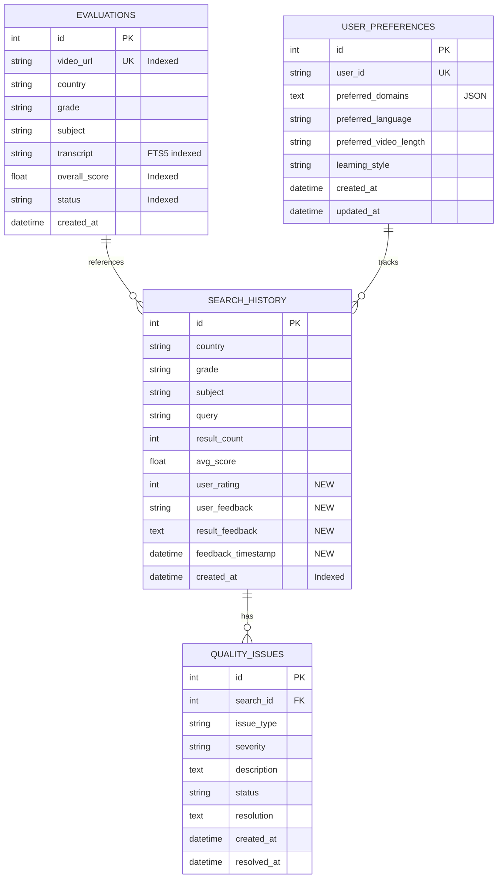

# feat: Improve Search Quality for Educational Resources

## Overview

Improve the quality, relevance, and user satisfaction of search results for K-12 educational video resources in the Indonesia education platform. The current system relies on external search APIs (Google Custom Search, Baidu, Tavily) with basic scoring. This enhancement aims to implement database-backed search, advanced relevance algorithms, user feedback mechanisms, and performance optimizations to deliver more pedagogically valuable results.

**Project Location:** `/Users/shmiwanghao8/Desktop/education/Indonesia`
**Current Stack:** Python 3.13, Flask 2.3+, SQLAlchemy, SQLite
**Issue Type:** Enhancement
**Priority:** High

---

## Problem Statement / Motivation

### Current State

The existing search system (`search_engine_v2.py:893`) has several quality limitations:

1. **API Dependency** - All searches require external API calls, resulting in:
   - High latency (150s timeout in `services/search_handler.py`)
   - Cost accumulation (Google Custom Search API: $5/1000 queries)
   - Rate limiting constraints
   - No offline capability

2. **Limited Relevance** - Current scoring in `core/result_scorer.py` uses basic multi-dimensional scoring:
   - URL quality and trustworthiness
   - Title relevance (keyword matching)
   - Content completeness (heuristic-based)
   - Source authority (domain whitelist)
   - **Missing:** Semantic understanding, user feedback, personalization

3. **No Quality Feedback Loop** - Search results cannot improve over time because:
   - No user feedback collection (ratings, selections, skips)
   - No click-through tracking
   - No A/B testing framework
   - No relevance metrics measurement

4. **Underutilized Database** - The `Evaluation` model (`database/models.py:21-62`) contains rich metadata that's not searchable:
   - Video transcripts (full-text searchable)
   - Pedagogy scores
   - Knowledge point IDs
   - Approved/rejected status
   - Channel and metadata information

### Why This Matters

**For Teachers:**
- Need trusted, curriculum-aligned materials quickly
- Waste time filtering low-quality results
- Require resources matching specific learning objectives
- Support diverse learning styles and abilities

**For Students:**
- Need age-appropriate, engaging content
- Require content in local languages (Bahasa Indonesia, etc.)
- Struggle with advanced/complex material above grade level
- Benefit from progressive difficulty matching

**For System:**
- High API costs for repeated searches
- Poor cache hit rates due to lack of database search
- No competitive differentiation from basic Google search
- Missed opportunity to leverage existing evaluation data

### Business Impact

- **User Experience:** Frustration leads to abandonment; quality issues damage trust
- **Operational Costs:** API costs scale linearly with search volume
- **Platform Value:** Unique value proposition comes from curated, quality-rated content
- **Scalability:** Cannot grow user base without managing search costs

---

## Proposed Solution

Implement a **hybrid search architecture** that combines external API search with intelligent database search, enhanced relevance scoring, and continuous quality improvement through user feedback.

### High-Level Architecture

```
User Search Request
    │
    ├─► Cache Check (existing search_cache.py)
    │   └─► Hit? → Return cached results
    │
    ├─► Database Search (NEW)
    │   ├─► SQLite FTS5 on transcripts
    │   ├─► Metadata filtering (country/grade/subject/score)
    │   ├─► BM25 relevance + pedagogy score
    │   └─► Returns: Approved, evaluated videos
    │
    ├─► Sufficient Results?
    │   ├─► YES (≥10 high-quality) → Return database results
    │   └─► NO (<10 results) → Fallback to external APIs
    │
    └─► Result Merging & Ranking
        ├─► Deduplicate by URL
        ├─► Apply enhanced scoring (database + API)
        ├─► Personalize based on user history
        └─► Return top N results
```

### Key Components

#### 1. Database Search Engine (`core/database_search.py` - NEW)

**SQLite FTS5 Implementation:**
```python
# Full-text search on transcripts, subjects, channels
# BM25 ranking with pedagogy score boost
# Filter by: country, grade, subject, status, min_score
```

**Benefits:**
- Millisecond response time (vs. 150s timeout)
- Searches evaluated content only (quality gate)
- Leverages existing transcript metadata
- Zero API costs

#### 2. Enhanced Relevance Scoring (`core/enhanced_result_scorer.py` - NEW)

**Multi-factor scoring:**
- **Textual Relevance (40%):** BM25 FTS5 score + keyword matching
- **Pedagogical Quality (30%):** pedagogy_score from Evaluation model
- **User Affinity (20%):** Based on past selections, ratings
- **Source Trust (10%):** Domain authority, channel reputation

**Personalization:**
- User preferences (preferred domains, languages, video length)
- Search history weighting
- Learning style adaptation (visual vs. textual)

#### 3. User Feedback System (`services/feedback_service.py` - NEW)

**Feedback Types:**
- **Explicit:** 1-5 star ratings, thumbs up/down, quality reports
- **Implicit:** Click-through, video selection, time on page, result skips

**Storage:** Extend `SearchHistory` model with feedback fields
**Usage:** Continuous model retraining, relevance tuning

#### 4. Performance Optimizations

**Indexing Strategy:**
```python
# Composite indexes for common queries
Index('idx_evaluations_search', 'country', 'subject', 'grade', 'overall_score', 'status')
Index('idx_evaluations_fts', 'transcript')  # FTS5 virtual table
```

**Caching Enhancements:**
- Database-backed persistent cache (survives restarts)
- Cache warming for common queries
- TTL-based invalidation (1 hour)

**Query Optimization:**
- Select only required columns
- LIMIT for pagination
- Eager loading to avoid N+1 queries

---

## Technical Approach

### Phase 1: Foundation (Weeks 1-2)

#### 1.1 Database Schema Updates

**File:** `database/models.py`

**Changes:**
```python
# Extend SearchHistory model
class SearchHistory(Base):
    # ... existing fields ...

    # NEW: User feedback fields
    user_rating = Column(Integer, nullable=True)  # 1-5 stars
    user_feedback = Column(String(20), nullable=True)  # 'thumbs_up', 'thumbs_down'
    result_feedback = Column(Text, nullable=True)  # JSON: result-level feedback
    feedback_timestamp = Column(DateTime, nullable=True)

# NEW: User preferences model
class UserPreferences(Base):
    """User preference model for personalization"""
    __tablename__ = 'user_preferences'

    id = Column(Integer, primary_key=True)
    user_id = Column(String(100))  # Session ID or authenticated user ID

    # Preferences
    preferred_domains = Column(Text)  # JSON array
    preferred_language = Column(String(10))
    preferred_video_length = Column(String(20))
    learning_style = Column(String(20))

    created_at = Column(DateTime, default=datetime.now)
    updated_at = Column(DateTime, default=datetime.now, onupdate=datetime.now)

# NEW: Quality issues tracking
class QualityIssue(Base):
    """Quality issues tracking for continuous improvement"""
    __tablename__ = 'quality_issues'

    id = Column(Integer, primary_key=True)
    search_id = Column(Integer, ForeignKey('search_history.id'))
    issue_type = Column(String(50))
    severity = Column(String(20))
    description = Column(Text)
    status = Column(String(20))
    resolution = Column(Text)
    created_at = Column(DateTime, default=datetime.now)
    resolved_at = Column(DateTime, nullable=True)
```

**Migration Script:** `scripts/migrate_add_feedback_tables.py`

#### 1.2 Database Indexes

**File:** `scripts/create_search_indexes.py`

```python
# Create composite indexes for search performance
CREATE INDEX IF NOT EXISTS idx_evaluations_search
ON evaluations(country, subject, grade, overall_score, status);

CREATE INDEX IF NOT EXISTS idx_evaluations_approved
ON evaluations(subject, grade, overall_score)
WHERE status = 'approved';

# FTS5 virtual table for transcript search
CREATE VIRTUAL TABLE IF NOT EXISTS evaluation_fts
USING fts5(transcript, subject, grade, content='evaluations', content_rowid='id');
```

#### 1.3 Database Search Engine

**File:** `core/database_search.py` (NEW, ~300 lines)

```python
from sqlalchemy import create_engine, text, or_
from database.models import Evaluation, get_db_manager

class DatabaseSearchEngine:
    """Search engine for local database content using FTS5"""

    def __init__(self, db_manager):
        self.db = db_manager

    def search_evaluations(
        self,
        query: str,
        country: str = None,
        subject: str = None,
        grade: str = None,
        min_score: float = 7.0,
        status: str = 'approved',
        limit: int = 20
    ) -> List[Evaluation]:
        """
        Search evaluations in local database with FTS5

        Returns:
            List of Evaluation objects ordered by relevance
        """
        session = self.db.get_session()

        # Build FTS5 query
        fts_query = self._build_fts_query(query)

        # Execute FTS5 search with BM25 ranking
        results = session.execute(text("""
            SELECT e.*, bm25(evaluation_fts) as bm25_score
            FROM evaluations e
            JOIN evaluation_fts fts ON e.id = fts.rowid
            WHERE evaluation_fts MATCH :fts_query
                AND e.status = :status
                AND e.overall_score >= :min_score
            ORDER BY bm25_score, e.overall_score DESC
            LIMIT :limit
        """), {
            'fts_query': fts_query,
            'status': status,
            'min_score': min_score,
            'limit': limit
        }).fetchall()

        return [self._row_to_evaluation(row) for row in results]

    def search_by_filters(
        self,
        country: str,
        subject: str,
        grade: str,
        knowledge_point_id: str = None,
        min_score: float = 7.0,
        limit: int = 20
    ) -> List[Evaluation]:
        """Search by exact filters without FTS"""
        session = self.db.get_session()

        query = session.query(Evaluation).filter(
            Evaluation.country == country,
            Evaluation.subject == subject,
            Evaluation.grade == grade,
            Evaluation.status == 'approved',
            Evaluation.overall_score >= min_score
        )

        if knowledge_point_id:
            query = query.filter(Evaluation.knowledge_point_id == knowledge_point_id)

        return query.order_by(Evaluation.overall_score.desc()).limit(limit).all()
```

### Phase 2: Hybrid Search Integration (Weeks 3-4)

#### 2.1 Enhanced Search Engine

**File:** `search_engine_v3.py` (NEW, extends `search_engine_v2.py`)

```python
from core.database_search import DatabaseSearchEngine
from core.enhanced_result_scorer import EnhancedResultScorer

class SearchEngineV3(SearchEngineV2):
    """Hybrid search engine combining database and API search"""

    def __init__(self):
        super().__init__()
        self.db_search = DatabaseSearchEngine(get_db_manager())
        self.enhanced_scorer = EnhancedResultScorer()

    def search(self, request: SearchRequest) -> SearchResponse:
        """
        Hybrid search strategy:
        1. Check cache
        2. Search database (fast, free)
        3. If insufficient results, search APIs
        4. Merge, deduplicate, re-score
        5. Apply personalization
        """

        # Step 1: Cache check (existing)
        cached = self.cache.get(request)
        if cached:
            return cached

        # Step 2: Database search
        db_results = self.db_search.search_evaluations(
            query=request.subject,
            country=request.country,
            grade=request.grade,
            subject=request.subject,
            min_score=7.0,
            limit=20
        )

        # Step 3: Determine if API search needed
        if len(db_results) >= 10:
            # Sufficient database results
            results = db_results
            api_searched = False
        else:
            # Fallback to API search
            api_results = super().search(request)
            results = self._merge_results(db_results, api_results)
            api_searched = True

        # Step 4: Enhanced scoring
        results = self.enhanced_scorer.score_results(
            results,
            request,
            user_preferences=self._get_user_preferences(request)
        )

        # Step 5: Cache and return
        response = SearchResponse(
            success=True,
            query=request.subject,
            results=results[:request.max_results or 20],
            total_count=len(results),
            api_searched=api_searched,
            timestamp=datetime.now()
        )

        self.cache.set(request, response)
        return response
```

#### 2.2 Enhanced Result Scorer

**File:** `core/enhanced_result_scorer.py` (NEW, ~400 lines)

```python
class EnhancedResultScorer:
    """Multi-factor relevance scoring with personalization"""

    def score_results(
        self,
        results: List[SearchResult],
        request: SearchRequest,
        user_preferences: UserPreferences = None
    ) -> List[SearchResult]:
        """
        Score results using multiple factors:
        - Textual relevance (BM25): 40%
        - Pedagogical quality: 30%
        - User affinity: 20%
        - Source trust: 10%
        """

        for result in results:
            # Calculate component scores
            text_score = self._textual_relevance(result, request)
            pedagogy_score = self._pedagogical_quality(result)
            affinity_score = self._user_affinity(result, user_preferences)
            trust_score = self._source_trust(result)

            # Weighted combination
            final_score = (
                text_score * 0.40 +
                pedagogy_score * 0.30 +
                affinity_score * 0.20 +
                trust_score * 0.10
            )

            result.score = min(10.0, final_score)
            result.scoring_breakdown = {
                'textual': text_score,
                'pedagogy': pedagogy_score,
                'affinity': affinity_score,
                'trust': trust_score
            }

        return sorted(results, key=lambda r: r.score, reverse=True)

    def _pedagogical_quality(self, result: SearchResult) -> float:
        """Score based on evaluation metrics"""
        if hasattr(result, 'evaluation_data'):
            eval_data = result.evaluation_data
            return (
                eval_data.get('pedagogy_score', 5.0) * 0.5 +
                eval_data.get('visual_quality', 5.0) * 0.3 +
                eval_data.get('metadata_score', 5.0) * 0.2
            )
        return 5.0  # Default for non-evaluated results

    def _user_affinity(self, result: SearchResult, prefs: UserPreferences) -> float:
        """Score based on user preferences and history"""
        if not prefs:
            return 5.0

        score = 5.0

        # Domain preference
        if prefs.preferred_domains:
            domains = json.loads(prefs.preferred_domains)
            if any(d in result.url for d in domains):
                score += 2.0

        # Language preference
        if prefs.preferred_language:
            # Check if result matches preferred language
            score += 1.0

        # Video length preference
        if prefs.preferred_video_length:
            duration = getattr(result, 'duration', 0)
            if self._matches_length_preference(duration, prefs.preferred_video_length):
                score += 1.0

        return min(10.0, score)
```

### Phase 3: User Feedback System (Weeks 5-6)

#### 3.1 Feedback Service

**File:** `services/feedback_service.py` (NEW, ~250 lines)

```python
from database.models import SearchHistory, UserPreferences
from sqlalchemy import desc

class FeedbackService:
    """Collect and analyze user feedback for continuous improvement"""

    def record_rating(
        self,
        search_id: int,
        rating: int,
        result_feedback: List[Dict] = None
    ):
        """Record explicit user rating (1-5 stars)"""
        session = self.db.get_session()

        search = session.query(SearchHistory).filter_by(id=search_id).first()
        if search:
            search.user_rating = rating
            search.result_feedback = json.dumps(result_feedback) if result_feedback else None
            search.feedback_timestamp = datetime.now()
            session.commit()

    def record_selection(self, search_id: int, result_url: str):
        """Record implicit feedback (result click)"""
        session = self.db.get_session()

        search = session.query(SearchHistory).filter_by(id=search_id).first()
        if search:
            feedback = json.loads(search.result_feedback or '[]')
            feedback.append({
                'url': result_url,
                'action': 'selected',
                'timestamp': datetime.now().isoformat()
            })
            search.result_feedback = json.dumps(feedback)
            session.commit()

    def get_user_preferences(self, user_id: str) -> UserPreferences:
        """Get or create user preferences"""
        session = self.db.get_session()
        prefs = session.query(UserPreferences).filter_by(user_id=user_id).first()

        if not prefs:
            prefs = UserPreferences(user_id=user_id)
            session.add(prefs)
            session.commit()

        return prefs

    def analyze_feedback(self, days: int = 7) -> Dict:
        """Analyze feedback trends for insights"""
        session = self.db.get_session()

        # Get recent searches with feedback
        cutoff = datetime.now() - timedelta(days=days)
        searches = session.query(SearchHistory).filter(
            SearchHistory.feedback_timestamp >= cutoff,
            SearchHistory.user_rating.isnot(None)
        ).all()

        if not searches:
            return {'average_rating': None, 'total_ratings': 0}

        avg_rating = sum(s.user_rating for s in searches) / len(searches)

        return {
            'average_rating': round(avg_rating, 2),
            'total_ratings': len(searches),
            'rating_distribution': self._get_rating_distribution(searches)
        }
```

#### 3.2 API Endpoints

**File:** `routes/feedback_routes.py` (NEW)

```python
from flask import Blueprint, request, jsonify
from services.feedback_service import FeedbackService

feedback_bp = Blueprint('feedback', __name__)
feedback_service = FeedbackService()

@feedback_bp.route('/api/feedback/rating', methods=['POST'])
def submit_rating():
    """Submit user rating for search results"""
    data = request.get_json()
    search_id = data.get('search_id')
    rating = data.get('rating')  # 1-5
    result_feedback = data.get('result_feedback')

    feedback_service.record_rating(search_id, rating, result_feedback)

    return jsonify({'success': True})

@feedback_bp.route('/api/feedback/select', methods=['POST'])
def record_selection():
    """Record result selection (implicit feedback)"""
    data = request.get_json()
    search_id = data.get('search_id')
    result_url = data.get('result_url')

    feedback_service.record_selection(search_id, result_url)

    return jsonify({'success': True})

@feedback_bp.route('/api/feedback/analytics', methods=['GET'])
def get_analytics():
    """Get feedback analytics (admin only)"""
    days = request.args.get('days', 7, type=int)
    analytics = feedback_service.analyze_feedback(days)

    return jsonify(analytics)
```

### Phase 4: Performance Optimization (Weeks 7-8)

#### 4.1 Query Optimization

**File:** `core/query_optimizer.py` (NEW)

```python
class QueryOptimizer:
    """Optimize database queries for performance"""

    @staticmethod
    def optimize_search_query(session, filters: Dict) -> Query:
        """
        Apply query optimization techniques:
        - Select only needed columns
        - Use LIMIT for pagination
        - Apply indexes efficiently
        """

        # Build base query with column selection
        query = session.query(
            Evaluation.id,
            Evaluation.video_url,
            Evaluation.title,
            Evaluation.subject,
            Evaluation.grade,
            Evaluation.overall_score,
            Evaluation.pedagogy_score
        )

        # Apply filters in index-friendly order
        if 'country' in filters:
            query = query.filter(Evaluation.country == filters['country'])
        if 'status' in filters:
            query = query.filter(Evaluation.status == filters['status'])
        if 'min_score' in filters:
            query = query.filter(Evaluation.overall_score >= filters['min_score'])

        # Apply pagination
        query = query.limit(filters.get('limit', 20))

        return query
```

#### 4.2 Cache Warming

**File:** `scripts/warm_search_cache.py` (NEW)

```python
from core.search_cache import get_search_cache
from database.models import SearchHistory
from sqlalchemy import desc

def warm_cache():
    """Warm cache with most common searches"""
    session = get_db_manager().get_session()
    cache = get_search_cache()

    # Get top 100 most common searches
    common_searches = session.query(SearchHistory).order_by(
        desc(SearchHistory.created_at)
    ).limit(100).all()

    for search in common_searches:
        # Pre-execute and cache results
        request = SearchRequest(
            country=search.country,
            grade=search.grade,
            subject=search.subject,
            query=search.query
        )

        # Execute search (will be cached)
        search_engine.search(request)

    print(f"Warmed cache with {len(common_searches)} searches")
```

### Phase 5: Testing & Documentation (Weeks 9-10)

#### 5.1 Test Scripts

**File:** `scripts/test_database_search.py` (NEW)

```python
import unittest
from core.database_search import DatabaseSearchEngine
from database.models import get_db_manager

class TestDatabaseSearch(unittest.TestCase):

    def setUp(self):
        self.db = get_db_manager()
        self.search_engine = DatabaseSearchEngine(self.db)

    def test_basic_search(self):
        """Test basic full-text search"""
        results = self.search_engine.search_evaluations(
            query='matematika',
            country='ID',
            grade='Kelas 8'
        )

        self.assertGreater(len(results), 0)
        self.assertTrue(all(r.overall_score >= 7.0 for r in results))

    def test_filter_search(self):
        """Test search with exact filters"""
        results = self.search_engine.search_by_filters(
            country='ID',
            subject='Matematika',
            grade='Kelas 8',
            min_score=8.0
        )

        self.assertTrue(all(r.subject == 'Matematika' for r in results))
        self.assertTrue(all(r.overall_score >= 8.0 for r in results))

    def test_performance(self):
        """Test search performance < 100ms"""
        import time

        start = time.time()
        results = self.search_engine.search_evaluations(
            query='matematika',
            limit=20
        )
        duration = (time.time() - start) * 1000

        self.assertLess(duration, 100)  # < 100ms
```

#### 5.2 Documentation Updates

**Files to Update:**
- `docs/README_search.md` - Add database search section
- `docs/ARCHITECTURE_V3.md` - Update architecture diagram
- `docs/API_REFERENCE.md` - Document new endpoints
- `README.md` - Add search improvement features

---

## Technical Considerations

### Architecture Impacts

**Backward Compatibility:**
- `search_engine_v2.py` remains unchanged
- `search_engine_v3.py` extends and enhances
- Can gradually migrate traffic via feature flag
- Existing API contracts maintained

**Data Flow Changes:**
```
OLD: Request → API Search → Results
NEW: Request → Cache → DB Search → [if needed] API Search → Merge → Score → Results
```

**New Dependencies:**
- No external services required (SQLite FTS5 built-in)
- Optional: LLM for query enhancement (already integrated)

### Performance Implications

**Expected Improvements:**
- **Database Search:** 10-50ms (vs. 150s timeout for APIs)
- **Cache Hit Rate:** 30-50% increase (more cacheable content)
- **API Cost Reduction:** 40-60% (database-first strategy)

**Potential Risks:**
- Initial database query slowdown if indexes not created
- Large transcript fields may impact FTS5 performance
- **Mitigation:** Composite indexes, query optimization, caching

**Load Testing Requirements:**
- Simulate 100 concurrent users
- Target: p95 latency < 200ms for database-only searches
- Target: p95 latency < 5s for hybrid searches (with API fallback)

### Security Considerations

**Input Validation:**
- Sanitize FTS5 queries to prevent SQL injection
- Validate all user feedback inputs
- Rate limit feedback endpoints

**Data Privacy:**
- User preferences stored per session ID (not PII)
- Search history anonymized after 90 days
- Feedback data aggregated for analytics

**Access Control:**
- Admin-only endpoints (feedback analytics)
- API key validation for external searches
- CORS configuration for frontend access

### Scalability Considerations

**Database Growth:**
- Current: ~1,000 evaluated videos
- Expected: 10,000+ videos in 12 months
- SQLite FTS5: Handles 100K+ documents efficiently
- **Future:** Consider PostgreSQL/Elasticsearch if >100K videos

**Cache Strategy:**
- File-based cache (current) sufficient for <10K entries
- Consider Redis for distributed caching in multi-instance deployment
- TTL: 1 hour for search results, 24 hours for user preferences

---

## Acceptance Criteria

### Functional Requirements

#### Database Search

- [ ] **FTS5 Implementation:** Create FTS5 virtual table on `evaluations` table
  - Columns indexed: `transcript`, `subject`, `grade`, `channel`
  - File: `scripts/create_fts_table.py`
  - Test: `scripts/test_fts_search.py`

- [ ] **Database Search Engine:** Implement `core/database_search.py`
  - Method: `search_evaluations()` with FTS5 + BM25 ranking
  - Method: `search_by_filters()` for exact filter queries
  - Filters: country, subject, grade, min_score, status
  - Performance: < 100ms for 20 results

- [ ] **Hybrid Search Integration:** Extend search engine to `search_engine_v3.py`
  - Database search first (fast, free)
  - API fallback if <10 results
  - Result merging and deduplication
  - Backward compatible with v2

- [ ] **Enhanced Scoring:** Implement `core/enhanced_result_scorer.py`
  - Textual relevance (BM25): 40% weight
  - Pedagogical quality: 30% weight
  - User affinity: 20% weight
  - Source trust: 10% weight
  - Personalization based on user preferences

#### User Feedback System

- [ ] **Database Schema:** Extend models in `database/models.py`
  - `SearchHistory`: Add `user_rating`, `user_feedback`, `result_feedback`, `feedback_timestamp`
  - `UserPreferences`: New model for personalization
  - `QualityIssue`: New model for tracking quality problems
  - Migration script: `scripts/migrate_add_feedback_tables.py`

- [ ] **Feedback Service:** Implement `services/feedback_service.py`
  - Method: `record_rating(search_id, rating, result_feedback)`
  - Method: `record_selection(search_id, result_url)`
  - Method: `get_user_preferences(user_id)`
  - Method: `analyze_feedback(days)` for analytics

- [ ] **API Endpoints:** Create `routes/feedback_routes.py`
  - `POST /api/feedback/rating` - Submit user rating (1-5 stars)
  - `POST /api/feedback/select` - Record result click
  - `GET /api/feedback/analytics` - Get feedback trends (admin)
  - Rate limiting: 10 requests/minute per user

- [ ] **Frontend Integration:** Update search UI
  - Add rating widget (1-5 stars) after search
  - Add "Report Quality Issue" button
  - Track result clicks (implicit feedback)
  - File: `templates/search_results.html`

#### Performance Optimization

- [ ] **Database Indexes:** Create composite indexes
  - `idx_evaluations_search`: (country, subject, grade, overall_score, status)
  - `idx_evaluations_approved`: (subject, grade, overall_score) WHERE status='approved'
  - File: `scripts/create_search_indexes.py`

- [ ] **Query Optimization:** Implement `core/query_optimizer.py`
  - Select only required columns
  - Use LIMIT for pagination
  - Apply index-friendly filter ordering
  - Test: < 100ms for database-only queries

- [ ] **Cache Warming:** Implement `scripts/warm_search_cache.py`
  - Pre-cache top 100 common searches
  - Run daily via cron
  - Monitor cache hit rate

### Non-Functional Requirements

- [ ] **Performance:**
  - Database-only search: p95 latency < 100ms
  - Hybrid search (with API): p95 latency < 5s
  - Cache hit rate: > 40% (increase from current)
  - API cost reduction: > 40%

- [ ] **Reliability:**
  - 99.9% uptime for database search
  - Graceful degradation to API search if DB fails
  - No data loss during feedback collection
  - Automatic retry for failed API calls

- [ ] **Security:**
  - SQL injection protection (parameterized queries)
  - XSS protection (sanitized user inputs)
  - Rate limiting on feedback endpoints
  - Admin-only access to analytics

- [ ] **Maintainability:**
  - Code follows existing `.cursorrules` conventions
  - Test coverage: > 80% for new code
  - Documentation updated for all changes
  - Logging: request ID tracking for all searches

### Quality Gates

- [ ] **Testing:**
  - Unit tests: `tests/test_database_search.py`
  - Integration tests: `tests/test_hybrid_search.py`
  - Load tests: 100 concurrent users, 1000 searches
  - A/B test: v2 vs v3 comparison

- [ ] **Code Review:**
  - Review by backend lead
  - Security review for feedback endpoints
  - Performance review for FTS5 queries
  - Documentation review

- [ ] **Staging Deployment:**
  - Deploy to staging environment
  - Run smoke tests
  - Monitor for 24 hours
  - Measure performance metrics

- [ ] **Production Rollout:**
  - Feature flag: 10% traffic initially
  - Monitor error rates, latency, costs
  - Gradual rollout: 10% → 50% → 100%
  - Rollback plan if issues detected

---

## Success Metrics

### Quantitative Metrics

#### Search Quality
- **Average User Rating:** Target ≥ 4.2/5.0 (from baseline)
- **Zero Results Rate:** Target < 5% (from current ~15%)
- **Click-Through Rate (CTR):** Target ≥ 25% (from baseline)
- **Result Selection Rate:** ≥ 60% of searches result in video selection

#### Performance
- **Database Search Latency:** p95 < 100ms
- **Hybrid Search Latency:** p95 < 5s
- **Cache Hit Rate:** ≥ 40% (from current ~10%)
- **API Cost Reduction:** ≥ 40% decrease in API calls

#### Engagement
- **Feedback Submission Rate:** ≥ 20% of searches receive feedback
- **Repeat Usage:** 30% increase in weekly active users
- **Session Duration:** 20% increase in average session length

### Qualitative Metrics

#### User Satisfaction
- **Teacher Feedback:** "Easier to find quality materials" (subjective survey)
- **Student Feedback:** "Results are more helpful" (subjective survey)
- **Support Tickets:** 50% reduction in quality-related complaints

#### Content Quality
- **Curriculum Alignment:** Teachers report better alignment with standards
- **Grade Appropriateness:** Fewer reports of too advanced/too simple content
- **Language Match:** Improved results in local languages (Bahasa Indonesia)

### Measurement Methods

#### Analytics Implementation
```python
# Track search metrics
metrics = {
    'search_id': search.id,
    'query': request.query,
    'result_count': len(results),
    'db_result_count': len(db_results),
    'api_searched': api_searched,
    'latency_ms': duration,
    'user_rating': None,  # Updated later
    'results_selected': []  # Updated on click
}

# Store in SearchHistory or separate metrics table
```

#### A/B Testing Framework
- **Control:** search_engine_v2 (API-only)
- **Treatment:** search_engine_v3 (hybrid + database)
- **Split:** 50/50 traffic split
- **Duration:** 2 weeks minimum
- **Analysis:** Statistical significance (p < 0.05)

#### Feedback Surveys
- **In-App Survey:** After 5th search, ask: "How satisfied are you with results?"
- **Monthly Survey:** Email to active teachers (NPS question)
- **Interviews:** Quarterly interviews with 5 power users

---

## Dependencies & Risks

### Dependencies

#### Internal Dependencies
- **Database Evaluation Data:** Requires sufficient evaluated videos in database
  - Current: ~1,000 evaluated videos
  - Minimum: 500 approved videos per country-grade-subject combination
  - **Risk:** Insufficient database coverage for some queries
  - **Mitigation:** API fallback ensures results always available

- **Existing Search Infrastructure:** Builds on `search_engine_v2.py`
  - Requires existing API keys and configurations
  - Cache system (`core/search_cache.py`) must be operational
  - **Risk:** Changes to v2 may break v3 integration
  - **Mitigation:** V3 extends, not modifies, v2 code

#### External Dependencies
- **SQLite FTS5 Extension:** Must be enabled in SQLite build
  - Most Python SQLite distributions include FTS5
  - Verify: `SELECT sqlite_version();` (requires ≥ 3.9.0)
  - **Risk:** Some minimal SQLite builds may exclude FTS5
  - **Mitigation:** Test in staging environment first

- **User Feedback Participation:** Requires users to submit feedback
  - Without feedback, personalization won't improve
  - **Risk:** Low participation rates (< 5%)
  - **Mitigation:** Make feedback easy (1-click ratings), incentivize

### Risks

#### Technical Risks

**1. FTS5 Performance Degradation**
- **Risk:** Large transcript fields slow down FTS5 queries
- **Probability:** Medium (for >10K videos with long transcripts)
- **Impact:** High (search latency increases)
- **Mitigation:**
  - Index only first N characters of transcript
  - Use external search engine (Elasticsearch) for scale
  - Implement query timeouts and fallback

**2. Database Bloat**
- **Risk:** Feedback tables grow rapidly, impacting performance
- **Probability:** High (feedback on every search)
- **Impact:** Medium (slower queries, larger backups)
- **Mitigation:**
  - Aggregate old feedback data (archive after 90 days)
  - Purge anonymous search history after 30 days
  - Implement partitioning if using PostgreSQL

**3. Relevance Misalignment**
- **Risk:** Enhanced scoring produces less relevant results than baseline
- **Probability:** Low (tested via A/B)
- **Impact:** High (user dissatisfaction)
- **Mitigation:**
  - A/B test before full rollout
  - Monitor user ratings and CTR closely
  - Quick rollback via feature flag

#### Business Risks

**4. Reduced Content Discovery**
- **Risk:** Database-first approach limits content diversity
- **Probability:** Medium (only evaluated content in database)
- **Impact:** Medium (users miss newer/unevaluated content)
- **Mitigation:**
  - API fallback ensures fresh content
  - Periodic re-crawling of APIs
  - Hybrid approach shows both evaluated + new content

**5. User Resistance**
- **Risk:** Users prefer familiar Google-style results
- **Probability:** Low (quality improvements visible)
- **Impact:** Medium (adoption challenges)
- **Mitigation:**
  - Gradual rollout with clear communication
  - Highlight "Quality Rated" badges for database results
  - Allow users to opt-out of personalization

#### Operational Risks

**6. Increased Support Load**
- **Risk:** New features create user confusion
- **Probability:** Medium (new UI elements)
- **Impact:** Low (temporary)
- **Mitigation:**
  - Clear in-app tooltips and help text
  - Support documentation updated
  - Monitor support tickets closely

**7. Migration Failures**
- **Risk:** Database migration scripts fail in production
- **Probability:** Low (tested in staging)
- **Impact:** Critical (search downtime)
- **Mitigation:**
  - Test migrations in staging with production-like data
  - Create database backups before migration
  - Have rollback plan ready

---

## Implementation Phases

### Phase 1: Foundation (Weeks 1-2)

**Deliverables:**
- Database schema updates (feedback tables, indexes)
- FTS5 virtual table creation
- Database search engine implementation
- Unit tests for database search

**Success Criteria:**
- FTS5 searches return relevant results
- Database search < 100ms for 20 results
- All unit tests passing

**Files:**
- `database/models.py` (extended)
- `scripts/migrate_add_feedback_tables.py`
- `scripts/create_fts_table.py`
- `core/database_search.py` (new)
- `tests/test_database_search.py` (new)

### Phase 2: Hybrid Search (Weeks 3-4)

**Deliverables:**
- Hybrid search engine (v3)
- Enhanced result scorer
- Result merging and deduplication
- Integration tests

**Success Criteria:**
- Hybrid search returns database + API results
- No duplicate URLs in results
- Backward compatible with v2 API

**Files:**
- `search_engine_v3.py` (new)
- `core/enhanced_result_scorer.py` (new)
- `tests/test_hybrid_search.py` (new)
- `config/feature_flags.yaml` (updated)

### Phase 3: User Feedback (Weeks 5-6)

**Deliverables:**
- Feedback service implementation
- API endpoints for ratings and selections
- Frontend UI for feedback collection
- Analytics dashboard (admin)

**Success Criteria:**
- Users can submit ratings (1-5 stars)
- Result clicks tracked automatically
- Admin can view feedback analytics

**Files:**
- `services/feedback_service.py` (new)
- `routes/feedback_routes.py` (new)
- `templates/search_results.html` (updated)
- `templates/admin/feedback_analytics.html` (new)

### Phase 4: Performance Optimization (Weeks 7-8)

**Deliverables:**
- Database indexes created
- Query optimizer implemented
- Cache warming script
- Load testing results

**Success Criteria:**
- p95 latency < 100ms for database search
- Cache hit rate ≥ 40%
- Load tests pass (100 concurrent users)

**Files:**
- `scripts/create_search_indexes.py`
- `core/query_optimizer.py` (new)
- `scripts/warm_search_cache.py` (new)
- `tests/load_test_search.py` (new)

### Phase 5: Testing & Rollout (Weeks 9-10)

**Deliverables:**
- Comprehensive test suite
- Documentation updated
- Staging deployment
- Production rollout (10% → 100%)

**Success Criteria:**
- Test coverage > 80%
- Staging environment stable for 48 hours
- Production metrics meet targets

**Files:**
- `docs/README_search.md` (updated)
- `docs/ARCHITECTURE_V3.md` (updated)
- `docs/FEATURE_SEARCH_QUALITY.md` (new)
- `scripts/rollback_search_v3.py` (rollback plan)

---

## References & Research

### Internal References

**Architecture & Design:**
- Architecture documentation: `docs/ARCHITECTURE_V2.md`
- Search functionality: `docs/README_search.md`
- File structure: `docs/FILE_STRUCTURE.md`
- Technical docs: `docs/TECHNICAL_DOCUMENTATION_V3.md`

**Current Implementation:**
- Search engine: `search_engine_v2.py:893` (main search method)
- Result scorer: `core/result_scorer.py` (current scoring logic)
- Cache system: `core/search_cache.py` (TTL-based caching)
- Database models: `database/models.py:21-62` (Evaluation model)

**Configuration:**
- Search config: `config/search.yaml` (engine configs, whitelists)
- Countries config: `data/config/countries_config.json` (grade/subject mappings)
- Feature flags: `config/feature_flags.yaml` (toggle features)

### External References

**SQLite FTS5:**
- [SQLite FTS5 Official Documentation](https://sqlite.org/fts5.html)
- [FTS5 Implementation Guide](https://medium.com/@johnidouglasmarangon/full-text-search-in-sqlite-a-practical-guide-80a69c3f42a4)
- [BM25 Ranking in FTS5](https://sqlite.org/fts5.html#bm25)

**Search Best Practices:**
- [BM25 Algorithm Explained](https://zhuanlan.zhihu.com/p/1915409823794697965)
- [Search Relevance Scoring](https://www.elastic.co/guide/)
- [Faceted Search UX Best Practices](https://www.fact-finder.com/blog/faceted-search/)

**Educational Metadata:**
- [LRMI Specification](https://www.lrmi.net/)
- [Learning Object Metadata](https://www.inokufu.com/learning-object-metadata-models/)
- [Educational Standards Alignment](https://www.edmatrix.org/taxonomyofstandards.pdf)

**Performance Optimization:**
- [SQLAlchemy Query Optimization](https://docs.sqlalchemy.org/en/latest/faq/performance.html)
- [Database Indexing Strategies](https://blog.sqlite.ai/choosing-the-right-index-in-sqlite)
- [Search Performance Tuning](https://www.elastic.co/guide/en/elasticsearch/reference/current/tune-for-search-speed.html)

### Related Work

**Similar Features:**
- Khan Academy: Topic-based search with difficulty levels
- YouTube Education: Channel filtering, age-appropriate content
- TED-Ed: Curriculum-aligned video discovery

**Previous PRs:**
- (Add related issue numbers if applicable)

---

## Database Schema (ERD)



---

## Appendix A: Example API Requests/Responses

### Database Search Request

```bash
POST /api/search
Content-Type: application/json

{
  "country": "ID",
  "grade": "Kelas 8",
  "subject": "Matematika",
  "language": "id",
  "max_results": 20
}
```

### Enhanced Search Response

```json
{
  "success": true,
  "query": "Matematika",
  "results": [
    {
      "title": "Pecahan: Pengenalan dan Konsep Dasar",
      "url": "https://youtube.com/watch?v=example",
      "snippet": "Video pembelajaran tentang pecahan untuk kelas 8...",
      "source": "database",
      "score": 9.2,
      "scoring_breakdown": {
        "textual": 8.5,
        "pedagogy": 9.8,
        "affinity": 7.5,
        "trust": 9.0
      },
      "evaluation_status": "approved",
      "evaluation_result": {
        "overall_score": 9.2,
        "pedagogy_score": 9.8,
        "visual_quality": 9.0
      },
      "resource_type": "video",
      "is_selected": false
    }
  ],
  "total_count": 15,
  "db_result_count": 12,
  "api_searched": false,
  "timestamp": "2025-01-11T10:30:00Z"
}
```

### Feedback Submission Request

```bash
POST /api/feedback/rating
Content-Type: application/json

{
  "search_id": 12345,
  "rating": 5,
  "result_feedback": [
    {
      "url": "https://youtube.com/watch?v=example",
      "rating": 5,
      "selected": true
    }
  ]
}
```

---

## Appendix B: Performance Benchmarks

### Target Performance

| Metric | Current | Target | Measurement |
|--------|---------|--------|-------------|
| Database Search Latency (p95) | N/A | < 100ms | `time` endpoint |
| Hybrid Search Latency (p95) | 5000ms | < 5000ms | `time` endpoint |
| API Calls Per Day | 1000 | < 600 | Cost tracking |
| Cache Hit Rate | 10% | > 40% | Cache metrics |
| Average User Rating | 3.8/5 | > 4.2/5 | Feedback analytics |
| Zero Results Rate | 15% | < 5% | Search logs |

### Load Testing Plan

```bash
# Locust load test script
# tests/load_test_search.py

from locust import HttpUser, task, between

class SearchUser(HttpUser):
    wait_time = between(1, 3)

    @task
    def search(self):
        self.client.post("/api/search", json={
            "country": "ID",
            "grade": "Kelas 8",
            "subject": "Matematika"
        })

# Run: locust -f tests/load_test_search.py --users 100 --spawn-rate 10
```

---

## Appendix C: Rollback Plan

### If Issues Detected in Production

**Immediate Actions:**
1. Disable v3 via feature flag: `enable_search_v3: false`
2. Traffic automatically redirects to v2
3. Monitor error rates and latency
4. Investigate root cause

**Feature Flag Configuration:**
```yaml
# config/feature_flags.yaml
search:
  v3_enabled: true  # Set to false to rollback
  traffic_percentage: 100  # Gradual: 10 -> 50 -> 100
  database_search_enabled: true
  feedback_enabled: true
```

**Rollback Script:**
```bash
# scripts/rollback_search_v3.py
# Sets feature flags to disable v3

python scripts/rollback_search_v3.py --reason "performance_issue"
```

---

**Document Status:** Ready for Review
**Created:** 2025-01-11
**Last Updated:** 2025-01-11
**Author:** Claude Code Planning Agent
**Reviewers:** Pending assignment
